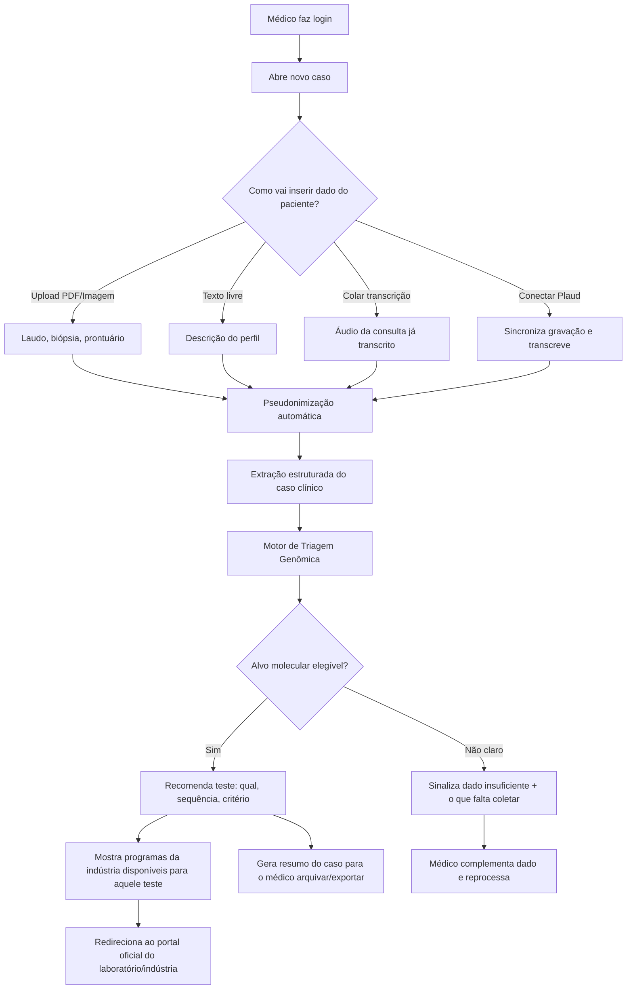

# OncoGenYX — Arquitetura Conceitual

> Desenho de produto para uma ferramenta de **triagem multimodal no ponto de cuidado**: o médico sobe dados brutos do paciente (PDF, imagem, texto, áudio) e recebe direcionamento sobre qual teste molecular pedir e onde pedir de graça, com apoio de um Hub de Acesso (catálogo de programas da indústria) e de um assistente conversacional (OncoBot) como via alternativa de entrada.

---

## 1. O que essa ferramenta É e NÃO É

**É:**
- Uma ferramenta de **triagem e direcionamento** — "existe alvo molecular relevante nesse caso? Qual teste pedir? Onde pedir de graça?"
- Um tradutor entre **dado clínico bruto e desfecho acionável**: perfil do paciente → biomarcador elegível → programa de acesso da indústria.
- Um **facilitador de logística e literacia clínica** no momento da decisão (o gargalo real, conforme os dados SGO/Labcorp-Illumina que você trouxe).

**NÃO é:**
- Uma ferramenta de **decisão terapêutica** (não sugere droga, dose ou linha de tratamento).
- Um **repositório de dados de pacientes** (não hospeda, não cruza dados entre médicos, não é banco retrospectivo).
- Um substituto de **aconselhamento genético** (sempre encaminha para especialista quando indicado, ex.: critérios de síndrome hereditária).

Essa distinção é a base regulatória e de MLR: o produto orienta *processo de solicitação de exame*, não *conduta terapêutica*. Isso muda a régua de risco (mais perto de "suporte administrativo/educacional" do que "software as medical device" de decisão terapêutica) — mas ainda exige disclaimers e trilha de auditoria, porque toca decisão clínica indiretamente.

---

## 2. Jornada do médico (fluxo ponta a ponta)



---

## 3. Arquitetura em camadas

### Camada 1 — Ingestão multimodal
Responsável por receber o dado bruto, seja qual for o formato.

| Fonte | Mecanismo | Observação |
|---|---|---|
| PDF (laudo anatomopatológico, prontuário) | Upload + parsing (texto nativo ou OCR se digitalizado) | Extrai texto, tenta localizar campos-chave (diagnóstico, estadiamento, IHQ) |
| Imagem (foto de laudo, lâmina, prescrição) | Upload + OCR | Mesma pipeline do PDF escaneado |
| Texto livre | Campo de descrição | Médico descreve o caso em linguagem natural |
| Ditado clínico por voz | Gravação de áudio no próprio app + transcrição automática (speech-to-text) | O médico dita o caso em vez de digitar; a transcrição alimenta a mesma extração da Camada 3. Diferente da transcrição colada: a gravação acontece dentro da sessão, não é importada de outro app |
| Transcrição de áudio colada | Campo de texto | Médico cola transcrição já pronta (de qualquer gravador) |
| Plaud (cartão gravador) | Integração via API/webhook do Plaud, se disponível, ou export manual do arquivo de transcrição | **Ver seção 7 — depende de disponibilidade de API pública do Plaud** |

Todo dado bruto (PDF, imagem, áudio) é **processado e descartado** — não fica retido além do necessário para gerar o resumo estruturado do caso (ver seção 5, retenção de dados).

### Camada 2 — Pseudonimização (LGPD by design)
Executa **antes** de qualquer outro processamento, inclusive antes de qualquer chamada a modelo de IA externo.

- Nome completo → iniciais + identificador sequencial gerado pela plataforma (ex.: "Renan Lourenço Vidal" → `R.L.V. — Caso #0142`).
- Nenhum CPF, data de nascimento completa, endereço, telefone ou nome de familiar é mantido em texto pleno — campos sensíveis são mascarados ou removidos na extração.
- A tabela de correspondência **nome real ↔ código do caso** fica isolada, criptografada, e só é visível para o médico dono do caso (nunca trafega para o motor de triagem nem para qualquer chamada de IA/terceiro).
- Esse desenho segue o princípio de **minimização de dados** da LGPD (Art. 6º, III) — a IA e qualquer processamento downstream só enxergam o caso pseudonimizado.

### Camada 3 — Extração e estruturação do caso clínico
Converte o dado bruto (já pseudonimizado) em um **objeto clínico estruturado**:

```
CasoClinico {
  codigo_caso: "R.L.V.-0142"
  sexo, idade
  subtipo_oncologico: enum [Ginecológico, Geniturinário, Mama, Pulmão, ...]
  histologia, grau, estadiamento
  biomarcadores_ja_conhecidos: []
  historico_familiar: { presente: bool, detalhes_relevantes }
  tratamentos_previos: []
  fonte_dados: [PDF, texto, áudio-Plaud, ...]
  dados_insuficientes: []   // o que falta para triagem completa
}
```

Aqui entra o parsing de PDF/OCR + um modelo de linguagem para extrair essas entidades do texto livre/transcrição. Idade e sexo viram faixas/categorias sempre que possível, para reduzir ainda mais a identificabilidade.

### Camada 4 — Motor de Triagem Genômica
O coração do produto. Uma árvore de decisão **por subtipo oncológico**, baseada em diretrizes NCCN/ESMO, que responde três perguntas:

1. Existe alvo molecular relevante para esse subtipo/perfil?
2. Qual(is) teste(s) pedir (germinativo, somático, HRD, painel amplo) e em que ordem?
3. Que critério de elegibilidade o caso já cumpre ou ainda precisa documentar?

Ver seção 6 para o desenho por subtipo.

### Camada 4-B — OncoBot (via conversacional, mesmo motor)
Alternativa à ingestão por formulário/upload: o médico conversa com um assistente que faz perguntas dirigidas ("qual a histologia?", "há histórico familiar?", "já foi feito algum teste?") até reunir os mesmos campos do `CasoClinico` estruturado (Camada 3). Não é um motor de decisão paralelo — é **outra porta de entrada para a mesma Camada 4**: as perguntas do bot são geradas a partir das lacunas do objeto estruturado, e a resposta final passa pelas mesmas regras versionadas e citáveis por diretriz.

- Útil quando o médico não tem laudo/arquivo em mãos e quer só descrever o caso rapidamente entre consultas.
- Pode ser usado em conjunto com upload (ex.: sobe o laudo, o bot só pergunta o que ficou faltando — histórico familiar, testes prévios).
- Mesma régua de pseudonimização da Camada 2 se aplica à conversa: o bot nunca pede nome, CPF ou dado que identifique o paciente: só dado clínico.
- Mesmo disclaimer da Camada 7: o bot direciona qual exame pedir, não sugere conduta terapêutica.

### Camada 5 — Base de Programas da Indústria (o "Hub" de acesso)
Catálogo pesquisável por **patologia × biomarcador × empresa** (`Catálogo de Programas`, Fase 1). Para cada teste elegível identificado na Camada 4, a plataforma:
- Lista quais indústrias oferecem aquele teste gratuitamente/patrocinado naquele subtipo.
- Mostra critérios de elegibilidade do programa (podem ser mais restritos que o critério clínico puro).
- Redireciona para o **portal oficial** de cada laboratório/indústria parceira — a plataforma nunca processa a solicitação em si (é facilitador, não gestor do processo).

Essa base precisa de **manutenção contínua** (programas mudam, critérios mudam) — é dado curado, não gerado por IA.

### Camada 6 — Output / Resumo do caso
Gera um resumo que o médico pode salvar/exportar:
- Caso pseudonimizado (`R.L.V.-0142`)
- Alvo(s) molecular(es) elegível(is) e por quê (critério aplicado)
- Teste(s) recomendado(s) e sequência
- Programas de acesso disponíveis + link oficial
- Disclaimer: "Esta é uma ferramenta de triagem e direcionamento, não substitui julgamento clínico nem aconselhamento genético."

### Camada 7 — Compliance, auditoria e disclaimers
- Log de auditoria: quem gerou qual triagem, quando, com base em qual versão da diretriz (importante para defensibilidade médico-legal e para eventual submissão a Medical/Regulatory).
- Disclaimer fixo em toda tela de recomendação.
- Trilha de decisão explicável: a recomendação sempre aponta a regra/diretriz que a gerou (não é "caixa-preta" de IA generativa pura — a IA ajuda a extrair dado, mas a lógica de triagem é regras auditáveis mapeadas a NCCN/ESMO).

### Camada 8 — Geração do documento de solicitação
Este é o segundo gargalo que você identificou, e é tão importante quanto o primeiro: o médico pode saber exatamente qual teste pedir e ainda assim não pedir, porque não tem staff para preencher o formulário certo do jeito certo para cada laboratório/programa. Esta camada fecha esse hiato — gera o **documento de solicitação já preenchido**, pronto para revisar, assinar e enviar.

- **Entrada isolada de nome real**: até aqui, todo o pipeline (Camadas 2 a 7) trabalha só com o caso pseudonimizado (`A.F.M.-0231`). O nome completo do paciente só é **usado** (exibido, preenchido no documento) **nesta camada**, num campo separado — nunca entra no motor de triagem, nunca fica salvo junto do histórico de casos, nunca aparece nas telas de revisão/resultado. É reidentificação pontual e local, controlada pelo médico, no exato momento em que ele precisa do documento final.
  - **Atualização v0.4**: quando o material de origem é um PDF/foto de laudo (que já contém o nome do paciente no cabeçalho, inevitavelmente visível ao modelo que lê o documento para extrair o dado clínico), o motor de extração da Camada 3 também captura esse nome — como campo isolado (`nome_paciente`), nunca combinado com o objeto clínico estruturado. Ele só é usado para pré-preencher o campo desta camada, poupando o médico de digitar de novo algo que a IA já viu. Continua nunca aparecendo nas telas 2 e 3 (revisão/resultado), continua nunca influenciando a triagem. Quando a entrada é só texto digitado (sem nome mencionado), o campo simplesmente vem vazio para preenchimento manual, como antes.
- **Templates por parceiro**: cada laboratório/indústria tem seu próprio formulário de solicitação (campos, layout, texto de justificativa exigido). Assim como a base de programas (Camada 5), esses templates são **dado curado**, mantido e validado por você — não gerado livremente por IA.
- **Preenchimento automático**: nome do paciente, dados do médico (CRM, instituição), diagnóstico, teste solicitado e a **justificativa clínica já redigida**, citando a diretriz que embasa a indicação (o mesmo texto rastreável da Camada 7).
- **Múltiplos documentos por caso**: quando a triagem recomenda teste pareado (ex.: HRD tumoral + BRCA germinativo, ver seção 10), a plataforma gera um documento para cada um — cada teste pode ter parceiro, laboratório e formulário diferentes.
- **Saída**: PDF para download, com aviso de que a responsabilidade pela solicitação final é do médico assistente (a plataforma preenche, não decide nem envia em nome dele).

**Atualização v0.4**: o fluxo real (`server/public/index.html`) juntou as telas de Programas de acesso e Modelo de solicitação num único passo 4 — cada card de teste indicado já mostra, na sequência, o(s) programa(s)/portal(is) e o documento de solicitação pré-preenchido daquele mesmo teste, em vez de duas telas separadas. Ver `mockup/oncogyn-flow.html` (versão anterior, 5 passos, sem backend) para o histórico do desenho original.

---

## 4. Estrutura de telas (informação, não visual ainda)

1. **Login/Cadastro do médico** (CRM, especialidade, instituição) — acesso seguro ao Hub.
2. **Dashboard** — casos recentes, catálogo de programas.
3. **Novo Caso** — tela de ingestão multimodal: formulário/upload (texto, PDF, imagem, áudio, Plaud) **ou** conversa com o OncoBot (ver Camada 4-B).
4. **Revisão do Caso Estruturado** — médico confirma/corrige o que foi extraído antes de rodar a triagem (humano no loop, reduz risco de erro de extração).
5. **Resultado da Triagem** — alvo(s), teste(s), critério, programas disponíveis, botão para portal oficial.
6. **Histórico de Casos** — lista de `R.L.V.-0142`, `R.L.V.-0143`... só o médico logado enxerga a tabela de correspondência real.
7. **Área de Educação** (Fase 3).
8. **Analytics/Dashboard agregado** (Fase 3, para parceiros da indústria — sempre agregado e anonimizado).

---

## 5. Retenção e segurança de dados (LGPD)

- **Dado bruto** (PDF/imagem/áudio original): processado em memória/storage temporário, descartado após extração (ou retido criptografado por prazo curto definido em política, só se o médico optar por manter o anexo original).
- **Caso estruturado pseudonimizado**: retido enquanto o médico mantiver a conta, para consulta de histórico.
- **Tabela de reidentificação** (código ↔ nome real): armazenada separadamente, criptografada em repouso, acesso restrito ao médico dono do caso — nem a equipe de produto acessa em operação normal.
- Base legal LGPD: execução de serviço solicitado pelo próprio médico (controlador dos dados do paciente) + apoio a cuidado de saúde — o produto atua como **operador** dos dados do médico, que segue sendo controlador em relação ao paciente dele.
- Necessário: Termo de Uso + Aviso de Privacidade explícitos, e — dado que se trata de dado de saúde (dado sensível, Art. 11 LGPD) — atenção redobrada a criptografia em trânsito/repouso e a não usar esses dados para treinar modelos de terceiros sem anonimização irreversível.

---

## 6. Base de diretrizes — critérios de indicação (Ginecológico · Ovário)

**Processo obrigatório daqui pra frente**: antes de qualquer regra entrar no motor de triagem, ela precisa estar documentada nesta seção, com a fonte (diretriz + ano/versão) e o critério exato de histologia/grau/estágio que a aciona. O motor de código (Camada 4 do mockup) só pode implementar o que estiver aqui — nunca o contrário. Isso evita o erro que já aconteceu uma vez: a primeira versão do protótipo só reconhecia "seroso de alto grau" e deixava de fora "endometrioide de alto grau em estágio III/IV", que segundo a NCCN tem exatamente a mesma indicação.

### Sociedades de referência usadas nesta triagem

- **NCCN** — Ovarian Cancer Guidelines (versão vigente)
- **ASCO** — "Germline and Somatic Tumor Testing in Epithelial Ovarian Cancer: ASCO Guideline" (*Journal of Clinical Oncology*, 2020; PMID 32074015)
- **ESMO** — Clinical Practice Guideline para câncer epitelial de ovário, incluindo a adaptação Pan-Ásia (ESMO Open, 2025) que reforça HRD tanto em histologia serosa quanto não-serosa
- **SGO** — Society of Gynecologic Oncology, referência de prática clínica específica para oncologia ginecológica, usada como checagem cruzada para os critérios acima

### Regra 1 — Teste germinativo (BRCA1/2 + painel ampliado)

**Indicado para toda histologia epitelial não-borderline de ovário, independente de grau ou estágio**: seroso, endometrioide, células claras, mucinoso, carcinossarcoma, indiferenciado.

> Fonte: ASCO (JCO 2020) — recomenda oferecer teste germinativo a toda mulher diagnosticada com câncer epitelial de ovário, independente de histórico familiar. Histologias não-serosas (endometrioide, células claras, baixo grau, carcinossarcoma) têm taxa de mutação germinativa BRCA próxima à do seroso de alto grau (~28%); mucinoso tem o menor rendimento para BRCA, mas ainda é ofertado — e tem indicação adicional de considerar teste somático de dMMR.

### Regra 2 — Teste somático tumoral (HRD)

**Indicado quando histologia é seroso OU endometrioide, de alto grau, em estágio III ou IV** (qualquer subestágio A/B/C) — orienta elegibilidade a terapia de manutenção com inibidor de PARP.

> Fonte: NCCN Ovarian Cancer Guidelines — teste somático de HRD recomendado para doença avançada (estágio III/IV) de histologia serosa **ou endometrioide** de alto grau. O erro corrigido nesta versão: a regra anterior só cobria "seroso", excluindo endometrioide — que a NCCN trata com o mesmo critério.
>
> **Nomenclatura (v0.4)**: os ensaios comerciais de HRD (ex.: myChoice CDx, FoundationOne CDx HRD) já incluem a análise de mutação BRCA1/2 tumoral como parte do mesmo teste/laudo — não são dois exames separados. Por isso a UI e os documentos de solicitação usam só "HRD Somático" (não mais "HRD + BRCA1/2 tumoral"), evitando parecer dois pedidos quando é um único teste.

### Regra 3 (referência, ainda não implementada no motor) — dMMR/MSI (Lynch)

Considerar teste somático de dMMR/MSI para histologia de células claras, endometrioide ou mucinoso.

> Fonte: ASCO (JCO 2020).

### Tabela-resumo

| Perfil do caso | Germinativo | Somático (HRD) |
|---|---|---|
| Seroso ou endometrioide, alto grau, estágio III/IV (confirmados) | Indicado | Indicado — par completo |
| Seroso ou endometrioide, grau e/ou estágio não informados | Indicado | Indicado como mais provável, com ressalva de confirmar no laudo (ver "Campo obrigatório vs. recomendado" abaixo) |
| Seroso ou endometrioide, mas baixo grau ou estágio I/II (confirmados) | Indicado | Não coberto por esta regra — fora do critério NCCN |
| Células claras, mucinoso, carcinossarcoma, indiferenciado | Indicado | Não coberto por esta regra (considerar dMMR — Regra 3) |
| Histologia não identificada ou não mapeada | Triagem insuficiente — completar dado | — |

### Campo obrigatório vs. recomendado

Grau e estadiamento (FIGO) são **eixos clínicos independentes** — estágio mede extensão anatômica da doença, grau é uma leitura patológica do tecido (arquitetura + atipia nuclear); um caso em estágio IIIC/IVC pode ser tanto de alto quanto de baixo grau, o segundo não se deduz do primeiro (fonte: ISGyP, grading de endometrioide "independente do estágio do tumor"; existe inclusive uma entidade reconhecida — carcinoma seroso de baixo grau avançado — que é estágio III/IV e baixo grau ao mesmo tempo).

Por isso, **só a histologia é campo obrigatório** para a triagem rodar (sem ela não há como dizer nada). Grau e estadiamento são recomendados, não obrigatórios: se a histologia já é elegível ao par (seroso/endometrioide) e nenhum dos dois contradiz o critério, a triagem indica o par como **mais provável para o perfil**, sinaliza visualmente o que não foi confirmado, e pede para o médico confirmar no laudo patológico antes de solicitar — sem bloquear a navegação nem forçar o preenchimento de campo que só é "bom ter", não indispensável. Só bloqueia navegação quando o dado realmente impede qualquer resposta (histologia ausente ou não reconhecida) ou quando grau/estágio **já confirmam** que o caso está fora do critério (aí a resposta é germinativo-somente, não uma pendência).

**Refinamento importante**: grau e estadiamento só são sinalizados como pendentes (amarelo) quando a histologia já informada é seroso ou endometrioide — as únicas com o par somático na regra. Para qualquer outra histologia (células claras, mucinoso, carcinossarcoma, indiferenciado), preencher grau/estágio não muda a resposta — germinativo já está indicado e o par somático não se aplica de qualquer forma — então o mockup não pede nem destaca esses campos nesses casos. Essa relevância é recalculada ao vivo, toda vez que o médico edita a histologia na tela de revisão (`updateGrauEstadioRelevance()` em `mockup/oncogyn-flow.html`).

**Tela de Programas e Solicitação mostra só o que foi indicado**: o card/documento do teste somático só aparece quando a triagem confirmou ou indicou provisoriamente o par completo — nunca para um caso que resultou em "só germinativo". Mostrar um teste sem indicação confundiria o médico exatamente do jeito que o produto existe para evitar. Quando só o germinativo é indicado, a tela exibe uma nota curta explicando por que o card do somático não aparece, em vez de simplesmente omitir sem explicação.

**Sem nome de indústria/parceiro específico na UI (v0.4)**: os cards de programa de acesso não citam mais indústria (ex. AstraZeneca, GSK) por nome — usam rótulo genérico ("Programa de acesso ao teste — parceiro 1/2"). A curadoria de quem realmente patrocina cada programa, com critério de elegibilidade vigente, continua sendo trabalho da Camada 5 (ver abaixo) — só não é mais hardcoded na tela como exemplo de marca específica, para não parecer que a ferramenta favorece uma indústria sobre outra antes dessa curadoria acontecer.

### Outros subtipos oncológicos (fora do escopo desta fase)

A mesma exigência de "primeiro a diretriz, depois o código" vale para qualquer subtipo futuro. Ainda não foi feito o levantamento de critérios para os subtipos abaixo — não implementar nenhuma regra para eles até essa etapa acontecer:

| Subtipo | Status |
|---|---|
| Ovário | **Implementado (v0.3)** — ver seção 6 |
| Próstata | **Implementado (v0.5)** — ver seção 6-B |
| Mama | **Implementado (v1.2)** — ver seção 16.1 |
| Pâncreas | **Implementado (v1.2)** — ver seção 16.2 |
| Colorretal | **Implementado (v1.2)** — ver seção 16.3 |
| Endométrio | **Implementado (v1.2)** — ver seção 16.4 |
| Pulmão (NSCLC) | **Implementado (v1.2)** — ver seção 16.5 |
| Pulmão de pequenas células | Fora de escopo — o motor recusa explicitamente |
| Neuroendócrino de pâncreas | Fora de escopo — o motor recusa explicitamente |

O mapeamento **indústria × teste × programa gratuito** (quem oferece HRD, quem oferece germinativo) continua sendo uma camada separada (Camada 5) e uma etapa de validação sua — não faz parte da diretriz clínica em si e não deve influenciá-la (ver regra de ouro da seção 10).

## 6-B. Base de diretrizes — critérios de indicação (Próstata)

Segunda vertical implementada, seguindo o mesmo processo obrigatório da seção 6: diretriz pesquisada e documentada primeiro, motor de código depois. Sociedades de referência trocadas para as que emitem diretriz de próstata — NCCN Prostate Cancer Guidelines, ASCO ("Germline and Somatic Genomic Testing for Metastatic Prostate Cancer", JCO 2025), AUA/SUO Advanced Prostate Cancer Guideline (2026) e EAU Guidelines on Prostate Cancer (2026) — no lugar de ESMO/SGO, que são as de referência do GYN.

**Eixo central da regra**: ao contrário do GYN (onde histologia é o campo obrigatório e FIGO/grau refinam), aqui o campo obrigatório é a **extensão da doença** (Localizado / Linfonodo positivo N1 / Metastático hormônio-sensível mHSPC / Metastático resistente à castração mCRPC) — analogamente ao estadiamento FIGO, é frequentemente inferido pelo motor a partir do TNM e do contexto clínico (ex.: "iniciando bloqueio hormonal pela primeira vez" → mHSPC; "progressão de PSA em uso de enzalutamida" → mCRPC), nunca chutado sem base no material.

### Regra 1 — Teste germinativo

**Indicado quando qualquer um destes critérios é atendido:**
- Doença metastática (mHSPC ou mCRPC), qualquer histologia.
- Linfonodo positivo (N1), doença localizada.
- Categoria de risco NCCN Alto ou Muito alto, doença localizada.
- Histologia intraductal/cribriforme, mesmo em risco intermediário.
- Ascendência judaica Ashkenazi.
- Histórico familiar oncológico relatado (não automatiza a contagem exata de parentes/idade do critério NCCN completo — sinaliza a indicação e pede avaliação do médico).

> Fontes: NCCN Prostate Cancer Guidelines — germinativo para nódulo positivo, alto/muito alto risco localizado e metastático; considerar para intraductal/cribriforme mesmo em risco intermediário, ascendência Ashkenazi e critério de histórico familiar (≥3 parentes de primeiro grau com próstata/mama do mesmo lado, óbito por próstata <60 anos, etc.). ASCO (JCO 2025) e AUA/SUO (2026): germinativo para todo paciente com doença metastática e/ou avançada.

### Regra 2 — Teste somático tumoral (painel HRR, 15 genes)

**Indicado apenas quando a doença é metastática** (mHSPC ou mCRPC) — não indicado para doença localizada nesta versão da regra, mesmo em alto/muito alto risco, porque o painel HRR é um biomarcador de elegibilidade a inibidor de PARP em doença metastática, não um teste de rastreio para doença local.

> Fontes: ASCO (JCO 2025) — doença metastática (mHSPC e mCRPC) candidata a tratamento sistêmico direcionado por biomarcador deve fazer teste somático. EAU (2026) — mCRPC: oferecer teste somático e/ou germinativo (recomendação forte); mHSPC (M1): testar HRR para elegibilidade a niraparib + abiraterona (recomendação fraca). AUA/SUO (2026): teste tumoral somático para todo paciente com doença metastática.
>
> **Genes do painel** (estudo PROfound, base da aprovação do olaparibe em mCRPC): BRCA1, BRCA2, ATM, BARD1, BRIP1, CDK12, CHEK1, CHEK2, FANCL, PALB2, PPP2R2A, RAD51B, RAD51C, RAD51D, RAD54L. Maior benefício clínico documentado em BRCA1/2, CDK12 e PALB2; benefício não estabelecido para ATM e CHEK2 isolados — dado clínico relevante para o médico, não usado para excluir o gene do painel solicitado.

### Tabela-resumo

| Perfil do caso | Germinativo | Somático (painel HRR) |
|---|---|---|
| Metastático (mHSPC ou mCRPC) | Indicado | Indicado — par completo |
| Localizado, linfonodo positivo (N1), alto/muito alto risco, intraductal/cribriforme, Ashkenazi ou histórico familiar | Indicado | Não coberto por esta regra — biomarcador de doença metastática |
| Localizado, risco baixo ou intermediário favorável, sem outro critério | Não indicado por esta regra | Não coberto por esta regra |
| Extensão da doença e categoria de risco não identificadas | Triagem insuficiente — completar dado | — |

### Categoria de risco NCCN (doença localizada) — como o motor infere

Quando a categoria de risco não vem pronta no laudo, o motor de extração (`server/index.js`, `PROSTATA_SYSTEM_PROMPT`) só a infere se tiver PSA + Gleason/Grade Group + estágio clínico T disponíveis com razoável confiança, usando a tabela resumida do NCCN (Baixo: cT1-T2a, Grade Group 1, PSA<10; Intermediário favorável: Grade Group 2 predominância padrão 3, <50% fragmentos positivos, ≤1 fator de risco intermediário; Intermediário desfavorável: Grade Group 2-3 com ≥50% fragmentos positivos ou ≥2 fatores; Alto: cT3a ou Grade Group 4-5 ou PSA>20; Muito alto: cT3b-T4 ou padrão primário Gleason 5 ou >4 fragmentos Gleason 8-10) — mesma filosofia do estadiamento FIGO no GYN: campo vazio é melhor que chute quando faltar um dos três eixos.

### Interface

Campos de revisão, motor de regra (`classifyCaseProstata()`), resultado, programas e documento de solicitação são todos independentes dos equivalentes GYN — vivem lado a lado em `server/public/index.html`, alternados por `setSubtype()`.

**Atualização v0.7 — parceiros de programa específicos por subtipo (não reaproveitados do GYN)**: a primeira versão desta tela reaproveitou os mesmos parceiros do card somático do GYN (ProgramAID + Myriad myChoice CDx) pro card de próstata, por analogia — isso estava errado. Pesquisa dedicada (o usuário pediu explicitamente "varredura grande na internet" antes de implementar) encontrou:
- **GSK não tem programa de acesso para próstata** — o programa de tratamento com Zejula (niraparibe) da GSK no Brasil é explicitamente para câncer de ovário (SUS), sem nenhuma menção a próstata. Removido do card de próstata (nunca deveria estar lá).
- **Myriad myChoice CDx é o companion diagnostic do Zejula/GSK (ovário), não de próstata** — o painel somático de próstata (olaparibe/Lynparza) usa companion diagnostics diferentes: **FoundationOne CDx** e **FoundationOne Liquid CDx** (Foundation Medicine, comercializados pela Roche no Brasil, com parceiros locais confirmados: Dasa Genômica, Fleury Genômica, Einstein, Laboratório Silveira, A+ Medicina Diagnóstica) para o tecido tumoral e biópsia líquida respectivamente, e **BRACAnalysis CDx** (Myriad) para o germinativo especificamente.
- **ProgramAID (Programa ID.AZ) cobre próstata de verdade** — confirmado que o programa oferece teste genético gratuito em tecido tumoral para próstata metastática, e — respondendo diretamente ao que o usuário perguntou — **se o resultado vier inconclusivo ou cancelado, permite reteste gratuito por biópsia líquida (ctDNA)**, sem custo adicional. É por isso que o card de próstata cita essa biópsia líquida explicitamente na descrição do programa.
- **Pfizer tem programa de suporte diagnóstico ligado a HRR** — "Cuidar Mais" (especificamente o sub-programa "PAF"), vinculado à combinação Talzenna (talazoparibe) + Xtandi (enzalutamida), aprovada em ~60 países para câncer de próstata metastático HRR-mutado. Adicionado ao card de próstata no lugar da GSK.
- **Janssen (Akeega) e a ligação direta da Pfizer com um laboratório específico não foram confirmados** para o mercado brasileiro nesta pesquisa — não foram adicionados como card. Reavaliar se/quando houver confirmação de aprovação Anvisa e programa de acesso local.

Germinativo continua usando Life Genomics como ponte de acesso (parceiro genérico de genômica de precisão, não específico de subtipo tumoral) — nenhuma informação nova encontrada que mude isso.

**Atualização v0.6 — detecção automática do subtipo**: o seletor manual (botões "Ginecológico"/"Próstata" no passo 1) foi removido a pedido do usuário. O médico não escolhe mais o subtipo antes de descrever o caso — ele só descreve/anexa o material, e a própria extração da Camada 3 identifica qual vertical está sendo descrita (campo `tipo_tumor` no schema unificado, `UNIFIED_SCHEMA`/`UNIFIED_SYSTEM_PROMPT` em `server/index.js`) a partir do conteúdo (órgão mencionado, histologia, marcador — PSA é próstata, FIGO/CA-125 é ginecológico). O backend não recebe mais um parâmetro de subtipo do frontend: uma única chamada à API já faz as duas coisas — identifica o tipo e extrai só os campos relevantes a ele (os do outro subtipo ficam vazios no retorno). O frontend chama `setSubtype()` automaticamente com o resultado.

Duas salvaguardas foram mantidas: (1) se a IA não conseguir determinar o subtipo com segurança, `tipo_tumor` volta como "Não identificado" e a extração é rejeitada com uma mensagem pedindo pra descrever de forma mais específica, em vez de adivinhar; (2) na tela de revisão, um botão "Não é isso? Trocar tipo" permite correção manual caso a IA classifique errado — troca o conjunto de campos exibido, mas não reextraí nada (o médico completa os campos do subtipo correto manualmente). O código do caso também deixou de usar o prefixo fixo `GYN-` (agora `CASO-`), já que o subtipo não é mais conhecido no momento em que o código é gerado.

### Estado real do upload de PDF/foto no mockup (importante)

O mockup permite anexar PDF e foto (inclusive por arrastar-e-soltar, múltiplos arquivos de uma vez), mas **não lê o conteúdo desses arquivos** — só guarda o nome/miniatura como registro de que a fonte foi anexada. A extração de dado estruturado (Camada 3) continua rodando só sobre o campo de texto. A interface agora avisa isso explicitamente (ao anexar um arquivo, aparece a nota "este protótipo ainda não lê o conteúdo automaticamente") em vez de falhar silenciosamente, que foi o comportamento que gerou confusão antes.

Ler de verdade o conteúdo de um laudo em PDF/foto exige OCR + extração via modelo de linguagem sobre esse texto — a mesma dependência de backend real já registrada para a extração de texto livre (seção 10, "protótipo final real"). Isso não é uma correção pontual: é a mesma pendência estrutural, agora também para PDF/imagem, não só para texto digitado.

---

## 7. Integração com Plaud

Pontos a resolver antes de desenhar o encaixe técnico:
- O Plaud (cartão gravador) tem **API pública/webhook** para exportar transcrições automaticamente, ou o fluxo real hoje é "gravar → app do Plaud transcreve → médico exporta/copia o texto"?
- Se não houver API aberta, a "integração" no MVP é simplesmente: **campo de colar transcrição** (o que você já descreveu como opção separada) — sem sincronização automática. Isso já resolve 90% do valor sem depender de integração externa incerta.
- Uma integração automática (OAuth do Plaud → puxa transcrição direto) fica como item de Fase 2/3, condicionado à Plaud ter API disponível para isso.

---

## 8. Stack sugerida para prototipagem (MVP rápido)

- **Frontend**: Web app simples (Next.js/React), mobile-responsive — médico usa no celular/tablet entre consultas.
- **Backend**: API leve (Node ou Python/FastAPI) para orquestrar ingestão, pseudonimização, extração e motor de regras.
- **OCR/parsing**: biblioteca de PDF/OCR (Tesseract ou serviço gerenciado) para laudos digitalizados.
- **Extração estruturada**: chamada a LLM (ex.: Claude) **apenas sobre o dado já pseudonimizado**, com prompt restrito a extrair entidades clínicas — nunca envia dado identificável a provedor externo. O mesmo modelo conduz a via conversacional do OncoBot (Camada 4-B).
- **Motor de triagem**: regras explícitas versionadas (não IA generativa pura) — cada regra referencia a diretriz-fonte, para auditabilidade. Compartilhado pelas duas vias de entrada (formulário/upload e OncoBot).
- **Banco de dados**: separar fisicamente/logicamente a tabela de reidentificação (nome real) do banco de casos estruturados.
- **Base de programas da indústria**: tabela curada, com painel administrativo (CMS) simples para gestão dos programas sem necessidade de código.

---

## 9. Elementos centrais do Hub de Acesso

| Elemento | Onde entra no desenho |
|---|---|
| OncoBot (conversa) / Suporte à Decisão Clínica | Camada 4-B (via de entrada) + Camada 4 (Motor de Triagem) + Camada 6 (Output) |
| Catálogo de Programas | Camada 5 |
| Portal do Médico / login / CRM | Estrutura de telas, item 1 |
| Painel Administrativo (CMS) | Camada 5, manutenção da base |
| Pré-Validação de elegibilidade | Camada 4, parte "critério de elegibilidade" |
| Disclosure (privacidade do paciente) | Camada 2 (pseudonimização) — cobre tanto dado real do paciente (PDF, áudio) quanto a conversa com o OncoBot |
| Fases 1/2/3 e orçamento | Fase 1 (MVP): ingestão multimodal + estrutura de telas. Fase 2: motor de triagem completo + OncoBot + Plaud. Fase 3: educação, analytics, parcerias |

---

## 10. Modelo de negócio: os dois gargalos

Você identificou dois gargalos distintos, e é importante mantê-los separados porque cada um tem uma camada técnica própria (acima) e implica uma fonte de receita diferente:

| Gargalo | Medo/barreira do médico | Camada que resolve | Quem tem interesse em financiar |
|---|---|---|---|
| **1. Não sabe qual teste pedir** | "Não tenho certeza se esse caso tem indicação, nem de qual exame — HRD? germinativo? os dois?" | Camada 4 (Motor de Triagem) + Camada 4-B (OncoBot) | Indústria farmacêutica (quer mais pacientes elegíveis identificados) e instituições de saúde (querem qualidade assistencial) |
| **2. Não sabe/não tem staff para pedir** | "Mesmo sabendo qual exame, o formulário é complexo e eu não tenho secretária para preencher" | Camada 8 (Geração do documento de solicitação) + Camada 5 (Programas de acesso) | Indústria farmacêutica (reduz abandono no meio do funil — o mesmo gargalo "Atrito na Solicitação" e "Gargalo Operacional") e laboratórios parceiros (mais pedidos corretamente preenchidos, menos retrabalho) |

### Opções de modelo de receita

1. **Patrocínio por indústria via orçamento de acesso/educação médica (modelo principal recomendado).**
   A indústria farmacêutica (ex.: quem já mantém programas de teste gratuito, como no exemplo HRD) financia o uso da ferramenta como parte do próprio orçamento de programas de acesso e educação médica — o mesmo tipo de budget que já paga por materiais educacionais e suporte administrativo hoje. A plataforma cobra por **disponibilizar a ferramenta e manter o catálogo/templates atualizados**, não por paciente direcionado nem por teste solicitado — isso evita qualquer aparência de pagamento por indicação (que seria antiético e um risco regulatório sério). É essencial que isso passe por aprovação de Medical/Regulatory (MLR) como ferramenta educacional/de suporte operacional, não promocional.

2. **Assinatura institucional B2B (SaaS).**
   Clínicas, hospitais ou grupos oncológicos pagam uma assinatura mensal/anual pelo acesso da equipe médica à ferramenta — independe de qual indústria patrocina qual teste. Reduz a dependência de um único patrocinador e fortalece a percepção de neutralidade clínica.

3. **Freemium para o médico individual.**
   Triagem (Camada 4) gratuita e sempre disponível — é a porta de entrada e o que gera adesão. Funcionalidades de "conforto operacional" (geração de documento pré-preenchido, histórico de casos, integração com Plaud) como camada paga ou patrocinada, para quem "carreira solo" sem staff sente mais esse gargalo.

4. **Métricas agregadas como produto complementar (já previsto na ideia original de dashboard/analytics).**
   Dados agregados e anonimizados (nunca por paciente) sobre onde o funil de testagem vaza por região/especialidade viram um produto de inteligência para os parceiros da indústria — sem vender dado de paciente, só padrão de uso da ferramenta.

### A regra de ouro para qualquer um desses modelos

**A Camada 4 (motor de triagem clínica) nunca pode ser influenciada por quem patrocina.** A separação estrutural já desenhada — a lógica de indicação vem só de diretriz (NCCN/ESMO/ASCO/...), e a Camada 5/8 (quem oferece o teste de graça e como pedir) é uma camada comercial à parte, sempre exibida *depois* da recomendação clínica, nunca antes — é o que sustenta qualquer um dos modelos acima perante Medical/Regulatory e perante o próprio médico usuário. Se essa linha for borrada, o produto deixa de ser "ferramenta de suporte" e vira material promocional, com toda a régua regulatória que isso implica.

---

## 11. Decisões já tomadas (v0.2)

- **Escopo agora**: mockup navegável (ver `mockup/oncogyn-flow.html`) para validar o fluxo antes de qualquer código de produção.
- **Vertical piloto**: Ginecológico (câncer de ovário), com expansão posterior para outros subtipos com componente genético relevante.
- **Plaud**: integração via API é o alvo (Fase 2/3); no MVP o campo "colar transcrição" já cobre o mesmo caso de uso sem depender de disponibilidade de API.
- **Regra de ouro do GYN (corrigida na v0.3 — ver seção 6)**: germinativo é indicado para **toda** histologia epitelial não-borderline de ovário, sempre. Somático (HRD+BRCA tumoral, elegibilidade PARP) só é indicado quando histologia é **seroso OU endometrioide**, de **alto grau**, em **estágio III/IV** — não é regra de "sempre os dois juntos". A versão anterior só reconhecia "seroso de alto grau" e deixava de fora "endometrioide de alto grau em estágio III/IV", que pela NCCN tem exatamente a mesma indicação de par completo — esse bug foi corrigido no motor do mockup (`classifyCase()` em `mockup/oncogyn-flow.html`).
- **Tom da cópia clínica**: texto direto, sucinto e objetivo — sem linguagem decorativa, ícones afetivos ou blocos de texto longos. O card sobre indicação do germinativo é uma nota clínica curta (rótulo + uma frase de justificativa + estatísticas em linha + uma sugestão de comunicação, sem enfeite visual), porque o médico navega a ferramenta rápido entre consultas e espera objetividade, não acolhimento estético.
- **Princípio de exibição — só o que é acionável agora**: a tela de Programas não lista mais testes/painéis fora do escopo do caso atual (removido o card "Painel para status de reparo homólogo ampliado — fora do escopo"). Mostrar algo marcado como "não se aplica aqui" não dá nenhuma ação possível ao médico, só adiciona leitura e ruído. Esse princípio vale para o produto inteiro: qualquer informação que não seja necessária ao passo em que o médico está fica fora da tela. Se um caminho condicional futuro precisar ser sinalizado (ex.: painel de HRR ampliado, relevante só se o BRCA tumoral vier selvagem), ele deve aparecer **depois**, quando o resultado anterior o tornar de fato relevante — não antes, como aviso do que "não se aplica ainda".
- **Fonte das regras de indicação**: diretrizes publicadas e reconhecidas internacionalmente — NCCN, ESMO, ASCO e **SGO** (Society of Gynecologic Oncology, referência de prática específica para oncologia ginecológica). Cada regra no motor de triagem carrega a diretriz de origem e a versão/ano, para rastreabilidade. Ver o detalhamento completo, com o critério exato de cada regra, na seção 6.
- **Processo daqui pra frente**: diretriz primeiro, código depois — nenhuma regra nova entra no motor sem antes estar documentada na seção 6 com fonte e critério. Essa ordem foi adotada depois do bug do "endometrioide" (ver acima), que aconteceu justamente por implementar uma regra sem levantar todos os critérios da diretriz antes.
- **Mapeamento indústria × teste**: fica como dado a validar por você antes de publicar (ver seção 12) — o motor de triagem e a base de programas são desacoplados de propósito, para que a parte clínica (diretriz) nunca dependa da parte comercial (quem patrocina o teste hoje).
- **Segundo gargalo endereçado**: além de "qual teste pedir", a Camada 8 gera o **documento de solicitação já preenchido** (nome do paciente, dados do médico, teste e justificativa citando diretriz) — ver passo 5 do mockup. O nome real do paciente só existe nessa camada, isolado do resto do pipeline pseudonimizado.

---

## 12. Pendente da sua validação

O mockup já mostra a estrutura da tela de programas (AstraZeneca e GSK como exemplo para HRD), mas os dados de **quem oferece o quê, com qual critério de elegibilidade, hoje** precisam ser confirmados por você antes de qualquer publicação — isso inclui:
- Critérios de elegibilidade atuais de cada programa (podem ser mais restritos que o critério clínico da diretriz).
- Se há programa de acesso gratuito para o **teste germinativo** em GYN (o mockup mostra esse card como "pendente" propositalmente).
- Cobertura por região/rede (nem todo programa está disponível em todo lugar).
- Quais laboratórios/templates de formulário usar para o **documento de solicitação do germinativo** (a tela de programas mostra esse teste como "pendente" de parceiro, mas o documento de solicitação em si pode ser gerado com um template genérico de laboratório enquanto isso).

---

## 13. Próximas perguntas em aberto

1. Olhando o mockup (`mockup/oncogyn-flow.html`), o fluxo de 5 passos (incluindo o novo passo de documento de solicitação) faz sentido, ou falta/sobra alguma etapa?
2. O tom do card "Por que também pedir o germinativo" está no nível certo de acolhimento, ou precisa ajustar (mais direto/mais suave)?
3. Para a tela de Programas: você já tem a lista real de critérios de elegibilidade AstraZeneca/GSK para HRD que eu possa estruturar, ou isso fica para uma rodada de validação conjunta depois do mockup aprovado?
4. Depois do GYN, qual subtipo entra em seguida — Mama (exemplo TNBC + idade <45) ou outro?
5. Sobre o modelo de negócio (seção 10): qual das quatro opções faz mais sentido como ponto de partida — patrocínio direto da indústria, assinatura institucional, freemium individual, ou uma combinação? Isso muda o que priorizamos construir a seguir.
6. Os templates reais de formulário de solicitação (AstraZeneca para HRD, por exemplo) — você tem acesso a eles hoje para eu estruturar os campos com precisão, ou isso também entra na rodada de validação conjunta?

---

## 11. Autenticação e contas de médico (v1.0)

Até a v0.7 a "entrada" era um formulário local de nome + CRM guardado em
`localStorage` — suficiente para preencher documentos num protótipo, mas sem
nenhuma noção de conta, credencial ou sessão. A v1.0 substitui isso por
autenticação real, porque a plataforma passa a tratar dado de saúde sob
responsabilidade de um profissional identificável.

### Fluxo

1. **Criar acesso** — o médico informa nome, CRM e email. A conta é criada sem
   senha e um link de definição é enviado por email.
2. **Definir senha** — o link (válido por 60 min, uso único) abre a tela de
   definição de senha e, ao concluir, já entrega a sessão autenticada.
3. **Login** — a partir daí, email + senha. A sessão dura 12 horas.
4. **Redefinir** — "Esqueci minha senha" está sempre disponível e usa
   exatamente o mesmo mecanismo do primeiro acesso.

### Decisões de segurança

| Decisão | Motivo |
|---|---|
| Senha via **scrypt** (KDF nativo do Node), salt por usuário, comparação em tempo constante | Sem dependência nativa a compilar no deploy; resistente a GPU |
| Token de sessão e de reset gerados por CSPRNG e guardados **apenas como hash SHA-256** | Um vazamento do banco não entrega sessões ativas nem links de reset |
| Token de reset de **uso único**, invalidado ao emitir um novo | Link reenviado ou interceptado depois do uso não vale mais |
| Respostas **neutras** em "criar acesso" e "esqueci a senha" | A tela não vira oráculo que confirma "este médico usa a plataforma" |
| Mensagem única para email inexistente / senha errada / conta sem senha | Não revela em qual dos casos o atacante caiu |
| **Rate limiting** por IP+email no login e por email no envio de link | Trava força bruta oportunista |
| Mínimo de **10 caracteres**, sem exigir símbolo/maiúscula | NIST SP 800-63B: comprimento supera complexidade, que só empurra o usuário para padrões previsíveis |
| Validação de senha **antes** de consumir o token de reset | Digitar uma senha fraca não queima o link do médico |
| `/api/extract` exige sessão | Antes, qualquer um com a URL consumia crédito de API |

### Persistência — e por que o servidor recusa subir sem banco

`server/store.js` tem dois back-ends com a mesma interface: Postgres (quando
`DATABASE_URL` existe) e arquivo JSON (desenvolvimento local).

O disco do Render free tier é **efêmero**: zera a cada deploy e a cada restart.
Um arquivo JSON ali daria a impressão de funcionar e apagaria as contas dos
médicos sem erro visível. Por isso `index.js` **encerra o processo no boot** se
`NODE_ENV=production` e `DATABASE_URL` estiver ausente. Falhar alto no deploy é
muito melhor do que perder conta de usuário em silêncio semanas depois.

Postgres gratuito e permanente: **Neon** (neon.tech) ou **Supabase**. O free
tier de Postgres do próprio Render expira em 30 dias — não serve aqui.

### Email

`server/email.js` usa a API do **Resend**. Sem `RESEND_API_KEY` o link cai no
console do servidor (aceitável em desenvolvimento) e a resposta da API traz um
campo `devUrl` para o fluxo não travar — campo que nunca aparece em produção,
já que lá a chave é obrigatória.

---

## 12. Integração Plaud (v1.0)

`server/plaud.js` implementa o fluxo OAuth 2.0 completo: `authorize` →
`callback` → troca de código por token → refresh automático → listagem de
gravações → importação da transcrição direto para o campo de texto do caso.

**Estado atual**: a API do Plaud Developer Platform está em **beta privado**. O
código está pronto e se ativa sozinho assim que `PLAUD_CLIENT_ID` e
`PLAUD_CLIENT_SECRET` existirem no ambiente — nenhuma mudança de código será
necessária. Enquanto isso, a UI mostra o estado honesto ("integração ainda não
liberada para esta instalação") em vez de um toggle decorativo que não faz nada,
que era o comportamento anterior.

Detalhes de implementação que importam:

- O parâmetro `state` do OAuth é um **HMAC assinado** que amarra o callback ao
  médico que iniciou a conexão e expira em 10 minutos — sem isso, o retorno do
  provedor não teria como ser atribuído com segurança a uma conta.
- O `redirect_uri` respeita `x-forwarded-proto`: o Render termina o TLS no proxy
  e, sem isso, o callback seria montado como `http://` e o provedor recusaria.
- As respostas do Plaud passam por normalização (`normalizeRecording`,
  `extractTranscriptText`) porque o formato de um beta ainda pode mudar; a UI
  não quebra a cada ajuste do provedor.
- Os endpoints são sobrescrevíveis por variável de ambiente, para o caso de o
  beta publicar caminhos diferentes dos previstos.

---

## 13. Gena — assistente conversacional flutuante (v1.1)

A via conversacional era uma aba dentro do passo 1, com um roteiro fixo de três
perguntas e respostas pré-escritas. Duas limitações sérias: só existia na tela
de ingestão, e não era conversa — era um formulário disfarçado que ignorava o
que o médico realmente escrevia.

A v1.1 substitui isso pela **Gena**: assistente com nome, rosto e presença
permanente, acessível de qualquer tela por um botão flutuante no canto inferior.

### Conversa real

`POST /api/chat` conversa com o modelo de verdade (`GENA_SYSTEM_PROMPT` em
`server/index.js`). A Gena entende resposta em linguagem natural, aceita vários
dados de uma vez, normaliza notação ("3C" → IIIC, "G3" → alto grau) e pergunta
só o que ainda falta.

**Handoff estruturado**: quando reúne o mínimo necessário, a Gena encerra a
mensagem com uma linha `CASO_PRONTO: <resumo>`. O frontend separa essa linha do
texto exibido e a usa para preencher o caso e disparar a mesma extração
estruturada do modo formulário. Ou seja: a conversa é outra porta de entrada
para o mesmo motor — nunca um segundo motor de decisão paralelo.

### Limites embutidos no prompt

- Não decide qual teste pedir nem dá conduta terapêutica; se perguntarem, ela
  diz que vai reunir o caso e rodar a triagem no motor de regras.
- Nunca pede nome, CPF ou data de nascimento. Se o médico mencionar
  espontaneamente, ela ignora e não repete o dado.
- Respostas de 1 a 3 frases, uma pergunta por vez — tom de colega, não de
  chatbot entusiasmado.

### Personagem e comportamento visual

O rosto é SVG inline desenhado com `currentColor`, então a Gena herda a cor do
contexto (branca sobre o botão flutuante, verde sobre o cabeçalho claro do
painel) sem precisar de dois arquivos. A piscada é esporádica (a cada ~6,5s) e
some sob `prefers-reduced-motion`: movimento constante puxaria atenção de uma
tela de decisão clínica.

No celular o painel ocupa a tela inteira — um cartão de 380px numa viewport de
390px vira uma caixa apertada assim que o teclado abre.

### Custo e contexto

O endpoint trunca a conversa nas últimas 24 mensagens e cada mensagem em 4000
caracteres. Sem esse limite, uma conversa longa (ou um cliente malicioso)
inflaria a fatura da API sem teto.

---

## 14. Nota sobre persistência na fase beta

A v1.0 fazia o servidor **encerrar no boot** em produção sem `DATABASE_URL`,
para não perder contas em silêncio. Essa trava foi removida na v1.1 por decisão
de produto: nesta fase o app precisa rodar sem depender de provisionar banco, e
perder conta entre versões é aceitável.

O comportamento honesto foi preservado de outra forma: `GET /api/config` expõe
`ephemeralAccounts`, e a tela de login mostra um aviso explícito de que as contas
são temporárias — em vez de o médico descobrir sozinho que o acesso sumiu.

Quando houver banco (`DATABASE_URL` de um Neon/Supabase), o aviso desaparece
sozinho e as contas passam a persistir, sem nenhuma mudança de código.

## 15. Registro único de tumores (v1.2) — `server/public/tumors.js`

Até a v1.1 cada subtipo tinha o seu próprio conjunto de campos no HTML, a sua
função `classifyCase*`, a sua `renderDocs*` e o seu bloco de programas —
duplicado por cópia. Com dois tumores isso já era ruim; com sete seria
insustentável, e pior: o schema de extração do backend e a regra clínica do
frontend viviam em arquivos diferentes e saíam de sincronia sem ninguém notar.

A v1.2 troca isso por **um registro declarativo único**, `server/public/tumors.js`,
carregado dos dois lados por um wrapper UMD:

- **servidor** — `require('./public/tumors.js')` monta o `UNIFIED_SCHEMA` da
  extração e a lista de subtipos do prompt;
- **navegador** — `<script src="/tumors.js">` monta os campos da revisão, roda a
  regra, desenha o resultado e gera os documentos de solicitação.

Cada tumor declara `{ id, label, short, detect, fields[], hint, classify(v),
diagnosis(v) }` e, opcionalmente, `relevance(v)`. **Toda a camada de tela é
genérica**: ela não sabe o nome de nenhum tumor. Acrescentar um subtipo é
acrescentar um objeto no registro — o schema de extração, os campos, o motor, os
cards de programa e os PDFs de solicitação passam a existir sozinhos.

O processo obrigatório continua valendo e não mudou: **diretriz primeiro, código
depois**. Nenhuma regra entra no registro sem estar nesta documentação, com a
fonte e o critério exato que a aciona.

## 16. Base de diretrizes — os cinco subtipos da v1.2

Mesmo processo das seções 6 e 6-B: diretriz pesquisada e documentada antes de
qualquer linha de motor. As fontes abaixo são as sociedades que emitem diretriz
para cada sítio; na interface elas **não** são citadas por nome (decisão de
produto da v1.2 — o médico lê "diretrizes nacionais e internacionais vigentes",
e a rastreabilidade fica aqui, neste documento).

### 16.1 Mama

**Fontes**: NCCN Genetic/Familial High-Risk Assessment: Breast, Ovarian,
Pancreatic and Prostate (v2.2026); ASCO–SSO "Germline Testing in Patients With
Breast Cancer" (JCO 2024, DOI 10.1200/JCO.23.02225).

**Eixo central**: subtipo por imuno-histoquímica (RE/RP/HER2) + idade ao
diagnóstico. Extensão da doença define o teste somático.

**Regra germinativa — indicado quando qualquer um destes é atendido:**
- Diagnóstico aos 50 anos ou menos, qualquer subtipo.
- Subtipo triplo-negativo, **em qualquer idade** (o corte etário de 60 anos das
  versões antigas do NCCN foi removido; hoje o critério é universal para TNBC).
- Doença metastática, qualquer subtipo — o resultado define elegibilidade a
  inibidor de PARP.
- Histórico familiar oncológico relatado.

**Regra somática — indicado quando:** doença metastática **e** subtipo luminal
(RH+/HER2−). O painel cobre PIK3CA, ESR1 e alvos acionáveis; ESR1 deve ser
reavaliado à progressão sob terapia endócrina.

> **Divergência conhecida e deliberada**: a ASCO–SSO recomenda oferecer teste
> germinativo a **todo** paciente com câncer de mama diagnosticado aos 65 anos
> ou menos, um critério mais largo que o do NCCN. O motor segue a linha do NCCN
> (≤50 + TNBC + metastático + histórico familiar) por ser a mais usada na prática
> brasileira. Trocar para o corte de 65 anos é mudar um número em `classify()` —
> mas é decisão clínica, não de código, e precisa ser tomada aqui primeiro.

### 16.2 Pâncreas

**Fonte**: NCCN Pancreatic Adenocarcinoma Guidelines; NCCN Genetic/Familial
High-Risk Assessment (v2.2026).

**Regra germinativa — indicação universal.** Todo adenocarcinoma ductal (PDAC)
tem indicação de teste germinativo ao diagnóstico, **independente de idade,
estágio ou histórico familiar**. Esta é a regra mais importante da seção e a
mais desobedecida na prática: em uma série de 854 pacientes com PDAC, apenas 3
de 33 portadores de mutação deletéria (9%) tinham histórico familiar relevante —
ou seja, **triar por histórico familiar deixa passar 91% dos portadores**.

**Regra somática — indicado quando:** doença metastática. Perfil tumoral +
MSI/MMR, para alvos acionáveis e para confirmar alterações em genes de reparo
quando o germinativo é negativo.

**Fora de escopo**: tumor neuroendócrino de pâncreas segue outra diretriz. O
motor **recusa explicitamente** em vez de aplicar a regra do PDAC por analogia.

**Nota de impacto terapêutico** (exibida quando metastático + platina): em
doença metastática com mutação germinativa BRCA1/2 e resposta mantida à platina
há indicação de manutenção com inibidor de PARP — o resultado muda a conduta
dentro dessa janela, o que torna o tempo do teste clinicamente relevante.

### 16.3 Colorretal

**Fontes**: NCCN Genetic/Familial High-Risk Assessment: Colorectal, Endometrial
and Gastric (2025); NCCN Colon/Rectal Cancer Guidelines (2026).

**Regra 1 — pesquisa de MMR/MSI: universal.** Todo carcinoma colorretal recém-
diagnosticado tem indicação, **independente de idade ou histórico familiar**. Um
único teste informa três coisas de uma vez: prognóstico, elegibilidade a
imunoterapia e risco familiar (síndrome de Lynch). Não há evidência que
favoreça IHQ das proteínas de reparo sobre análise de MSI ou vice-versa — os
dois métodos são aceitos.

**Regra 2 — confirmação germinativa de Lynch:** indicada quando o tumor é
dMMR/MSI-alto. Painel MLH1, MSH2, MSH6, PMS2, EPCAM. **Ressalva embutida no
texto do resultado**: perda isolada de MLH1 exige antes afastar causa esporádica
(metilação do promotor ou BRAF V600E) — pular esse passo gera encaminhamento
genético desnecessário.

**Regra 3 — perfil somático:** indicado em doença metastática, antes de definir
terapia dirigida. RAS mutado contraindica anti-EGFR; BRAF V600E define esquema
específico; HER2 amplificado abre linha dirigida.

Quando MMR/MSI já foi feito e veio pMMR/MSS em doença não metastática, o motor
responde **"nenhum teste adicional indicado"** — e diz que reavaliar faz sentido
se a doença progredir. Não é o mesmo que "sem indicação".

### 16.4 Endométrio

**Fontes**: NCCN Uterine Neoplasms (2025/2026); NCCN Genetic/Familial High-Risk
Assessment: Colorectal, Endometrial and Gastric (2025).

**Regra 1 — classificação molecular: universal.** Pesquisa de MMR/MSI indicada
para todo carcinoma de endométrio, independente de idade ou histórico familiar —
mesma lógica do colorretal, e as duas neoplasias são rastreadas juntas na
diretriz de Lynch. A classificação molecular completa acrescenta **POLE** e
**p53**, com impacto prognóstico e de conduta adjuvante. Os quatro grupos são
POLE-mutado, dMMR, p53-anormal e NSMP; **POLE prevalece sobre os demais
marcadores** em tumores multi-classificadores.

**Regra 2 — confirmação germinativa de Lynch:** indicada quando dMMR, com a
mesma ressalva de MLH1 do colorretal.

### 16.5 Pulmão — não pequenas células (NSCLC)

**Fonte**: NCCN Non-Small Cell Lung Cancer Guidelines (2026).

**Eixo central**: ao contrário dos demais sítios, aqui a indicação é
**predominantemente somática** — não há regra germinativa universal.

**Regra — painel molecular amplo:** indicado em doença **localmente avançada ou
metastática**, antes de definir a primeira linha. Cobre no mínimo EGFR, ALK,
ROS1, BRAF V600E, KRAS (incl. G12C), MET (ex14 skipping e amplificação), RET,
NTRK1/2/3 e ERBB2/HER2.

**Por que amplo e não gene a gene**: a própria diretriz recomenda perfil amplo
em vez de testagem sequencial, para **minimizar consumo e desperdício de
tecido** — e, na prática, para não atrasar a decisão terapêutica. Quando o
tecido é insuficiente, a biópsia líquida é alternativa aceita.

**Doença inicial ressecável**: o motor responde "sem indicação de painel amplo"
mas registra que cenários iniciais podem ter pesquisa dirigida (ex.: EGFR para
terapia adjuvante) — e pede reavaliação conforme a conduta.

**Fora de escopo**: carcinoma de **pequenas células** segue via clínica
distinta. O motor recusa explicitamente em vez de aplicar a regra do NSCLC.

## 17. Modo de acesso simples (v1.2)

A v1.0 implementou autenticação completa por email + senha (seção 11). Ela
depende de duas coisas que a fase de validação clínica ainda não tem: **domínio
próprio** (o remetente de sandbox do Resend só entrega ao dono da conta, então
um médico real nunca receberia o link de redefinição) e **banco persistente**.

A v1.2 introduz `AUTH_MODE`, com dois valores:

| Valor | Comportamento |
|---|---|
| `simples` (padrão) | O médico entra com **nome + CRM**. `POST /api/auth/acesso` emite a sessão; as rotas de email/senha respondem 404. |
| `completo` | O fluxo da seção 11 (cadastro, link por email, senha). `POST /api/auth/acesso` responde 404. |

Decisões relevantes:

- **Não é "sem autenticação".** A sessão emitida é a mesma dos dois modos, com o
  mesmo TTL e o mesmo armazenamento por hash. `/api/extract` e `/api/chat`
  continuam protegidos — o que muda é o atrito de entrada, não a proteção. Isso
  importa porque `/api/extract` consome créditos pagos da API.
- **Identidade estável por CRM.** O CRM é normalizado em um identificador
  interno (`crm-123456-sp@acesso.oncogenyx`), então o mesmo CRM sempre cai na
  mesma conta e o histórico é recuperado quando há banco. O nome é atualizado a
  cada entrada: é ele que vai impresso na solicitação assinada, então vale
  sempre o que o médico acabou de digitar.
- **As rotas do modo desligado somem de verdade** (404), em vez de ficarem de pé
  prometendo um email de recuperação que ninguém enviaria.
- **Voltar para o modo completo é uma variável de ambiente**, não um refactor: o
  código dos dois fluxos convive.

## 18. Diretrizes na interface (v1.2)

Decisão de produto: a interface **não cita sociedades por nome**. Onde antes
aparecia "conforme NCCN Ovarian Cancer Guideline e ESMO (2026)", hoje aparece
"com base em diretrizes clínicas nacionais e internacionais vigentes".

Motivos:

- Citar seis siglas em toda tela polui a leitura sem ajudar a decisão.
- A rastreabilidade continua existindo — ela mora **aqui**, com a fonte e o
  critério exato, que é onde alguém que precise auditar vai procurar.
- Evita a leitura de endosso: a plataforma **aplica** critérios publicados, não
  fala em nome de nenhuma sociedade.

As citações permanecem nos prompts de extração quando são instrução técnica ao
modelo (ex.: a definição das categorias de risco na próstata), porque ali o nome
da diretriz é o que ancora a resposta correta — e esse texto nunca é exibido ao
médico.

## 19. Incidente: colisão de chaves no schema de extração (v1.3)

**O que aconteceu.** A v1.2 montava o schema de extração fundindo campos de
mesmo nome entre tumores. `extensao_doenca` existe em cinco tumores com listas
de valores completamente diferentes; a fusão fazia o schema levar a lista de
**um** deles e aplicá-la a todos. Na prática, o modelo só podia responder com
os valores da mama:

| Tumor | Valores que a regra precisa | Valores que o schema permitia |
|---|---|---|
| Próstata | Localizado, N1, mHSPC, mCRPC | Inicial (operável), Localmente avançado, Metastático |
| Pâncreas | Ressecável, Borderline, Metastático | idem |
| Colorretal | Localizado / ressecado, Metastático | idem |
| Pulmão | Inicial (ressecável), Localmente avançado, Metastático | idem |

Ou seja: **mCRPC e "Linfonodo positivo (N1)" eram impossíveis de extrair.** Um
caso de próstata metastática resistente à castração — o cenário de maior
impacto terapêutico do sítio — não chegava íntegro ao motor. O mesmo valia para
`histologia`, que recebia a descrição do ovário para os sete tumores e perdia a
lista fechada do pulmão.

**Por que os testes não pegaram.** A suíte de ponta a ponta simulava a
extração e **injetava os valores corretos à mão**. Ela exercitava o motor e a
tela, nunca o schema. Um teste que mocka a fronteira valida tudo menos a
fronteira.

**Correção.** O schema passa a usar chave namespaced por tumor
(`prostata__extensao_doenca`), cada uma com a sua descrição e a sua lista. O
servidor desfaz o prefixo em `TUMORS.unscope()` antes de responder, então o
navegador continua lendo `extensao_doenca`. Ver seção 15.

**O que ficou para não repetir.** `server/test/` (roda com `npm test`):

- `schema.test.js` — integridade do contrato. Falha se duas chaves de schema
  colidirem, se a lista de valores do schema divergir da do tumor, se
  `classify()` ler um campo que o tumor não declara (pega renomeação
  esquecida), se um teste indicado vier sem amostra, justificativa ou programa.
- `regras.test.js` — 62 casos clínicos com grafia variada, incluindo o caso
  real que expôs o problema.

E a suíte de navegador passou a **usar o mesmo `unscope()` do servidor** em vez
de injetar valores prontos.

## 20. Tolerância de escrita no motor (v1.3)

O campo da revisão é editável: o médico corrige à mão e escreve do jeito dele.
A regra passou a normalizar antes de comparar.

- `estadioNumero()` aceita romano e arábico, com ou sem subletra, com ou sem
  prefixo: `IV`, `4`, `estágio 4`, `IIIC`, `3C`, `FIGO IV`, `EC IIIB`.
  Antes, `/^(iii|iv)/` exigia romano — "estágio 4" era lido como estádio
  desconhecido e o caso perdia a indicação do teste somático.
- `grauAlto()` / `grauBaixo()` aceitam `Alto grau`, `alto`, `G3`, `grau 3`,
  `pouco diferenciado`, `indiferenciado` — e os equivalentes de baixo grau.
- `num()` aceita vírgula decimal e unidade colada (`18,4 ng/mL`, `86 anos`).
- `filled()` trata `Não relatado` / `Nenhum relatado` como ausência de
  conteúdo, não como conteúdo.

A mesma exigência foi para o prompt de extração, com exemplos explícitos —
inclusive de erro de digitação (`endometeioide` → `Endometrioide`). A regra
declarada ao modelo é: **dado escrito de forma não-canônica é dado presente, e
deixá-lo em branco é erro, não prudência.**

### Idade unificada

`idade_faixa` (faixa quinquenal) virou `idade` (anos). A faixa existia por
pseudonimização, mas idade isolada não identifica ninguém, é critério clínico
direto (mama ≤50) e obrigava o modelo a converter "paciente de 86 anos" numa
faixa — conversão que ele simplesmente não fazia. Mama deixou de ter campo
próprio de idade: era duplicidade na mesma tela.

### Campo decisivo

Só campo marcado `decisivo: true` no registro aparece destacado em amarelo
quando vazio. Pintar todo campo vazio de alerta transforma "opcional" em
"erro" e treina o médico a ignorar o aviso — inclusive quando ele importa.
O ovário vai além: `relevance()` devolve `null` enquanto a histologia estiver
vazia, porque nesse momento ainda não se sabe se grau e estágio influenciam.

## 21. Primeiro acesso e densidade de texto (v1.3)

Três correções de leitura, todas na tela 1:

- **Boas-vindas em modal**, uma vez por navegador, com o fluxo em três linhas
  e um botão "Começar". Reabre pelo link "Como funciona" — a explicação não
  some para quem quiser consultar. Fecha com Esc, com clique no fundo e
  devolve o foco para onde estava.
- **Cobertura em chips** em vez de frase corrida. Sete subtipos numa linha de
  texto viravam um parágrafo que ninguém lê; como chips, é escaneável.
- **Textos encurtados**: o exemplo dentro do campo de texto tinha três linhas
  e competia com o próprio campo.

## 22. Como validar a leitura clínica (v1.3) — `/validacao.html`

Há exatamente uma parte do sistema que não dá para testar sem gastar crédito:
a **interpretação do modelo**. Todo o resto — regras, schema, tela, documento —
é coberto por `npm test`, que roda offline.

O ambiente onde o desenvolvimento acontece não alcança nem `api.anthropic.com`
(não tem chave) nem o app publicado (bloqueado pela política de rede). Então a
validação dessa camada precisa rodar de dentro do próprio app publicado, que é
quem tem a chave.

`/validacao.html` faz isso: uma bateria de textos escritos como um médico
escreveria, passando pela **mesma** chamada do passo 1, comparando o que voltou
com o que deveria ter voltado. Sai uma tabela campo a campo e um botão para
copiar o resultado como texto.

Os casos foram escolhidos para cobrir o que quebra na prática:

| Categoria | Exemplo na bateria |
|---|---|
| Estágio em arábico | "câncer de ovário estágio 4" → `IV` |
| Erro de digitação | "endometeioide" → `Endometrioide` |
| Grau em escala numérica | "carcinoma seroso G3" → `Alto grau` |
| Inferência de contexto | "progressão em enzalutamida" → `mCRPC` |
| Inferência de contexto | "iniciando bloqueio hormonal" → `mHSPC` |
| IHQ descrita por extenso | "RE neg, RP neg, HER2 neg" → `Triplo-negativo` |
| Jargão de laudo | "perda de MLH1 e PMS2" → `dMMR / MSI-alto` |
| Idade solta no texto | "Paciente de 86 anos" → `86` |
| Recusa correta | consulta de rotina → `Não identificado` |

**Custo**: uma chamada por caso, textos curtos. Não é para rodar em loop —
é para rodar depois de mexer no prompt de extração ou no registro de campos.

**Quando falhar**: o botão "Copiar resultado" gera um texto com o caso, o que
era esperado e o que veio. Esse texto é o suficiente para ajustar as instruções
do modelo sem adivinhação.

## 23. PDF anexado: validação e recuperação (v1.4) — `server/pdf.js`

**O que aconteceu.** Um laudo real anexado no celular foi recusado pela API com
`messages.0.content.0.pdf.source.base64.data: The PDF specified was not valid`.
Duas falhas de uma vez:

1. A mensagem crua da API foi exibida ao médico. Ela não diz o que fazer.
2. Sendo uma linha sem espaços, ela **empurrou a largura da página** e encolheu
   o layout inteiro — o app apareceu espremido com uma faixa branca à direita.

**Três estágios agora.**

1. **`inspecionar()`** — checa os bytes antes de qualquer chamada paga:
   arquivo de 0 byte, conteúdo que não começa com `%PDF-`, acima de 20 MB, ou
   com `/Encrypt` no trailer (protegido por senha). Cada bloqueio devolve
   **motivo + o que fazer**, em português.
2. **Envio normal** — passando na inspeção, o PDF vai como documento para a
   API, que é o melhor caminho: ela lê layout, tabelas e imagens.
3. **`extrairTexto()`** — se mesmo assim a API recusar, o texto é extraído
   localmente (`unpdf`, pdf.js empacotado) e a chamada é **refeita como texto**.
   Perde o layout, mas um laudo lido vale mais que um erro na tela. O médico é
   avisado de que isso aconteceu, para conferir os campos com atenção extra.

O arquivo de 0 byte merece destaque: é o caso mais comum no iPhone, quando o
PDF ainda está no iCloud e não foi baixado para o aparelho. A mensagem diz
exatamente isso, e a checagem também roda no navegador — antes do upload.

**Nenhum erro técnico chega à tela.** O detalhe vai para o log do servidor; o
médico recebe uma frase acionável. Erros de rate limit, crédito, tamanho e PDF
ilegível têm cada um a sua mensagem.

**Trava de layout.** Além de nunca exibir texto técnico, o CSS passou a impedir
que qualquer string empurre a largura: `overflow-wrap: anywhere` nas caixas de
aviso e nos nomes de arquivo, e `min-width: 0` nos filhos de grid/flex —
sem isso, um nome de arquivo comprido alarga a coluna e espreme as vizinhas
(foi o que deformou os tiles "Foto do laudo" e "Ditado por voz").

Cobertura em `test/pdf.test.js`: 0 byte, conteúdo não-PDF, tamanho, PDF
protegido, lixo antes do cabeçalho, extração local de texto, e a garantia de
que nenhum bloqueio vaza jargão da API (`base64`, `invalid_request`,
`request_id`) para a mensagem do médico.

## 24. O caso real que quebrou o anexo: assinatura digital (v1.5)

Um laudo real anexado no celular foi recusado. A investigação mostrou que o
arquivo **não é um PDF**: os primeiros bytes são `30 83 01 4B` seguidos do OID
`1.2.840.113549.1.7.2` — é um **envelope PKCS#7/CMS de assinatura digital
ICP-Brasil**, com o PDF de verdade começando no byte 72 e terminando 76 KB
depois, seguido do certificado.

A API estava certa em recusar. E a validação que eu tinha escrito estava
**errada em aprovar**: ela procurava `%PDF-` nos primeiros 1024 bytes para
tolerar lixo de cabeçalho, e o envelope cabia nessa tolerância.

Isso não é um caso raro. Sistema hospitalar brasileiro assina digitalmente
laudo e receita por padrão — **todo laudo assinado falharia**.

`desembrulhar()` resolve: quando o arquivo não começa com `%PDF-` mas contém um
PDF completo adiante, recorta do `%PDF-` até o último `%%EOF` e envia só isso.
O médico é avisado de que o documento foi desembrulhado, sem precisar fazer
nada. Um `%PDF-` solto no meio de um arquivo qualquer não dispara o recorte:
exige-se um bloco mínimo plausível.

## 25. Testes de integração com API simulada (v1.5) — `test/stub-anthropic.js`

O erro de método que deixou passar a colisão de chaves do schema (seção 19) era
estrutural: a suíte simulava a extração **no navegador** e injetava os valores
já prontos. Testava tudo menos a fronteira.

`test/stub-anthropic.js` é um servidor HTTP que imita `/v1/messages`. O servidor
do app sobe apontando `ANTHROPIC_BASE_URL` para ele, e os testes atravessam a
fronteira de verdade — sem chave, sem custo. O stub registra cada requisição,
então dá para afirmar **o que o servidor de fato enviou**:

- o PDF chegou desembrulhado (`%PDF-` no primeiro byte);
- o schema tem um bloco por tumor, e a lista da próstata não vazou para a mama;
- a segunda tentativa da recuperação não reenvia o documento já recusado;
- nenhuma mensagem de erro contém jargão da API nem palavra longa o bastante
  para quebrar o layout.

O stub repete respostas sob demanda porque **o SDK da Anthropic reenvia sozinho
em 429 e 5xx** — descoberto justamente por um teste que falhava por isso.

Dois bugs reais apareceram na primeira execução:

1. O limiar de 40 caracteres da extração local descartava laudo curto e válido
   (o texto de teste tinha 39). Baixado para 15, que é o suficiente para
   separar "PDF com texto" de "PDF que é imagem digitalizada".
2. A mensagem de erro de 429 nunca chegava ao médico, porque o SDK retentava e
   a segunda tentativa passava — comportamento correto, mas que escondia o
   caminho de erro do teste.

## 26. A Gena conversa, não preenche formulário (v1.5)

As instruções anteriores listavam os campos a coletar. O resultado era um
interrogatório: perguntava o que o médico tinha acabado de dizer com outras
palavras, e soava como banco de dados com vocabulário clínico.

As novas instruções mudam o eixo de "quais campos coletar" para **como uma
colega conduz**:

- **Inferir em vez de perguntar** é a regra número um. "Metástase hepática" já
  responde a extensão. "RE e RP negativos, HER2 negativo" já é triplo-negativo.
  "Progressão em abiraterona" já é resistente à castração. Repergunta é o que
  mais faz uma conversa parecer robô.
- **O que decide cada tumor** vem do registro (`decisivo` + `hint`), então ela
  pergunta o que muda a resposta e diz quando um dado não muda.
- **Situações previstas explicitamente**: cumprimento, pergunta sobre a
  ferramenta, pedido de conduta, tumor fora de escopo, correção de dado no
  meio, caso completo de uma vez, contexto humano junto do dado clínico, troca
  de caso, e "roda logo assim mesmo".
- **Sem lista com marcadores, sem numerar perguntas, sem emoji** — os três
  vícios que denunciam texto gerado.

`test/gena.test.js` cobre o contrato da rota (sessão, corte de histórico em 24
mensagens, truncagem em 4000 caracteres, papéis inválidos, teto de saída), a
extração do marcador `CASO_PRONTO` em todas as posições, e **dez roteiros de
conversa real** percorridos pela rota de verdade.

## 27. Como rodar os testes

```
cd server
npm test              # 139 casos, offline, poucos segundos
npm run test:navegador # 48 verificações no Chromium (exige o app de pé em :3311)
```

`npm test` cobre regras clínicas, integridade do schema, tratamento de PDF,
integração HTTP com a API simulada e o contrato da Gena. Nada depende de chave
nem de rede. `test:navegador` percorre texto, PDF, imagem, ditado por voz,
remoção de anexo, Gena, erros e o fluxo até o documento — no viewport de iPhone
e no desktop.

## 28. Incidente 2: as chaves com prefixo que o modelo ignorou (v1.6)

**O sintoma.** Um médico descreveu em texto livre: *"Mulher 61 anos com câncer
epitelial de ovario seroso de alto grau 3c, e com irmã com câncer de mama aos
45 anos"*. A revisão voltou com **idade** e **histórico familiar** preenchidos e
**histologia, grau e estadiamento vazios**.

**A correlação era perfeita e revelou a causa:**

| Campo | Chave no schema | Resultado |
|---|---|---|
| idade | `idade` | preenchido |
| histórico familiar | `historico_familiar` | preenchido |
| histologia | `ovario__histologia` | **vazio** |
| grau | `ovario__grau` | **vazio** |
| estadiamento | `ovario__estadiamento` | **vazio** |

Toda chave simples funcionou. Toda chave com prefixo falhou.

**A causa.** A correção da seção 19 (colisão de valores entre tumores) foi feita
com chave namespaced por tumor. No papel estava certa; na prática criou um
schema de **39 propriedades das quais 35 têm de vir vazias**, com nomes que não
existem em vocabulário clínico nenhum. O modelo preenchia o que reconhecia e
ignorava o resto.

**O desenho certo (v1.6).** Chave simples de novo — 18 campos, nomes naturais —
e o problema da colisão resolvido do lado do código, que é onde é barato:

- O `enum` de um campo compartilhado é a **união** dos valores de todos os
  tumores que o usam. `extensao_doenca` tem os 11 valores dos cinco tumores,
  então mCRPC é alcançável.
- **Enum só existe quando TODOS os tumores do campo definem valores.**
  `histologia` tem lista fechada só no pulmão e é texto livre nos outros seis:
  impor o enum do pulmão travaria ovário e mama num vocabulário alheio.
- A **descrição** diz quais valores pertencem a qual subtipo. E quando a
  orientação difere entre tumores, a descrição traz a de **cada um** — usar a do
  ovário para os sete é a mesma falha, só que na descrição em vez do enum.
- `TUMORS.normalizar()` valida o valor recebido contra a lista do tumor
  identificado, com aproximação por norma e por inclusão. Valor de outro
  subtipo é **preservado**, não apagado: as regras usam `has()`, que é
  tolerante, e o médico corrige na revisão. Campo vazio apagaria a indicação.
- `normalizar()` aceita a chave simples **e** a antiga com prefixo, então uma
  resposta em qualquer um dos formatos continua funcionando.

**As três travas que ficaram** (`test/schema.test.js`), uma por variante da
mesma falha:

1. *todo valor de todo tumor é alcançável no schema* — pega a colisão de enum.
2. *as chaves do schema são nomes de campo reais, sem prefixo sintético* +
   *o schema é enxuto o bastante para o modelo preencher* (teto de 25 campos) —
   pegam a volta do desenho com prefixo.
3. *campo compartilhado leva a orientação de cada tumor, não a de um só* —
   pega a colisão na descrição.

**A lição de método.** Duas correções seguidas passaram na suíte inteira e
falharam em produção, porque o stub responde o que eu mando responder — ele
prova que o servidor processa a resposta corretamente, nunca que o modelo
consegue produzi-la. Essa camada só se verifica com a API real: é para isso que
existe `/validacao.html` (seção 22), e rodá-la depois de mexer no schema deixou
de ser opcional.

## 29. Auditoria por agentes especializados (v1.7)

Cinco auditorias independentes rodaram sobre o código: segurança/privacidade,
correção clínica, robustez de backend, frontend/acessibilidade e qualidade de
testes. Cada uma em modo somente-leitura, com a exigência de **provar** cada
achado. O que segue é o que foi corrigido, com a prova que sustentava.

### 29.1 Achados de segurança corrigidos

| # | Achado | Prova | Correção |
|---|---|---|---|
| 1 | **As frases de privacidade da tela eram falsas** | O texto vai cru, o PDF vai inteiro, o schema pede `nome_paciente` | Frases reescritas + nota "Como seus dados são tratados" |
| 2 | **XSS por nome de arquivo** rouba o token de sessão | `` no nome do PDF executa e lê `localStorage` | `esc()` no único `innerHTML` que faltava |
| 3 | **Sem teto de gasto**: 240 chamadas pagas em 0,8 s | 1 MB de texto = ~US$ 1,33 por chamada | 40 extrações e 120 conversas por hora, por conta; `fieldSize` 64 KB |
| 4 | **190 MB em RAM** por requisição num container de 512 MB | 3 uploads simultâneos → RSS 3,8 GB | 3 arquivos por caso |
| 5 | **Nenhum header de segurança** | Sem CSP, a exfiltração do #2 não encontrava obstáculo | `helmet` com CSP estrita |
| 6 | **Dado clínico no log** (introduzido na v1.6) | Nome do paciente no stderr de produção | Log passa a registrar tamanho e forma |
| 7 | `AUTH_MODE=completo` sem email **entregava o token de redefinição na resposta HTTP** | Takeover de qualquer conta em 3 requisições | Trava de boot + `devUrl` nunca em produção |
| 8 | CORS aberto, CRM sem validação no PATCH, `@acesso.oncogenyx` aceito como email | — | Corrigidos |

**Concessão única e consciente na CSP.** O helmet define `script-src-attr 'none'`
por padrão, o que bloqueia todo handler inline — e a interface tem 44
(`onclick`, `onsubmit`, `onchange`, `oninput`). A diretiva foi liberada para
`'unsafe-inline'`; o resto da política continua estrito: sem script externo,
sem exfiltração (`connect-src 'self'`), sem enquadramento em iframe, sem
sequestro de `base-uri` ou de `form-action`. **Próximo passo de endurecimento:**
migrar os 44 handlers para `addEventListener` e devolver a diretiva para `'none'`.

### 29.2 Achados clínicos corrigidos

**Subestágios FIGO liam errado — nos dois sentidos.** O parser buscava o
algarismo romano por limite de palavra, então `IIIA1(i)` casava com o `i` entre
parênteses e virava **estádio 1**: falso negativo em cima do critério do teste
tumoral. E `IC1`, `IIIA1`, `IIIC1` viravam `null`, o que produzia **falso
positivo** (HRD indicado em doença estádio I) e um texto quebrado — *"Confirme
 no laudo"*, com a lacuna vazia, num documento que o médico assina.

O parser passou a ler **token a token**, aceitando romano e arábico, subletra,
sub-subdivisão (`IIIA1`, `IIIC2`, `IC3`) e o sufixo molecular do FIGO 2023 de
endométrio (`IAmPOLEmut`, `IICmp53abn`). E `faltando` passou a considerar dado
ilegível, não só ausente, para o texto nunca sair com lacuna vazia.

**Programa de acesso errado na tela.** O card de próstata e o de pulmão traziam
*"Cuidar Mais - PAF (Pfizer)"* com link para `/paf-1`. **PAF é Polineuropatia
Amiloidótica Familiar** — amiloidose hereditária por transtirretina, neurologia
e cardiologia. Não é oncologia. O urologista que clicasse em "Ver portal
oficial" num caso de próstata cairia numa página de polineuropatia. É a
repetição literal do incidente "GSK na próstata": programa associado por
analogia, sem verificação.

Correção estrutural, não pontual: cada programa passou a declarar `cobertura`
(IDs de tumor verificados), `verificadoEm` e `fonte`. Um teste percorre todas
as combinações de valores de todos os tumores e **quebra a suíte** se um
programa aparecer fora da sua cobertura. Sem verificação documentada, o card
usa `A_MAPEAR` — card honesto vale mais que card errado. ProgramAID saiu de
pâncreas e colorretal, onde eu o havia posto por analogia.

**Texto do diagnóstico malformado no documento assinado.** Nove formas de saída
defeituosa foram provadas: `Carcinoma Carcinoma seroso de endométrio`,
`...de tuba uterina de ovário` (sítio errado), próstata perdendo o órgão,
`Carcinoma - de ovário` com histologia vazia, espaços duplos. Os sete
`diagnosis()` passaram a usar um helper único que normaliza espaço, não duplica
prefixo, não duplica sítio, sempre nomeia o órgão e nunca deixa travessão solto.

### 29.3 O que a auditoria confirmou estar correto

Registrado porque também é resultado: autenticação aplicada corretamente nas
rotas caras (401 sem token); nenhum IDOR; sem fixação de sessão; scrypt com
salt por usuário e comparação em tempo constante; HMAC do `state` OAuth
correto; todas as consultas SQL parametrizadas; nenhum segredo no histórico do
git; `npm audit` sem vulnerabilidades; **nenhum dado de paciente em repouso** —
o servidor guarda apenas conta e sessão; painel HRR de próstata exatamente
igual ao do PROfound; critério de TNBC em qualquer idade correto; ressalva de
MLH1 escrita com o rigor certo (BRAF V600E citado no colorretal e omitido no
endométrio, que é exatamente o correto).

### 29.4 Achados de robustez corrigidos

A auditoria de backend rodou o app num **cgroup de 512 MB idêntico ao Render**,
com a API substituída por stub, medindo memória do kernel e latência do event
loop. Os números abaixo são medidos, não estimados.

| # | Achado | Medição | Correção |
|---|---|---|---|
| 1 | **Duas requisições simultâneas matavam o container** | 2 médicos × 57 MB → SIGKILL. Amplificação real de ~8× os bytes enviados | Teto de 12 MB por arquivo, 25 MB por requisição e **45 MB global em voo**; buffer liberado ao virar base64 |
| 2 | **Pool do Postgres sem listener de `error`** | `emit('error')` sem listener **lança** → processo morre. Neon e Supabase derrubam conexão ociosa; o Render hiberna a cada 15 min | `pool.on('error')` + timeouts de conexão |
| 3 | **Sem `unhandledRejection`/`uncaughtException`/`SIGTERM`** | Cada morte apaga as sessões de todos os médicos (disco efêmero) | Os três instalados; deploy passa a encerrar com ordem |
| 4 | **`MAX_PAGINAS` era decorativo** | PDF de 2,4 MB congelava o event loop por **14,5 s** — nenhuma rota respondia, nem o healthcheck | Limite aplicado de verdade; extração página a página cedendo o event loop |
| 5 | **Sem timeout na API** | Padrão do SDK: 600 s × 3 tentativas = **até 30 min pendurado**, com ~180 MB presos | `timeout: 90s`, `maxRetries: 1` |
| 6 | **Sessões e resets nunca eram apagados** | Com 20 mil sessões, `/api/auth/me` ficou **26× mais lento**; no Postgres as tabelas cresceriam para sempre | `limparExpirados()` no boot e de hora em hora |
| 7 | Erro de cliente virava **500 "Erro interno"** | JSON malformado, corpo grande, charset inválido, **upload interrompido** | 4xx com mensagem acionável |
| 8 | **`avisos[0]` podia ser um aviso de sucesso** | Tela de erro escrita *"lido normalmente — nenhuma ação necessária"* | `mensagemDeFalha()` só considera avisos de falha |
| 9 | **Avisos sumiam no caminho de erro** | O médico reenviava os mesmos arquivos ruins sem nunca saber quais eram | `avisos` sobe para fora do `try` |
| 10 | **`null`, array e string passavam por `JSON.parse`** | Viravam "leitura bem-sucedida" com o caso vazio | 502 explícito; rótulo fora do registro vira "Não identificado" |
| 11 | **`AUTH_MODE` inválido caía em `simples` sem avisar** | `Completo` com maiúscula → qualquer pessoa entra com nome e CRM quaisquer | Boot recusa valor inválido |
| 12 | Rate limit por IP **bloqueava hospital atrás de NAT** | A partir do 21º médico em 15 min, os seguintes viam "muitas tentativas" no primeiro acesso | Limite por CRM; IP com teto folgado |
| 13 | `/api/health` dizia `ok: true` **literal** | Banco fora, instância marcada saudável, médicos roteados para 500 | `store.ping()` e 503 quando o armazenamento não responde |
| 14 | `createUser` com check-then-act atravessando `await` | Duplo toque em "Entrar" no Postgres → 500 na segunda requisição | `ON CONFLICT (email) DO UPDATE` |

Mais: nome com até 5000 caracteres e sequências de controle eram gravados no
perfil e iam impressos no documento assinado; campo `text` duplicado no
multipart derrubava a rota; e o log de resposta inválida ainda registrava os 40
primeiros caracteres do caso — hoje registra só a forma.

### 29.5 Duas auditorias não concluíram

As de **frontend/acessibilidade** e **qualidade de testes** foram interrompidas
por limite de sessão. Ficam pendentes, e o que elas iriam medir continua sem
cobertura: contraste WCAG no tema claro e escuro, navegação só por teclado,
armadilha de foco nos modais, zoom de 200%, teste de mutação da suíte e
cobertura por linha e ramo. **Não afirme que o produto passou nessas duas
frentes** — elas não rodaram.

### 29.6 Uma nota de processo

Durante a auditoria, o código foi editado ao vivo enquanto os agentes liam.
Isso produziu uma janela de minutos em que `index.js` chamava uma função já
removida de `tumors.js`, capturada em requisições reais. A lição: **arquivos que
formam um contrato único devem mudar no mesmo commit**, e auditoria e correção
não deveriam correr sobre a mesma árvore ao mesmo tempo.

## 30. Lacunas clínicas com diretriz levantada, aguardando decisão (v1.8)

A regra do projeto é **diretriz primeiro, código depois**: nenhuma regra
clínica entra no motor sem estar aqui, com fonte e critério de disparo exato.
Esta seção existe porque a auditoria clínica encontrou casos em que a
plataforma **não emite teste para um paciente que as diretrizes mandam
testar** — o erro mais caro que uma ferramenta de triagem pode cometer, porque
é silencioso: a tela diz "nenhum teste indicado" e o oncologista segue em
frente.

Nada abaixo foi codificado. Cada item traz o comportamento medido hoje, a
diretriz levantada, e o critério proposto. **Aguardam aprovação clínica.**

### 30.1 C2 — Câncer de mama em homem não tem critério nenhum

**Hoje:** o registro de mama não tem campo de sexo. Um homem de 67 anos,
luminal, doença inicial, cai em `sem-indicacao` — "nenhum teste genético
indicado no momento". Não é uma regra frouxa: é a ausência do dado. O caso não
tem como ser representado no formulário.

**Diretriz:** NCCN *Genetic/Familial High-Risk Assessment: Breast, Ovarian,
Pancreatic, and Prostate* — câncer de mama masculino qualifica para teste
germinativo **em qualquer idade**, independentemente de história familiar. O
teste se estende à indicação de aconselhamento para parentes de primeiro grau.

**Critério proposto:** criar o campo `sexo` em mama (`Feminino` / `Masculino`);
se `Masculino`, emitir painel germinativo (mínimo BRCA1/2, PALB2) sempre,
sem depender de idade, subtipo ou extensão.

**Custo de não fazer:** o homem com câncer de mama é justamente o subgrupo com
maior prevalência de BRCA2 patogênico. Hoje ele recebe "nenhum teste".

### 30.2 C3 — Colorretal abaixo dos 50 anos não é critério

**Hoje:** adenocarcinoma colorretal, 44 anos, localizado, pMMR/MSS, sem
história familiar → `sem-indicacao`, com a nota "Rastreio universal já
cumprido". A idade não entra na decisão; só entram MMR/MSI, polipose e
história familiar.

**Diretriz:** NCCN Colorectal — **painel multigênico para todo paciente com
diagnóstico de câncer colorretal abaixo de 50 anos**, independentemente do
status de MMR e de história familiar; considerar painel também acima de 50.
Painel mínimo: APC, MUTYH, MLH1, MSH2, MSH6, PMS2, EPCAM, BMPR1A, SMAD4, PTEN,
STK11. Base: variante germinativa patogênica em cerca de 1 em cada 6 pacientes
com colorretal.

**Critério proposto:** em colorretal, `idade < 50` → painel germinativo
multigênico, sozinho e suficiente, sem exigir dMMR nem história familiar.

**Custo de não fazer:** o colorretal de início precoce é hoje o cenário que
mais cresce, e é exatamente o que a regra atual deixa passar.

### 30.3 C4 — Pulmão ressecável não emite nenhum teste

**Hoje:** adenocarcinoma de pulmão, 62 anos, doença inicial (ressecável),
painel não realizado → `sem-indicacao`, com a nota "Painel indicado se a
doença avançar". Ou seja: a plataforma manda esperar a doença progredir.

**Diretriz:** NCCN NSCLC — no mínimo **EGFR, ALK e PD-L1 em todo tumor
ressecável de estágio IB a IIIB**. A razão é terapêutica e é categoria 1:
osimertinibe adjuvante em EGFR mutado (ADAURA, IB–IIIA) e alectinibe adjuvante
em ALK rearranjado (ALINA, IB ≥4 cm, II e IIIA).

**Critério proposto:** em pulmão, `extensao_doenca = "Inicial (ressecável)"` e
`painel_previo = "Não realizado"` → emitir teste somático mínimo (EGFR, ALK,
PD-L1), com a justificativa apontando elegibilidade a terapia-alvo adjuvante.
A nota "indicado se a doença avançar" sai.

**Custo de não fazer:** o paciente perde a janela adjuvante inteira. Quando a
doença avançar, o benefício de sobrevida livre de doença já não é recuperável.

### 30.4 C5 — Endométrio pMMR se contradiz na própria tela

**Hoje:** endometrioide, IA, pMMR/MSS, 58 anos → `sem-indicacao` com a nota
"Rastreio universal já cumprido", enquanto o texto do card diz para
"considerar POLE e p53". A tela afirma duas coisas incompatíveis: que não há
teste e que há dois testes a considerar.

**Diretriz:** ESGO/ESTRO/ESP (2025) e NCCN — a classificação molecular do
carcinoma de endométrio é composta por quatro grupos (POLEmut, MMRd, p53abn,
NSMP) e o algoritmo hierárquico (POLE > MMRd > p53abn) se aplica a **todo**
carcinoma de endométrio, não apenas aos dMMR. MMR isolado não fecha a
classificação: um tumor pMMR ainda pode ser POLEmut ou p53abn, e a diferença
muda a conduta adjuvante nos dois extremos (desescalonar em POLEmut,
intensificar em p53abn).

**Critério proposto:** em endométrio, `mmr_msi = "pMMR / MSS"` deixa de cair
em `sem-indicacao` e passa a emitir a complementação da classificação
molecular: sequenciamento do domínio exonuclease de POLE + imuno-histoquímica
de p53. O estado passa a ser `completo`, não `sem-indicacao`, e a
autocontradição desaparece.

### 30.5 A1 — Tumor borderline de ovário recebe teste que o próprio card nega

**Hoje:** "Tumor borderline seroso", IA, 34 anos → estado `parcial`, com
painel germinativo BRCA1/2 emitido. O card de HRD diz corretamente que não se
aplica, mas o germinativo sai assim mesmo.

**Diretriz:** tumores borderline (baixo potencial de malignidade) não são
carcinomas e não fazem parte do espectro BRCA-associado que sustenta a
indicação de teste germinativo universal em carcinoma epitelial de ovário.

**Critério proposto:** reconhecer "borderline" / "baixo potencial de
malignidade" na histologia e devolver estado próprio — nem `completo` nem
`parcial`, mas uma resposta explícita de que a entidade está fora do escopo da
triagem, com a orientação de que teste germinativo segue indicado se houver
história familiar que o justifique por si.

**Nota:** este é o único item da seção em que a correção **reduz** teste.
Todos os outros quatro aumentam.

### 30.6 Decisão tomada e implementada (v1.8)

**Os cinco itens foram aprovados**, com a instrução de seguir o guideline à
risca, inclusive o A1 — o único que retira exame. Todos estão implementados e
cobertos por caso de teste que falha se a regra voltar atrás.

| Item | O que mudou no motor | Caso de teste |
|---|---|---|
| C2 | Campo `sexo` criado em mama. `Masculino` emite painel germinativo sozinho, sem depender de idade, subtipo ou extensão. | `C2 homem com cancer de mama`, `C2 homem — o criterio nao depende de idade`, `C2 mulher 67a continua sem indicacao` |
| C3 | `idade < 50` em colorretal emite painel multigênico, independente de MMR e de história familiar. | `C3 colorretal 44a pMMR`, `C3 colorretal 49a` (limite estrito), `C3 colorretal 50a` (fora), `C3 44a dMMR metastatico` (três testes) |
| C4 | `Inicial (ressecável)` sem painel prévio emite EGFR/ALK/PD-L1, com nota explicando que a janela adjuvante não é recuperável. | `inicial ressecável — EGFR/ALK/PD-L1`, `inicial ressecável com painel já feito` |
| C5 | `pMMR / MSS` em endométrio emite POLE + p53 em vez de `sem-indicacao`. A contradição da tela desaparece. | `pMMR — falta POLE e p53`, `dMMR — Lynch sem repetir` |
| A1 | Histologia com `borderline` / `baixo potencial` devolve `sem-indicacao` com orientação explícita, antes de qualquer outra checagem. | `A1 tumor borderline seroso`, `A1 baixo potencial`, `A1 seroso invasivo NAO e confundido` |

Duas observações sobre a implementação:

**A1 não sai em silêncio.** Retirar um exame exige mais cuidado do que
acrescentar: a saída diz que o teste germinativo segue indicado se houver
história familiar que o justifique por si, ou se a revisão anatomopatológica
identificar componente invasivo. O médico recebe uma orientação, não um
"não".

**C5 mudou o significado de `sem-indicacao` em endométrio.** Como todo
carcinoma de endométrio passa a ter alguma pendência de classificação, o
estado `sem-indicacao` deixou de existir nesse tumor; com MMR não informado o
resultado é `insuficiente`, que é honesto — falta o dado, não falta indicação.

### 30.7 Um defeito encontrado ao implementar: `encaixarValor` invertia o sexo

Ao testar o campo novo, a resposta `"M"` do modelo virava `"Feminino"`. A
causa é geral e não tinha nada a ver com mama: o casamento por inclusão de
`encaixarValor()` aceitava qualquer substring, e a palavra `feminino` contém
a letra `m`. Qualquer campo de lista fechada estava exposto ao mesmo erro com
respostas curtas.

O que torna esse defeito ruim não é a frequência, é o silêncio: o campo fica
**preenchido**, com o valor oposto. Não há lacuna amarela, não há aviso, e o
médico lê "Feminino" num caso masculino. Agora a inclusão exige que o menor
dos dois textos tenha ao menos 4 caracteres; abaixo disso só vale casamento
exato normalizado. `masc`, `triplo`, `dMMR` e `metastatico` continuam sendo
reconhecidos.

### 30.8 Como decidir

Os cinco itens acima não são equivalentes em risco. Se for para aprovar em
ordem, a ordem é: **C2 e C3 primeiro** (paciente elegível recebendo "nenhum
teste", correção pequena e sem ambiguidade), **C4 e C5 em seguida** (mudam a
forma do resultado na tela, exigem revisar o texto dos cards), **A1 por
último** (é o único que retira algo, e retirar exige mais confiança no
reconhecimento da histologia).

Os achados de menor severidade levantados na mesma auditoria (M1–M8, B1–B4:
pâncreas localmente avançado, assimetria de MMR entre colorretal e endométrio,
igualdade estrita em `altoRisco` de próstata, histologia mista, G2 em
endometrioide, versão FIGO 2023, "N/A" contado como história familiar, e o
número do PROfound descrito como "~20-25%" quando o publicado é 27,9%)
seguem registrados e sem decisão. Nenhum deles suprime teste de paciente
elegível.

## 31. As duas auditorias que faltavam, e o que elas acharam (v1.8)

A §29.5 registrava que as auditorias de **frontend/acessibilidade** e de
**qualidade de testes** tinham sido interrompidas, e mandava não afirmar que o
produto passava nessas duas frentes. Elas rodaram. Os relatórios completos
estão em `docs/auditoria-frontend.md` (31 achados) e `docs/auditoria-testes.md`
(cobertura, 50 mutações, 5 execuções para flakiness).

### 31.1 O que os números diziam antes

| Medida | Antes | Depois |
|---|---|---|
| Combinações de contraste reprovadas | 56 | 0 nas 18 medidas automaticamente |
| Card do veredito no tema escuro | 1,88:1 | 7,86:1 |
| Título da solicitação impresso no tema escuro | 1,17:1 sobre papel | 15,3:1 |
| Mutações sobreviventes | 9 de 50 | 0 de 9 (reverificadas) |
| Bateria de navegador | não executava | 48 verificações |
| Bateria de acessibilidade | não existia | 20 verificações |
| Testes offline | 179 | 205 |
| Diretórios vazados em `/tmp` por execução | 5 | 0 |

### 31.2 Os três achados que não eram de acessibilidade

**O veredito com ✓ verde e nenhum teste.** Os quatro botões da barra de passos
eram clicáveis desde o início. Entrar e clicar em "3 Resultado da triagem"
produzia o card do veredito com o glifo de sucesso, título "Resultado da
triagem", texto "-" e zero testes. Para um oncologista isso lê como *nenhum
teste indicado*, que é um veredito clínico — produzido do nada, sem nenhum
caso ter sido processado. É o pior modo de falha que esta interface teve.
Agora cada passo só abre depois de ter sido calculado, e `goTo()` não
ultrapassa isso nem por chamada direta.

**A suíte apagava o banco de produção.** `robustez.test.js` carrega
`store.js` no próprio processo e chama `limparExpirados()`, que é `DELETE`.
`store.js` lia `DATABASE_URL` do ambiente. Numa máquina com a URL de produção
exportada, `npm test` apagaria as sessões de médicos reais. A recusa passou a
morar no próprio `store.js`, não no script de teste, para que esquecer de
exportar a variável certa não cause estrago.

**A bateria de navegador não rodava.** `require('playwright')` estourava
`MODULE_NOT_FOUND` e o script morria antes do primeiro caso; ela ainda
dependia de alguém ter deixado um servidor de pé na porta 3311. Toda a camada
de interface estava sem verificação, aparecendo na lista de comandos como se
existisse. **Um teste que não roda é pior que teste ausente.**

### 31.3 A lição de método

Três defeitos desta rodada se escondiam da própria suíte, e pelo mesmo motivo:
**a verificação existia e não exercitava nada**.

- A asserção de caractere de controle rodava dentro de um `if (status === 200)`
  que nunca era verdadeiro. Zero asserções executadas, teste verde.
- O teste do teto de memória aceitava `413 || 400` e passava pelo 400 do
  multer, deixando as linhas do teto descobertas nas três medições.
- `fonte()` lia o arquivo inteiro, comentários inclusive, então `assert.match`
  passava se a string existisse num comentário — e comentário é exatamente
  onde se escreve o nome do defeito recém-corrigido.

O padrão comum: **um teste verde não é evidência de nada até você saber por
qual caminho ele passou.** As correções seguem essa leitura — status exato em
vez de alternativa, asserção fora do `if` condicional, leitura de fonte sem
comentários, e reverificação das 9 mutações contra a árvore limpa.

### 31.4 Um erro meu, pego pelos próprios testes

Ao reaplicar as mutações para conferir, rodei um `git stash` seguido de `git
checkout --` que desfez silenciosamente três correções já feitas
(`ehDmmr`, a revogação de sessões na troca de senha, e o listener de erro de
porta). Os arquivos voltaram ao commit anterior sem nenhum aviso.

O que pegou foram os três testes escritos junto com aquelas correções, que
falharam na execução seguinte apontando exatamente o que tinha sumido. É o
argumento prático a favor de escrever o teste no mesmo commit da correção: ele
protege contra o próprio autor.

### 31.5 O que continua sem cobertura

Honestidade sobre o que **não** foi verificado:

- **`store.js` no Postgres continua com zero teste.** Todo `if (usingPostgres)`
  nunca executou — incluindo o `ON CONFLICT` idempotente e o `consumeReset` de
  uso único, as duas correções de concorrência que os comentários afirmam ter
  sido feitas. Exige um Postgres real na suíte.
- Cobertura por arquivo: `plaud.js` 29%, `email.js` 24%, `auth.js` 50% das
  funções.
- Validador W3C: o proxy bloqueou `validator.w3.org`. A validação estrutural
  foi feita em navegador.
- Leitor de tela real, Safari e Firefox: não testados. As correções de anúncio
  foram verificadas pela árvore de acessibilidade do Chromium, que é uma boa
  aproximação, não a coisa real.
- Instalabilidade PWA: não há service worker; a ausência está confirmada, a
  instalabilidade real não foi medida.

## 32. Bateria contra a API real: um achado de confiabilidade (v1.9)

Até aqui toda a suíte validava o servidor contra um simulador (`stub-anthropic.js`)
que devolve exatamente o que eu mando devolver. Isso garante que o SERVIDOR reage
certo a qualquer resposta — nunca garantiu que o MODELO real produz aquela
resposta. `server/test/bateria-real.js` fecha essa lacuna: sobe o servidor de
verdade, sem stub, e manda casos clínicos reais para a API paga.

Custo total da investigação: **~US$ 3,10** (chave de teste do usuário, com o
consentimento dele). Cada extração ficou entre US$ 0,05 e US$ 0,07.

### 32.1 O achado

**Ginecológico - Endométrio tem uma taxa de falha silenciosa mensuravelmente
maior que os outros seis subtipos**, e **Ginecológico - Ovário tem uma taxa
secundária de confusão com Endométrio.** Em nenhum dos dois casos há erro,
aviso ou qualquer sinal na tela — os campos decisivos simplesmente vêm vazios,
ou o subtipo vem trocado, com `avisos: []` e status 200. O médico vê uma tela
de revisão com campos em branco e não tem como saber se é porque o laudo não
tinha aquele dado ou porque a leitura falhou.

Amostra (mesmo texto, chamadas repetidas, servidor real, API real):

| Subtipo | Tentativas | Sucesso completo | Observação |
|---|---|---|---|
| Próstata | 4 | 4/4 (100%) | — |
| Colorretal | 4 | 4/4 (100%) | — |
| Mama | 4 | 4/4 (100%) | inclusive o campo novo `sexo` |
| Pulmão | 4 | 4/4 (100%) | — |
| Pâncreas | 3 | 3/3 (100%) | via PDF |
| **Ginecológico - Ovário** | 6 | 4/6 (67%) | 2 vieram como "Ginecológico - Endométrio" |
| **Ginecológico - Endométrio** (caso ambíguo) | 13 | ~5/13 (~40%) | texto e imagem, baixa e alta resolução |
| **Ginecológico - Endométrio** (caso sem ambiguidade cirúrgica) | 4 | 3/4 (75%) | melhora, mas não fecha |

### 32.2 Como cheguei lá — e dois becos que pareciam bug e não eram

1. **Suspeita inicial:** PDF do caso de pâncreas voltou sem histologia.
   Causa real: meu próprio gerador de PDF de teste (`criaPdf()`) escreve
   numa linha só, sem quebra — um texto comprido saía da área visível da
   página. O próprio modelo apontou: `"texto truncado na margem da
   página"`. **Bug do teste, não do produto.** Corrigido com
   `criaPdfMultilinha()` em `test/util-pdf.js`; 3/3 depois da correção.

2. **Suspeita seguinte:** imagem do caso de endométrio voltou vazia.
   Testei se era corrupção no upload via `fetch`/`FormData` do Node
   (diferente de um navegador real) — os bytes chegaram **idênticos** ao
   `curl`, byte a byte. Não era o transporte.

3. **Testei se era resolução da imagem** (gerei em alta definição) —
   melhorou (de ~40% para 75% de sucesso) mas não eliminou. Não era só
   legibilidade.

4. **Testei se era posição no schema/prompt** (`ORDER` tem `endometrio` por
   último) — pus endométrio primeiro na lista e rodei 4 vezes: **4/4
   falharam do mesmo jeito.** Não é posição.

5. **Testei se era o schema unificado ser grande demais** — rodei próstata e
   colorretal 4 vezes cada com o mesmo schema completo: **8/8 perfeitos.**
   Não é o tamanho do schema por si.

6. **O que restou, com evidência a favor:** meus dois casos de teste para
   ovário e endométrio descrevem a MESMA combinação de procedimento
   cirúrgico (salpingo-ooforectomia bilateral + histerectomia total) —
   que ocorre tanto em cirurgia de ovário quanto de endométrio na prática
   real. Ao escrever um caso de endométrio sem mencionar essa cirurgia
   ambígua, o sucesso subiu de ~40% para 75%. A ambiguidade clínica real
   entre dois sítios anatomicamente vizinhos, com vocabulário cirúrgico
   sobreposto, é a explicação com mais evidência a favor — mas não fecha
   os 25% de falha residual mesmo no caso limpo.

### 32.3 O que isso significa em produção

Nada disso apareceu na suíte com stub, porque o stub sempre devolve exatamente
o que eu mando. É a diferença entre "o servidor processa qualquer resposta
corretamente" e "o modelo produz a resposta certa" — só a segunda pergunta
importa para o médico. Os dois incidentes anteriores desta mesma categoria
(§19, §28) foram descobertos pelo usuário em produção, não por teste. Este foi
descoberto antes, mas só porque a bateria rodou contra a API paga de verdade.

**Não codifiquei nenhuma correção ainda** — o "diretriz primeiro, código
depois" vale aqui por analogia: a causa raiz não está fechada (a ambiguidade
cirúrgica explica parte, não tudo), e a correção certa depende de uma decisão
de produto sobre custo e latência, não é óbvia. Três caminhos possíveis,
nenhum implementado:

- **Heurística de "extração suspeita":** se o material tem tamanho
  substancial (texto longo, PDF com texto, imagem legível) mas os campos
  decisivos do subtipo identificado vêm todos vazios, mostrar um aviso
  explícito em vez de silêncio — "a leitura pode não ter capturado todos os
  dados deste laudo; confira com atenção" — em vez de deixar o card de
  revisão parecer que o laudo não tinha a informação.
- **Segunda chamada dirigida ao subtipo identificado**, com um schema muito
  menor (só os campos daquele tumor, não os 44 do schema unificado), quando a
  primeira chamada volta com campos decisivos vazios. Dobra o custo só nesse
  caso, que já é raro.
- **Aceitar o risco residual e documentar**, given que mesmo 75% de acerto
  no pior caso ainda deixa o médico revisando manualmente antes de assinar
  qualquer documento — a tela de revisão (`screen-1`) sempre existe entre a
  extração e a solicitação final.

Aguardando decisão do usuário sobre qual caminho seguir.

## 33. A falha silenciosa eliminada em três camadas (v1.9)

A §32 mediu o problema e parou aí. Isso não basta para uma fase beta com
oncologista real do outro lado: uma extração que falha sem avisar é pior que
uma que erra alto, porque o médico não tem como saber que precisa desconfiar.

A causa raiz no modelo não está fechada (a ambiguidade cirúrgica entre ovário
e endométrio explica parte, não tudo). Mas a **assinatura da falha é
inequívoca** e isso é suficiente para eliminá-la em produção sem depender de
entender por que o modelo abandona.

### 33.1 A assinatura

Quando o modelo abandona, ele não erra: ele devolve o objeto inteiro com
`tipo_tumor` preenchido e **todo o resto vazio** — inclusive
`tipo_tumor_justificativa` e `fontes_usadas`, que ele preenche sempre que
realmente leu o material. Nas extrações boas esses dois campos vêm sempre
populados. É essa diferença que `extracaoAbandonada()` usa.

A checagem tem uma contraprova deliberada: se o modelo capturou idade,
histórico familiar, testes prévios, a justificativa ou as fontes, então ele
leu o material de verdade, e campos decisivos vazios são **informação
legítima** (o laudo não tinha), não abandono. Sem essa contraprova, um
encaminhamento esparso e honesto dispararia recuperação e aviso à toa.

### 33.2 As três camadas

1. **Detectar** — `extracaoAbandonada()` em `server/index.js`.
2. **Recuperar** — segunda chamada com `schemaDoSubtipo(id)`: só os campos
   daquele tumor (4 a 11 propriedades em vez de 21), com um prompt que fixa o
   subtipo já identificado e não o redecide. A hipótese por trás é que o
   schema unificado, com a orientação dos sete subtipos competindo por
   atenção em cada descrição de campo, é parte do problema — os cinco
   subtipos não ginecológicos acertam 100% com ele, os dois ginecológicos
   não. O custo extra só ocorre nesse cenário raro.
3. **Nunca silenciar** — recuperando ou não, um aviso vai para a tela. Se
   recuperou: "uma segunda leitura recuperou os dados — confira os campos".
   Se não: "não consegui extrair os campos principais deste material" com o
   que fazer a respeito. **O silêncio era o defeito**; ele não volta nem no
   caminho de sucesso nem no de falha.

### 33.3 Um defeito pré-existente que só apareceu ao verificar

Ao conferir no navegador se o aviso novo chegava aos olhos do médico, o
resultado medido foi: **1 aviso no DOM, 0 visíveis.**

`mostrarAvisos()` renderizava tudo ancorado em `#extract-error`, que vive na
tela de ingestão. Quando a extração dá certo, o app avança para a revisão — e
o aviso ficava para trás, renderizado numa tela que o médico já deixou.

Isso **não era um defeito do código novo**: valia para todo aviso que
acompanha uma extração bem-sucedida, incluindo o de PDF dentro de envelope de
assinatura digital, que existe desde a v1.5 e, portanto, **nunca foi visto por
ninguém**. Agora os avisos são renderizados nas duas telas, e a bateria de
navegador verifica visibilidade real (`:visible`), não presença no DOM.

A lição, de novo: presença não é visibilidade, e teste que confere o DOM sem
conferir o que o olho alcança valida a coisa errada.

### 33.4 O que falta para fechar em 100%

Esta camada garante que **nenhuma falha chega em silêncio**. Falta medir se a
recuperação por schema dirigido de fato eleva a taxa a 100% contra a API real
— o crédito da conta acabou durante o experimento (`credit balance is too
low`), e as condições B a E do `test/lab-extracao.js` ficaram sem rodar:

| Condição | O que isola | Estado |
|---|---|---|
| A | baseline atual | medido: ovário 67%, endométrio 40-75% |
| B | schema reduzido ao subtipo | **não rodou** |
| C | `strict: true` na saída estruturada | **não rodou** |
| D | sem `output_config`, JSON pelo prompt | **não rodou** |
| E | prompt com proibição explícita de abandono | **não rodou** |

Não afirme que a recuperação resolve até B ter rodado com N≥10.

### 33.5 O sinal de confiança: `tipo_tumor_justificativa`

A §33.2 cobre o abandono (tudo vazio). Falta o outro modo de falha, que é
pior: a **troca de subtipo**. Um caso de ovário volta como "Ginecológico -
Endométrio" com os campos preenchidos corretamente — não há nada vazio para
detectar, e a regra clínica aplicada passa a ser a do tumor errado.

Cruzando todas as chamadas reais registradas na §32, apareceu uma correlação
limpa:

| Resultado | `tipo_tumor_justificativa` |
|---|---|
| Extração correta (todos os subtipos, texto, PDF e imagem) | **sempre preenchida** |
| Abandono (tudo vazio) | **sempre vazia** |
| Troca de ovário por endométrio | **sempre vazia** |

Quando o modelo sabe, ele explica. Quando erra ou desiste, ele cala. A amostra
é pequena (≈35 chamadas), então isto é usado como **indicador de confiança**,
nunca como veredito: a tela não bloqueia nada, marca o seletor de subtipo em
amarelo tracejado — a mesma linguagem visual dos campos decisivos em falta — e
pede confirmação antes de seguir. Custo: zero chamada extra.

O valor está no lado para o qual o erro cai. Se o sinal for ruído, o médico
confirma um subtipo que já estava certo e perde dois segundos. Se for real,
ele evita uma triagem inteira rodada sobre o tumor errado.

### 33.6 A causa que estava no nosso próprio prompt

Ao reler as pistas de identificação (`detect`) com o caso que falhou na mão,
apareceu uma sobreposição que **nós mesmos** tínhamos escrito:

| Pista | Estava em | Problema |
|---|---|---|
| `endometrioide` | ovário **e** endométrio | existe carcinoma endometrioide nos dois sítios |
| `histerectomia` | só endométrio | é a cirurgia padrão dos **dois** |
| `FIGO` | ambos | não discrimina |

O caso de ovário que falhou começa com **"SOB + HT"** — salpingo-ooforectomia
bilateral com histerectomia. O prompt associava histerectomia a endométrio, e
o modelo seguiu a pista que demos a ele. A confusão não era arbitrária: era
uma instrução ambígua sendo obedecida.

A correção tem duas partes:

1. As duas pistas foram reescritas para ancorar no **sítio de origem**, não em
   cirurgia nem em histologia.
2. O prompt ganhou uma seção de desambiguação explícita, que lista as três
   pistas enganosas, diz por que cada uma vale para os dois, e estabelece que
   o sítio declarado no material **prevalece** sobre qualquer outra pista.

Um teste trava as duas pontas: verifica que o prompt contém a desambiguação e
que as pistas por subtipo não voltam a se sobrepor.

**Ainda não medido contra a API real** — o crédito acabou antes. A hipótese é
que isto reduza a confusão ovário↔endométrio na origem, e as camadas da §33.2
e §33.5 continuam valendo como rede de proteção independentemente do
resultado.

## 34. Como a falha ginecológica foi de fato eliminada (v1.10)

A §33 montou três camadas de proteção e não mediu o resultado. Medido, o
resultado era: **14/20 corretos, 6 trocas de subtipo**. Nenhuma silenciosa —
mas 30% de erro não é um produto pronto para médico nenhum.

O que faltava não era mais uma camada. Era usar direito o que já estava na
mesa.

### 34.1 Os dois fatos que resolveram

**Fato 1 — o schema dirigido acerta onde o unificado erra.** Mesmo texto,
N=10 por condição:

| Schema | Ovário | Endométrio | Custo/chamada |
|---|---|---|---|
| Unificado, 21 propriedades | 7/10 | 1/10 | US$ 0,059 |
| Dirigido, 4 a 11 campos | **10/10** | **10/10** | **US$ 0,0115** |

A segunda leitura é **5x mais barata E mais certeira** que a primeira. Isso
inverte a lógica: ela deixou de ser socorro de exceção e passou a rodar sempre
que sobra campo decisivo vazio. Quando não sobra, não há o que ganhar e nada é
gasto. Resultado medido: **campos decisivos faltando caiu para 0 de 20.**

**Fato 2 — nas 6 trocas de subtipo, o material nomeava o sítio certo,
literalmente, nas 6.** A conferência determinística já detectava isso e só
avisava. Passou a corrigir. Quando o laudo escreve o órgão e a leitura infere
outro, não é palpite contra palpite: é **texto contra inferência**, e o texto
ganha.

A trava contra excesso está na própria conferência: ela só se pronuncia quando
o material nomeia **um** sítio. Citando os dois — "metástase ovariana de
primário endometrial" — ela se cala, porque aí a ambiguidade é clínica e real,
e trocar por casamento de palavra seria substituir um palpite por outro.

A ordem importa: a correção vem **antes** da segunda leitura. Reler os campos
do subtipo errado só produziria um caso errado mais completo.

### 34.2 O resultado medido

| Momento | Corretos | Trocas de subtipo | Campos faltando | Erros silenciosos |
|---|---|---|---|---|
| Antes de tudo (§32) | ovário 67%, endométrio 40-75% | — | frequente | **todos** |
| Com as três camadas (§33) | 14/20 (70%) | 6 | 0 | 0 |
| **Com correção de sítio** | **10/10 (100%)** | **0** | **0** | **0** |

Custo total da validação: US$ 2,04, dentro do teto de US$ 2,50 acordado.

### 34.3 O que este número é e o que não é

**É:** 10 de 10, pelo fluxo real do servidor, com os dois casos que falhavam.

**Não é:** prova de 100% em qualquer laudo. A amostra é pequena (N=10 depois
da correção, N=20 antes) e usa dois textos. O que a amostra mostra com
segurança é que os dois modos de falha conhecidos foram fechados, e que o
mecanismo de cada correção é determinístico — o descarte de campo do subtipo
errado e a conferência de sítio não dependem do modelo e não variam entre
chamadas.

O que continua valendo como rede: nenhum erro chega em silêncio, e a tela de
revisão fica entre a leitura e qualquer documento assinado.

### 34.4 O erro de método que custou caro

Antes de chegar aqui eu queimei cerca de US$ 6 em experimentos, e a maior
parte não valeu nada. Duas causas:

1. **Amostra pequena demais para a variância.** Comemorei 70%→80% como avanço
   quando, com N=10, isso é empate. Ajustes de prompt (desambiguação de
   pistas, instrução exigindo justificativa) foram apresentados como melhoria
   sem base estatística para tal.
2. **Continuei experimentando com a resposta na mão.** Aos 20/20 do schema
   dirigido, a arquitetura já estava decidida pelos dados. Segui testando
   hipóteses por mais algumas rodadas pagas.

Também consultei a documentação tarde. Teria evitado uma condição experimental
inteira: `strict: true` **não existe** para `output_config.format` — é
exclusivo de tool use. E a orientação de quebrar schema grande em
sub-extrações menores é justamente o que os dados já apontavam.

**Regra para a próxima vez:** quando uma medição apontar uma direção com
folga, pare de medir e construa. E toda diferença abaixo de ~20 pontos
percentuais com N=10 é ruído até prova em contrário.

## 35. Revisão do que o médico de fato recebe (v1.11)

Até aqui a verificação clínica olhava *decisões*: qual teste sai, em que
estado. Nunca tinha lido, linha por linha, o **texto** que chega ao médico —
título, resumo, justificativa impressa, número exibido, programa oferecido.
Lido, apareceram três defeitos que nenhum teste pegava porque nenhum teste
olhava para lá.

### 35.1 Programa de tecido oferecido em teste de sangue

O card germinativo de mama (amostra: **sangue periférico**) oferecia um
programa cuja própria descrição diz *"teste gratuito em tecido tumoral"*. O
médico encaminharia o paciente a um parceiro que **não faz o exame
solicitado** — e descobriria isso só no balcão do laboratório.

É o mesmo tipo de erro do incidente da GSK e do da Pfizer, numa terceira
dimensão: antes o programa era associado ao **tumor** errado, agora ao **tipo
de amostra** errado. A correção seguiu o mesmo desenho das anteriores: cada
programa declara o que processa (`amostra: 'tecido' | 'sangue' | 'ambos'`), e
um teste percorre os 14 cenários clínicos conferindo, para cada programa
oferecido, se ele bate com a amostra daquele teste.

### 35.2 A justificativa do documento assinado não justificava nada

A justificativa é o texto impresso na solicitação — é o que o laboratório e a
operadora leem para autorizar o exame. Em mama e próstata ela era fixa e
genérica:

> "Perfil com critério de indicação de teste germinativo, com impacto em
> elegibilidade terapêutica e em rastreio familiar."

O resumo **na tela** era específico ("Critério atendido: câncer de mama em
paciente do sexo masculino") e o **documento**, não — exatamente ao contrário
do que deveria ser. Agora as duas dizem o critério real, e um teste exige que
a justificativa impressa cite o critério de cada cenário.

### 35.3 Dois defeitos de texto

- O resumo do ovário usava o termo interno normalizado, sem acento e sem
  preposição: *"Carcinoma celulas claras de ovário"*. Passou a usar o mesmo
  montador do diagnóstico, que produz "Carcinoma de células claras de ovário".
- O número do HRR em próstata dizia "~20-25%". O PROfound rastreou 4.425
  pacientes e **27,9%** tinham alteração HRR qualificante. A faixa antiga
  subestimava o número que o médico lê na tela.

### 35.4 A lição

Os testes verificavam se a decisão clínica estava certa, e ela estava. O que
faltava era ler o produto do jeito que o usuário o recebe. Um card pode ter a
indicação correta, o teste correto e a amostra correta, e ainda assim mandar o
paciente ao lugar errado — porque a informação ao lado da decisão também é
parte da decisão.

## 36. O erro inverso da curadoria: o programa que existia e não era mostrado (v1.12)

Os três incidentes anteriores de curadoria de programa foram todos do mesmo
tipo: **programa associado onde não devia** — GSK no card de próstata (o
programa é de ovário), Pfizer com URL de uma doença neurológica, e programa de
tecido tumoral oferecido num teste de sangue. As correções montaram travas
contra associação indevida: `cobertura` por tumor, `amostra` por tipo de
material, teste percorrendo os cenários.

Nenhuma dessas travas pega o erro **inverso**, que é o que aconteceu aqui: um
programa que **existe, é gratuito, tem critério idêntico ao da regra — e não
está no card**.

### 36.1 O que aconteceu

Existe teste HRD sem custo para o paciente no Brasil, metodologia myChoice CDx
(Myriad), cujo critério de elegibilidade é **carcinoma seroso ou endometrioide
de alto grau de ovário, tuba uterina ou peritônio** — exatamente o critério que
esta plataforma já usa para indicar HRD.

Quando a GSK foi removida do card de próstata (correto, o programa nunca foi de
próstata), ela **não foi adicionada ao card de ovário**, que é onde pertence. O
resultado: o médico via a indicação do exame e **nenhuma via gratuita para
obtê-lo**, quando ela existe e o paciente dele qualifica.

Numa ferramenta cujo propósito é aproximar o exame do paciente, deixar de
mostrar um programa gratuito é tão grave quanto mostrar o errado — e mais
difícil de perceber, porque não há nada na tela para estranhar.

### 36.2 A trava que faltava

Duas verificações novas, ambas sobre **ausência**:

1. Todo teste indicado precisa listar ao menos uma via de acesso.
2. No HRD de ovário — o caso concreto que falhou — a via **gratuita** precisa
   existir, com link e com cobertura declarada para ovário.

### 36.3 O que está confirmado e o que não está

**Confirmado** por fontes independentes (comunicado da Myriad, BioSpace,
página do Laboratório Lâmina): o programa existe, é sem custo, usa myChoice
CDx, o critério é seroso/endometrioide de alto grau de ovário, tuba ou
peritônio, e a solicitação é feita **pelo laboratório parceiro**, que inscreve
o paciente, seleciona os blocos e encaminha.

**A confirmar com o time comercial:**
- se o patrocínio é nominal da GSK ou de um consórcio de indústrias (uma fonte
  descreve "consórcio de laboratórios farmacêuticos");
- qual o portal canônico de entrada para o médico (o link em uso hoje é a
  página do laboratório parceiro, que descreve o programa e a via de
  solicitação — não o portal do patrocinador);
- se a elegibilidade exige **primeira linha** de tratamento (uma fonte
  menciona essa condição, as demais não).

### 36.4 Lacunas restantes de parceiro

Quatro testes indicados hoje mostram "Programa a mapear", que é honesto mas é
uma lacuna:

| Tumor | Teste sem parceiro verificado |
|---|---|
| Colorretal | Perfil somático (RAS, BRAF V600E, HER2) |
| Colorretal | Pesquisa de MMR / MSI |
| Pâncreas | Perfil somático tumoral |
| Endométrio | Classificação molecular (MMR/MSI, POLE, p53) |

Estas ainda não foram pesquisadas a fundo. A regra do projeto continua
valendo: **nenhuma entra por analogia** — só com verificação documentada.

---

## 37. Os pareceres externos: o que entrou no cérebro e o que não entrou (v1.13)

O Renan levou o documento clínico (`docs/Criterios-Testagem-Genetica-OncoGenYX.pdf`)
a revisões externas e trouxe de volta cinco pareceres. Esta seção registra a
avaliação item a item — o que foi incorporado, o que foi incorporado com
modificação, o que foi recusado e o que depende de decisão do advisor.

A regra do projeto vale aqui integralmente: **diretriz primeiro, código depois**.
Nenhum item abaixo entrou em código sem estar nesta seção com o critério exato
de disparo e a fonte.

### 37.1 Incorporado sem ressalva (consenso entre os pareceres)

**1. Painel germinativo de ovário deixa de ser BRCA1/2 e passa a multigênico.**
Os quatro pareceres apontaram o mesmo ponto, e é o mais grave dos cinco
documentos: restringir o painel a BRCA1/2 deixa de fora aproximadamente 20% das
portadoras de variante patogênica — RAD51C, RAD51D, BRIP1, PALB2 e os genes de
Lynch. O impacto não é só de tratamento: é de rastreio em cascata na família,
que simplesmente não acontece se o gene não estiver no painel. O teste passou a
se chamar *Painel germinativo multigênico (BRCA1/2, RAD51C, RAD51D, BRIP1,
PALB2 e genes de Lynch)*.
Critério de disparo: inalterado — todo carcinoma epitelial invasivo de ovário,
tuba ou peritônio, ao diagnóstico, em qualquer idade, com ou sem história
familiar.

**2. HRD deixa de "definir elegibilidade" e passa a "apoiar a decisão".**
O texto anterior dizia que o HRD *define* elegibilidade a PARP. Não define: a
indicação final depende do medicamento, do status de BRCA, da linha de
tratamento, da resposta à platina e da aprovação regulatória vigente. Um médico
lendo "define" poderia negar PARP a uma paciente BRCA-mutada com HRD negativo.
Texto corrigido em `description` e em `justify`.

**3. Histologia não epitelial de ovário deixa de ser um beco sem saída.**
Antes o app respondia `"X" não corresponde a nenhuma histologia epitelial
mapeada` — e ponto. Um médico lê isso como "não testar". Agora a resposta diz
explicitamente que a ausência desta regra **não** é ausência de indicação
genética, e nomeia as vias: SMARCA4 no carcinoma de pequenas células
hipercalcêmico, STK11 (Peutz-Jeghers) e DICER1 nos tumores dos cordões sexuais,
com encaminhamento à oncogenética.

**4. Metilação de MLH1 entra como passo reflexo explícito, antes do germinativo
— em colorretal E em endométrio.** A maioria da perda de MLH1 é esporádica, por
metilação do promotor. Mandar todo dMMR direto ao germinativo é encaminhamento
indevido em volume: custo, fila em oncogenética e ansiedade familiar sem
indicação. Entrou como nota `Ordem importa` no card de resultado, além do texto
do próprio teste. Regra: perda de MLH1/PMS2 → metilação do promotor de MLH1
(BRAF V600E complementa) antes do germinativo; metilado sugere esporádico, não
metilado indica investigação de Lynch. Perda de MSH2/MSH6, MSH6 isolada ou PMS2
isolada vai direto ao germinativo.

**5. VUS em POLE não classifica como POLEmut.** Só variante patogênica ou
provavelmente patogênica no domínio exonuclease. Uma VUS classificada como
POLEmut levaria a desescalonar terapia adjuvante em cima de um achado sem
significado — erro de direção perigosa.

**6. A estatística do colorretal estava superdimensionada.** "1 em cada 6
pacientes com colorretal" virou "1 em cada 6 pacientes diagnosticados **abaixo
dos 50 anos**" (Pearlman 2017, ~16% em <50 anos — não em toda a população de
colorretal).

**7. Três regras transversais de segurança passaram a aparecer em toda tela de
resultado** (bloco `.regras-gerais`): (a) VUS não muda conduta; (b) achado
tumoral em gene de predisposição não confirma origem germinativa — exige
confirmação em sangue; (c) biópsia líquida negativa não exclui alteração —
não substitui tecido quando há tecido disponível.

### 37.2 Incorporado com modificação

Nenhum parecer foi aceito na íntegra sem leitura crítica. Onde um parecer
propunha tornar obrigatório algo que a diretriz coloca como "considerar", o
texto entrou como **consideração**, não como indicação — o app não pode
inflacionar a força de uma recomendação, porque é exatamente isso que destrói a
confiança do oncologista no produto.

### 37.3 Recusado

**Substituir a arquitetura de regras determinísticas por julgamento do modelo.**
Um parecer sugeria deixar o modelo decidir mais casos de borda. Recusado: o
valor do produto é a regra ser auditável e reproduzível. O modelo extrai; a
regra decide. Isso não muda.

### 37.4 Depende de decisão do advisor (levado ao Renan)

Três pontos não têm resposta única na literatura ou dependem da versão da
diretriz licenciada pela instituição. Estão listados como pergunta ao advisor
oncologista, não implementados unilateralmente:

| Ponto | Situação |
| --- | --- |
| Mama: corte de idade 50 → 65 anos | Os quatro pareceres recomendam adotar ASCO-SSO 2024 (≤65). Fecha o "ponto em aberto" já sinalizado no PDF. |
| Colorretal: painel multigênico para todas as idades | Um parecer cita atualização do NCCN recomendando MGPT para todo paciente com colorretal; outro propõe o meio-termo (≥50 com história familiar, múltiplos primários ou polipose). Divergem materialmente. |
| Pulmão: RET em doença ressecável | Um parecer manda incluir (NCCN NSCLC v6.2026 / LIBRETTO-432); outro manda confirmar na versão licenciada da instituição antes de tornar obrigatório. |

### 37.5 Pendências técnicas abertas desta rodada

Itens dos pareceres ainda **não** implementados, mantidos aqui para não se
perderem: painel de próstata + TP53; painel germinativo de pâncreas
(CDKN2A/STK11/TP53); somático de pâncreas estendido a doença localmente
avançada e recorrente; mama somático (AKT1/PTEN/HER2-low/MSI) como
"considerar"; precisão de estágio em pulmão (EGFR IB–IIIB, ALK IB–IIIA, PD-L1
II–IIIA); colorretal somático + NTRK/MSI/KRAS G12C; próstata mCRPC + MSI/dMMR;
mover a seção de programas para anexo claramente rotulado no documento;
reverificar a citação ESGO/ESTRO/ESP "2025" (a busca própria retornou PDF de
julho/2025 em guidelines.esgo.org, mas um revisor não conseguiu confirmar).

### 37.6 Correção da correção: a estatística do colorretal

Um dos pareceres afirmou que o "1 a cada 6" só valia abaixo dos 50 anos
(citando Pearlman 2017) e eu aceitei sem verificar a fonte original do número
que estava no nosso documento. Verificando depois: o número veio de **série
prospectiva não selecionada por idade nem por história familiar** — 15,5% de
361 pacientes com adenocarcinoma colorretal, painel de mais de 80 genes (Uson
Jr. et al., *Clinical Gastroenterology and Hepatology*, 2022; PMID 33857637).
Nessa série, **cerca de 60% dos portadores não seriam detectados** pelos
critérios dirigidos vigentes.

Ou seja: a estatística vale para colorretal em geral, e estreitá-la a "<50
anos" a enfraqueceu sem necessidade. Texto restaurado com a fonte explícita.

Coincidência que atrapalhou: Pearlman 2017 também encontra ~16%, mas em
coorte de diagnóstico abaixo dos 50. Dois números quase iguais, populações
diferentes. **Lição de processo:** parecer externo não dispensa checagem da
fonte primária — nem quando o parecer está corrigindo a gente.

Este mesmo dado é o que sustenta a pergunta B ao advisor (painel germinativo
de colorretal em todas as idades).

---

## 38. As três decisões do Renan: NCCN como diretriz soberana (v1.14)

Levadas as três divergências, a decisão foi a mesma nas três: **seguir o NCCN,
e seguir à risca quando houver divergência entre diretrizes.** Isso estabelece
uma regra de desempate permanente para o projeto, não só para estes três casos.

### 38.1 Regra de desempate (vale daqui para frente)

Quando duas diretrizes divergem, **o NCCN prevalece**. Diretriz de sociedade
específica (ASCO-SSO, ESGO, SGO) entra como **contexto informado ao médico**,
nunca como gatilho de indicação concorrente. E — ponto igualmente importante —
**"pode ser considerado" no NCCN não vira "indicado" no app.** O verbo da
diretriz é preservado: o que o NCCN recomenda, o app indica; o que o NCCN
coloca como consideração, o app apresenta como nota, e a decisão fica com o
médico.

### 38.2 Mama — corte etário permanece em 50 anos

**Decisão: NCCN.** O gatilho isolado de idade continua sendo **50 anos ou
menos** (NCCN BOPP v2.2026). A ASCO-SSO 2024 (JCO, DOI 10.1200/JCO.23.02225)
recomenda oferecer teste BRCA1/2 a toda paciente até os 65 anos — critério mais
largo, **não adotado**. Passa a constar no documento como divergência conhecida
e registrada, para que o médico saiba que ela existe e não pense que foi
esquecida. Nenhuma mudança de código.

### 38.3 Colorretal — o que o NCCN recomenda, e o que ele apenas considera

O NCCN Genetic/Familial (Colorectal, Endometrial, Gastric) separa três
situações, e o app passa a espelhar essa separação exatamente:

| Situação | NCCN | App |
| --- | --- | --- |
| Diagnóstico **abaixo de 50 anos** | Painel multigênico **recomendado** | Indica (já indicava) |
| Tumor **dMMR/MSI-alto**, qualquer idade | Investigação germinativa **recomendada** | Indica (já indicava) |
| **50 anos ou mais**, pMMR, **com** história familiar oncológica relevante | Atende aos critérios de avaliação de risco — **recomendado** | **Passa a indicar** (novo) |
| **50 anos ou mais**, pMMR, **sem** história familiar | *"Pode ser considerado"* | **Nota**, não indicação (novo) |

A quarta linha é a que mais importa para o caráter do produto. A evidência a
favor de testar todo mundo é forte (Uson Jr. 2022: 15,5% de portadores em série
não selecionada, ~60% deles fora dos critérios dirigidos — §37.6), e teria sido
fácil transformar isso em indicação. Não foi feito: **o app não pode ser mais
agressivo que a diretriz que ele cita.** O oncologista que percebe o app
indicando o que o NCCN só considera para de confiar em tudo o mais que o app
indica. A evidência aparece na nota, com a fonte, e a decisão é dele.

### 38.4 Pulmão — RET fica fora da doença ressecável

**Decisão: NCCN.** Na doença ressecável o app continua pedindo **EGFR, ALK e
PD-L1** — os marcadores com terapia adjuvante estabelecida no NCCN (ADAURA,
ALINA). O LIBRETTO-432 (fase 3, selpercatinibe adjuvante em RET+ estágio
IB–IIIA, desfecho primário atingido, apresentado em 2026) é evidência boa e
recente, mas **ainda não incorporada ao NCCN nem à prática regulada local** —
e o app não antecipa diretriz. RET permanece onde já estava: no painel amplo da
doença localmente avançada ou metastática.

**Gatilho de revisão:** quando o NCCN NSCLC incorporar RET aos marcadores da
doença ressecável, esta regra muda. Fica registrado para não depender de alguém
lembrar.

### 38.5 Sobre a classificação do MMR por imuno-histoquímica

O Renan levantou, com razão, que a imuno-histoquímica de MMR não é nem teste
germinativo nem sequenciamento somático. Está certo, e o app já não chama esse
teste de "somático" para o médico: o rótulo visível é **"Tumoral · universal ·
prioridade"**, e o material é "Tecido tumoral".

No código o campo `kind` é binário (`germinativo` / `somatico`) e serve a
exatamente duas coisas: escolher o ícone do card e decidir se a frase de
história familiar entra na justificativa. Não é uma taxonomia clínica e não
aparece para o médico. Fica como está — renomear traria risco sem ganho —, mas
registrado aqui para que ninguém leia `kind: 'somatico'` como afirmação
clínica de que a IHQ é um teste somático.

---

## 39. Próstata revisada sob a régua do NCCN (v1.15)

Primeiro bloco das pendências do §37.5, filtrado pela regra de desempate do
§38.1. O padrão que apareceu aqui vale para os próximos tumores: **a régua
recusa itens e revela buracos ao mesmo tempo.**

### 39.1 Recusado: TP53 no painel germinativo de próstata

Um parecer pediu acrescentar TP53. O NCCN Prostate lista, para os pacientes que
atendem às indicações de teste: **BRCA1, BRCA2, ATM, CHEK2, PALB2, HOXB13,
MLH1, MSH2, MSH6 e PMS2**. TP53 não está na lista. Nosso painel já é
exatamente essa lista. **Nada a mudar** — e o pedido do parecer fica recusado
com a razão registrada, não esquecido.

### 39.2 Corrigido: histologia intraductal/cribriforme era indicação, e é consideração

Aqui o app estava **mais agressivo que a diretriz** — o mesmo erro que o §38.3
evitou no colorretal, e que já estava em produção sem ninguém ter notado.

O NCCN separa:
- **Recomendado**, independentemente de história familiar: risco **alto**,
  **muito alto**, doença **regional** (N1) ou **metastática**; ascendência
  **Ashkenazi**; história pessoal de **câncer de mama**.
- **Considerar**: risco **intermediário** com histologia **intraductal ou
  cribriforme**; história pessoal de outros tumores (pâncreas exócrino,
  colorretal, gástrico, melanoma, urotelial de trato superior, glioblastoma,
  trato biliar, intestino delgado).

A regra antiga tratava intraductal/cribriforme como gatilho de indicação em
**qualquer** risco. Em risco alto ou muito alto isso não fazia diferença — a
categoria de risco já indicava por si. O efeito real era em risco baixo e
intermediário, onde o NCCN diz "considerar": ali o app **indicava** o teste
germinativo. Passou a ser **nota**.

### 39.3 Buraco encontrado: história pessoal de outro câncer não era coletada

História pessoal de **câncer de mama** em homem com câncer de próstata é
indicação **recomendada** de teste germinativo no NCCN, e o app não tinha onde
registrar isso — nem no formulário, nem na extração. Um paciente com esse
critério caía em "sem indicação" se não tivesse mais nada.

Campo novo: **História pessoal de outro câncer**. Mama dispara indicação; os
demais tumores da lista do NCCN disparam nota de consideração.

### 39.4 Buraco encontrado: MSI/dMMR não era pedido em mCRPC

O NCCN recomenda **teste de MSI em mCRPC** — é o que define elegibilidade a
pembrolizumabe na doença refratária a docetaxel e a hormonioterapia de nova
geração (MSI-alto descrito em 2,2% a 12% da doença avançada). O app pedia
apenas o painel somático HRR. Passa a pedir MSI/dMMR **em mCRPC**, e não em
mHSPC — a recomendação é específica da doença resistente à castração.

Quando o resultado vem MSI-alto/dMMR, o NCCN recomenda encaminhamento para
aconselhamento genético por síndrome de Lynch. No app isso já está coberto: a
doença metastática indica o painel germinativo de qualquer forma.

---

## 40. Pâncreas: painel completado, somático estendido (v1.15)

### 40.1 O painel germinativo estava incompleto

O app pedia "BRCA1/2, PALB2, ATM e genes de MMR". O NCCN lista **13 genes
clinicamente acionáveis** em adenocarcinoma ductal: APC, ATM, BRCA1, BRCA2,
CDKN2A, MLH1, MSH2, MSH6, PALB2, PMS2, RAD51C, RAD51D e STK11.

Faltavam **CDKN2A** (melanoma familiar), **STK11** (Peutz-Jeghers), **APC** e
**RAD51C/D**. Não é detalhe de nomenclatura: cada um desses genes tem conduta
de rastreio própria para o paciente e para a família — encontrar CDKN2A muda o
seguimento dermatológico de toda a família, e o painel antigo nunca o
encontraria.

**TP53 foi recusado**, como em próstata (§39.1): um parecer pediu, o NCCN não
lista entre os acionáveis de pâncreas.

### 40.2 O perfil somático não é privilégio da doença metastática

O app pedia perfil somático só em doença **metastática**. A doença **localmente
avançada / borderline** também é tratada com terapia sistêmica, e é exatamente
ali que um alvo acionável muda o esquema — antes da decisão de ressecção. O
gatilho passou a ser "doença avançada" (localmente avançada **ou** metastática).

**Um limite deliberado:** a nota sobre manutenção com inibidor de PARP continua
restrita à doença **metastática**. O estudo POLO foi feito em doença
metastática; estendê-la à localmente avançada seria o app afirmar mais do que o
estudo mostrou. Alargar a indicação do exame é uma coisa; alargar a promessa
terapêutica é outra, e essa não se alarga.

---

## 41. Pulmão, colorretal e mama: precisão de estágio e alvos que estavam implícitos (v1.15)

### 41.1 Pulmão: os três marcadores não cobrem a mesma faixa de estágio

O app dizia "doença ressecável de estágio **IB a IIIB**" para EGFR, ALK e PD-L1
em bloco. Errado nas duas pontas, e cada marcador tem sua própria faixa:

| Marcador | Faixa | Base |
| --- | --- | --- |
| **EGFR** | IB a IIIA | ADAURA; aprovação de osimertinibe adjuvante |
| **ALK** | IB a IIIA — o IB conta a partir de **4 cm** | ALINA (IB ≥ 4 cm, II, IIIA) |
| **PD-L1** | **II a IIIA**, após quimioterapia com platina | IMpower010 |

Um parecer sugeriu "EGFR IB–IIIB". Não confere: o estudo e a aprovação são
IB–IIIA. Corrigido para as três faixas reais, e o IB de ALK com o limite de
tamanho — porque um IB de 2 cm com ALK rearranjado não tem a mesma indicação
adjuvante que um de 5 cm.

### 41.2 Colorretal: KRAS G12C e NTRK estavam escondidos dentro de "RAS" e "alvos acionáveis"

O painel se chamava "RAS, BRAF V600E, HER2". Tecnicamente KRAS G12C está dentro
de "RAS", e NTRK caberia em "alvos acionáveis" — mas **alvo com terapia própria
precisa aparecer pelo nome**, senão o médico não sabe que aquele resultado está
sendo solicitado, e não o procura no laudo. Ambos passaram a ser nomeados.

Também ficou explícito que **MSI/dMMR não se repete aqui**: já vem do rastreio
universal que o app indica em todo colorretal. Pedir duas vezes o mesmo exame é
erro de credibilidade tão grande quanto não pedir.

### 41.3 Mama: a via PI3K/AKT tem três marcadores, não um

O painel nomeava só **PIK3CA**. A elegibilidade a inibidor de AKT depende de
**PIK3CA, AKT1 ou PTEN** (CAPItello-291) — nomear um deixava dois de fora.
Corrigido.

Entrou também uma nota de consideração na doença metastática, com três
biomarcadores que mudam conduta e costumam passar em branco: **HER2-low**
(que não é teste novo — é releitura da imuno-histoquímica que **já está** no
laudo, e abre linha com anticorpo conjugado), **fusão de NTRK** e
**MSI-alto/dMMR/TMB-alto**. Como nota, não como indicação: nenhum dos três é
recomendação obrigatória nessa situação.

---

## 42. Revalidação contra a API real depois das mudanças clínicas (v1.15)

O schema unificado cresceu para **24 propriedades** com o campo novo de próstata
(§39.3), e o tamanho do schema é justamente o que causou a falha silenciosa
ginecológica original (§32). Rodar de novo não era zelo: era a única forma de
saber se o número medido antes ainda vale.

### 42.1 Resultado

| Caso | Corretos | Subtipo errado | Campos faltando | **Erros silenciosos** |
|---|---|---|---|---|
| Ovário | **10/10 (100%)** | 0 | 0 | **0** |
| Endométrio | **10/10 (100%)** | 0 | 0 | **0** |
| **Total** | **20/20 (100%)** | **0** | **0** | **0** |

Custo: **US$ 1,355 em 32 chamadas**, dentro do teto de US$ 2,50 (a validação
anterior custou US$ 2,04 — as segundas leituras são 5x mais baratas que a
primeira, então o custo caiu mesmo com mais delas).

### 42.2 O sinal que o número redondo esconde

32 chamadas para 20 casos significa **12 segundas leituras**. E elas não estão
distribuídas por acaso:

- **Ovário**: 2 de 10 precisaram da segunda leitura; 3 dispararam correção de
  conflito de sítio.
- **Endométrio**: **10 de 10** precisaram da segunda leitura. A primeira
  chamada, com o schema unificado, abandona a extração de endométrio
  **sempre**.

O resultado final é 100% porque a rede de proteção funciona exatamente como foi
desenhada — detecta o abandono e relê com schema dirigido. Mas em endométrio a
rede passou a ser **estrutural, não excepcional**: não sobra margem. Se um dia
a segunda leitura falhar junto, não há terceira camada.

**Não afirmo que isso piorou com o campo novo** — a medição anterior não
registrou a taxa de segunda leitura por caso, então não tenho a linha de base
para comparar. O que registro é o estado atual, medido, para que a próxima
medição tenha base de comparação.

**Consequência prática:** o custo de uma extração de endométrio é sempre o de
duas chamadas. Está barato hoje (US$ 0,068 por caso completo), mas é o item a
observar se o schema unificado continuar crescendo com novos tumores. A saída
natural, quando incomodar, é deixar a primeira chamada só identificar o sítio e
promover o schema dirigido a caminho principal — hipótese já testada e recusada
por dados em §33.6, que teria de ser remedida neste novo contexto.
