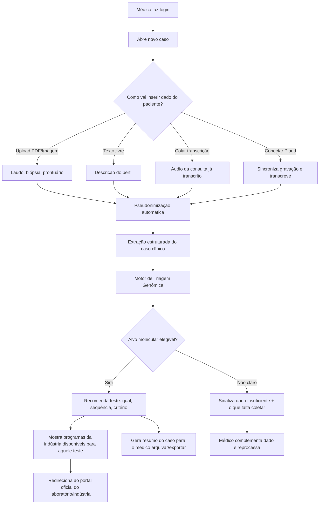

# OncoGenYX — Arquitetura Conceitual

> Desenho de produto para uma ferramenta de **triagem multimodal no ponto de cuidado**: o médico sobe dados brutos do paciente (PDF, imagem, texto, áudio) e recebe direcionamento sobre qual teste molecular pedir e onde pedir de graça, com apoio de um Hub de Acesso (catálogo de programas da indústria) e de um assistente conversacional (OncoBot) como via alternativa de entrada.

---

## 1. O que essa ferramenta É e NÃO É

**É:**
- Uma ferramenta de **triagem e direcionamento** — "existe alvo molecular relevante nesse caso? Qual teste pedir? Onde pedir de graça?"
- Um tradutor entre **dado clínico bruto e desfecho acionável**: perfil do paciente → biomarcador elegível → programa de acesso da indústria.
- Um **facilitador de logística e literacia clínica** no momento da decisão (o gargalo real, conforme os dados SGO/Labcorp-Illumina que você trouxe).

**NÃO é:**
- Uma ferramenta de **decisão terapêutica** (não sugere droga, dose ou linha de tratamento).
- Um **repositório de dados de pacientes** (não hospeda, não cruza dados entre médicos, não é banco retrospectivo).
- Um substituto de **aconselhamento genético** (sempre encaminha para especialista quando indicado, ex.: critérios de síndrome hereditária).

Essa distinção é a base regulatória e de MLR: o produto orienta *processo de solicitação de exame*, não *conduta terapêutica*. Isso muda a régua de risco (mais perto de "suporte administrativo/educacional" do que "software as medical device" de decisão terapêutica) — mas ainda exige disclaimers e trilha de auditoria, porque toca decisão clínica indiretamente.

---

## 2. Jornada do médico (fluxo ponta a ponta)



---

## 3. Arquitetura em camadas

### Camada 1 — Ingestão multimodal
Responsável por receber o dado bruto, seja qual for o formato.

| Fonte | Mecanismo | Observação |
|---|---|---|
| PDF (laudo anatomopatológico, prontuário) | Upload + parsing (texto nativo ou OCR se digitalizado) | Extrai texto, tenta localizar campos-chave (diagnóstico, estadiamento, IHQ) |
| Imagem (foto de laudo, lâmina, prescrição) | Upload + OCR | Mesma pipeline do PDF escaneado |
| Texto livre | Campo de descrição | Médico descreve o caso em linguagem natural |
| Ditado clínico por voz | Gravação de áudio no próprio app + transcrição automática (speech-to-text) | O médico dita o caso em vez de digitar; a transcrição alimenta a mesma extração da Camada 3. Diferente da transcrição colada: a gravação acontece dentro da sessão, não é importada de outro app |
| Transcrição de áudio colada | Campo de texto | Médico cola transcrição já pronta (de qualquer gravador) |
| Plaud (cartão gravador) | Integração via API/webhook do Plaud, se disponível, ou export manual do arquivo de transcrição | **Ver seção 7 — depende de disponibilidade de API pública do Plaud** |

Todo dado bruto (PDF, imagem, áudio) é **processado e descartado** — não fica retido além do necessário para gerar o resumo estruturado do caso (ver seção 5, retenção de dados).

### Camada 2 — Pseudonimização (LGPD by design)
Executa **antes** de qualquer outro processamento, inclusive antes de qualquer chamada a modelo de IA externo.

- Nome completo → iniciais + identificador sequencial gerado pela plataforma (ex.: "Renan Lourenço Vidal" → `R.L.V. — Caso #0142`).
- Nenhum CPF, data de nascimento completa, endereço, telefone ou nome de familiar é mantido em texto pleno — campos sensíveis são mascarados ou removidos na extração.
- A tabela de correspondência **nome real ↔ código do caso** fica isolada, criptografada, e só é visível para o médico dono do caso (nunca trafega para o motor de triagem nem para qualquer chamada de IA/terceiro).
- Esse desenho segue o princípio de **minimização de dados** da LGPD (Art. 6º, III) — a IA e qualquer processamento downstream só enxergam o caso pseudonimizado.

### Camada 3 — Extração e estruturação do caso clínico
Converte o dado bruto (já pseudonimizado) em um **objeto clínico estruturado**:

```
CasoClinico {
  codigo_caso: "R.L.V.-0142"
  sexo, idade_faixa
  subtipo_oncologico: enum [Ginecológico, Geniturinário, Mama, Pulmão, ...]
  histologia, grau, estadiamento
  biomarcadores_ja_conhecidos: []
  historico_familiar: { presente: bool, detalhes_relevantes }
  tratamentos_previos: []
  fonte_dados: [PDF, texto, áudio-Plaud, ...]
  dados_insuficientes: []   // o que falta para triagem completa
}
```

Aqui entra o parsing de PDF/OCR + um modelo de linguagem para extrair essas entidades do texto livre/transcrição. Idade e sexo viram faixas/categorias sempre que possível, para reduzir ainda mais a identificabilidade.

### Camada 4 — Motor de Triagem Genômica
O coração do produto. Uma árvore de decisão **por subtipo oncológico**, baseada em diretrizes NCCN/ESMO, que responde três perguntas:

1. Existe alvo molecular relevante para esse subtipo/perfil?
2. Qual(is) teste(s) pedir (germinativo, somático, HRD, painel amplo) e em que ordem?
3. Que critério de elegibilidade o caso já cumpre ou ainda precisa documentar?

Ver seção 6 para o desenho por subtipo.

### Camada 4-B — OncoBot (via conversacional, mesmo motor)
Alternativa à ingestão por formulário/upload: o médico conversa com um assistente que faz perguntas dirigidas ("qual a histologia?", "há histórico familiar?", "já foi feito algum teste?") até reunir os mesmos campos do `CasoClinico` estruturado (Camada 3). Não é um motor de decisão paralelo — é **outra porta de entrada para a mesma Camada 4**: as perguntas do bot são geradas a partir das lacunas do objeto estruturado, e a resposta final passa pelas mesmas regras versionadas e citáveis por diretriz.

- Útil quando o médico não tem laudo/arquivo em mãos e quer só descrever o caso rapidamente entre consultas.
- Pode ser usado em conjunto com upload (ex.: sobe o laudo, o bot só pergunta o que ficou faltando — histórico familiar, testes prévios).
- Mesma régua de pseudonimização da Camada 2 se aplica à conversa: o bot nunca pede nome, CPF ou dado que identifique o paciente: só dado clínico.
- Mesmo disclaimer da Camada 7: o bot direciona qual exame pedir, não sugere conduta terapêutica.

### Camada 5 — Base de Programas da Indústria (o "Hub" de acesso)
Catálogo pesquisável por **patologia × biomarcador × empresa** (`Catálogo de Programas`, Fase 1). Para cada teste elegível identificado na Camada 4, a plataforma:
- Lista quais indústrias oferecem aquele teste gratuitamente/patrocinado naquele subtipo.
- Mostra critérios de elegibilidade do programa (podem ser mais restritos que o critério clínico puro).
- Redireciona para o **portal oficial** de cada laboratório/indústria parceira — a plataforma nunca processa a solicitação em si (é facilitador, não gestor do processo).

Essa base precisa de **manutenção contínua** (programas mudam, critérios mudam) — é dado curado, não gerado por IA.

### Camada 6 — Output / Resumo do caso
Gera um resumo que o médico pode salvar/exportar:
- Caso pseudonimizado (`R.L.V.-0142`)
- Alvo(s) molecular(es) elegível(is) e por quê (critério aplicado)
- Teste(s) recomendado(s) e sequência
- Programas de acesso disponíveis + link oficial
- Disclaimer: "Esta é uma ferramenta de triagem e direcionamento, não substitui julgamento clínico nem aconselhamento genético."

### Camada 7 — Compliance, auditoria e disclaimers
- Log de auditoria: quem gerou qual triagem, quando, com base em qual versão da diretriz (importante para defensibilidade médico-legal e para eventual submissão a Medical/Regulatory).
- Disclaimer fixo em toda tela de recomendação.
- Trilha de decisão explicável: a recomendação sempre aponta a regra/diretriz que a gerou (não é "caixa-preta" de IA generativa pura — a IA ajuda a extrair dado, mas a lógica de triagem é regras auditáveis mapeadas a NCCN/ESMO).

### Camada 8 — Geração do documento de solicitação
Este é o segundo gargalo que você identificou, e é tão importante quanto o primeiro: o médico pode saber exatamente qual teste pedir e ainda assim não pedir, porque não tem staff para preencher o formulário certo do jeito certo para cada laboratório/programa. Esta camada fecha esse hiato — gera o **documento de solicitação já preenchido**, pronto para revisar, assinar e enviar.

- **Entrada isolada de nome real**: até aqui, todo o pipeline (Camadas 2 a 7) trabalha só com o caso pseudonimizado (`A.F.M.-0231`). O nome completo do paciente só é **usado** (exibido, preenchido no documento) **nesta camada**, num campo separado — nunca entra no motor de triagem, nunca fica salvo junto do histórico de casos, nunca aparece nas telas de revisão/resultado. É reidentificação pontual e local, controlada pelo médico, no exato momento em que ele precisa do documento final.
  - **Atualização v0.4**: quando o material de origem é um PDF/foto de laudo (que já contém o nome do paciente no cabeçalho, inevitavelmente visível ao modelo que lê o documento para extrair o dado clínico), o motor de extração da Camada 3 também captura esse nome — como campo isolado (`nome_paciente`), nunca combinado com o objeto clínico estruturado. Ele só é usado para pré-preencher o campo desta camada, poupando o médico de digitar de novo algo que a IA já viu. Continua nunca aparecendo nas telas 2 e 3 (revisão/resultado), continua nunca influenciando a triagem. Quando a entrada é só texto digitado (sem nome mencionado), o campo simplesmente vem vazio para preenchimento manual, como antes.
- **Templates por parceiro**: cada laboratório/indústria tem seu próprio formulário de solicitação (campos, layout, texto de justificativa exigido). Assim como a base de programas (Camada 5), esses templates são **dado curado**, mantido e validado por você — não gerado livremente por IA.
- **Preenchimento automático**: nome do paciente, dados do médico (CRM, instituição), diagnóstico, teste solicitado e a **justificativa clínica já redigida**, citando a diretriz que embasa a indicação (o mesmo texto rastreável da Camada 7).
- **Múltiplos documentos por caso**: quando a triagem recomenda teste pareado (ex.: HRD tumoral + BRCA germinativo, ver seção 10), a plataforma gera um documento para cada um — cada teste pode ter parceiro, laboratório e formulário diferentes.
- **Saída**: PDF para download, com aviso de que a responsabilidade pela solicitação final é do médico assistente (a plataforma preenche, não decide nem envia em nome dele).

**Atualização v0.4**: o fluxo real (`server/public/index.html`) juntou as telas de Programas de acesso e Modelo de solicitação num único passo 4 — cada card de teste indicado já mostra, na sequência, o(s) programa(s)/portal(is) e o documento de solicitação pré-preenchido daquele mesmo teste, em vez de duas telas separadas. Ver `mockup/oncogyn-flow.html` (versão anterior, 5 passos, sem backend) para o histórico do desenho original.

---

## 4. Estrutura de telas (informação, não visual ainda)

1. **Login/Cadastro do médico** (CRM, especialidade, instituição) — acesso seguro ao Hub.
2. **Dashboard** — casos recentes, catálogo de programas.
3. **Novo Caso** — tela de ingestão multimodal: formulário/upload (texto, PDF, imagem, áudio, Plaud) **ou** conversa com o OncoBot (ver Camada 4-B).
4. **Revisão do Caso Estruturado** — médico confirma/corrige o que foi extraído antes de rodar a triagem (humano no loop, reduz risco de erro de extração).
5. **Resultado da Triagem** — alvo(s), teste(s), critério, programas disponíveis, botão para portal oficial.
6. **Histórico de Casos** — lista de `R.L.V.-0142`, `R.L.V.-0143`... só o médico logado enxerga a tabela de correspondência real.
7. **Área de Educação** (Fase 3).
8. **Analytics/Dashboard agregado** (Fase 3, para parceiros da indústria — sempre agregado e anonimizado).

---

## 5. Retenção e segurança de dados (LGPD)

- **Dado bruto** (PDF/imagem/áudio original): processado em memória/storage temporário, descartado após extração (ou retido criptografado por prazo curto definido em política, só se o médico optar por manter o anexo original).
- **Caso estruturado pseudonimizado**: retido enquanto o médico mantiver a conta, para consulta de histórico.
- **Tabela de reidentificação** (código ↔ nome real): armazenada separadamente, criptografada em repouso, acesso restrito ao médico dono do caso — nem a equipe de produto acessa em operação normal.
- Base legal LGPD: execução de serviço solicitado pelo próprio médico (controlador dos dados do paciente) + apoio a cuidado de saúde — o produto atua como **operador** dos dados do médico, que segue sendo controlador em relação ao paciente dele.
- Necessário: Termo de Uso + Aviso de Privacidade explícitos, e — dado que se trata de dado de saúde (dado sensível, Art. 11 LGPD) — atenção redobrada a criptografia em trânsito/repouso e a não usar esses dados para treinar modelos de terceiros sem anonimização irreversível.

---

## 6. Base de diretrizes — critérios de indicação (Ginecológico · Ovário)

**Processo obrigatório daqui pra frente**: antes de qualquer regra entrar no motor de triagem, ela precisa estar documentada nesta seção, com a fonte (diretriz + ano/versão) e o critério exato de histologia/grau/estágio que a aciona. O motor de código (Camada 4 do mockup) só pode implementar o que estiver aqui — nunca o contrário. Isso evita o erro que já aconteceu uma vez: a primeira versão do protótipo só reconhecia "seroso de alto grau" e deixava de fora "endometrioide de alto grau em estágio III/IV", que segundo a NCCN tem exatamente a mesma indicação.

### Sociedades de referência usadas nesta triagem

- **NCCN** — Ovarian Cancer Guidelines (versão vigente)
- **ASCO** — "Germline and Somatic Tumor Testing in Epithelial Ovarian Cancer: ASCO Guideline" (*Journal of Clinical Oncology*, 2020; PMID 32074015)
- **ESMO** — Clinical Practice Guideline para câncer epitelial de ovário, incluindo a adaptação Pan-Ásia (ESMO Open, 2025) que reforça HRD tanto em histologia serosa quanto não-serosa
- **SGO** — Society of Gynecologic Oncology, referência de prática clínica específica para oncologia ginecológica, usada como checagem cruzada para os critérios acima

### Regra 1 — Teste germinativo (BRCA1/2 + painel ampliado)

**Indicado para toda histologia epitelial não-borderline de ovário, independente de grau ou estágio**: seroso, endometrioide, células claras, mucinoso, carcinossarcoma, indiferenciado.

> Fonte: ASCO (JCO 2020) — recomenda oferecer teste germinativo a toda mulher diagnosticada com câncer epitelial de ovário, independente de histórico familiar. Histologias não-serosas (endometrioide, células claras, baixo grau, carcinossarcoma) têm taxa de mutação germinativa BRCA próxima à do seroso de alto grau (~28%); mucinoso tem o menor rendimento para BRCA, mas ainda é ofertado — e tem indicação adicional de considerar teste somático de dMMR.

### Regra 2 — Teste somático tumoral (HRD)

**Indicado quando histologia é seroso OU endometrioide, de alto grau, em estágio III ou IV** (qualquer subestágio A/B/C) — orienta elegibilidade a terapia de manutenção com inibidor de PARP.

> Fonte: NCCN Ovarian Cancer Guidelines — teste somático de HRD recomendado para doença avançada (estágio III/IV) de histologia serosa **ou endometrioide** de alto grau. O erro corrigido nesta versão: a regra anterior só cobria "seroso", excluindo endometrioide — que a NCCN trata com o mesmo critério.
>
> **Nomenclatura (v0.4)**: os ensaios comerciais de HRD (ex.: myChoice CDx, FoundationOne CDx HRD) já incluem a análise de mutação BRCA1/2 tumoral como parte do mesmo teste/laudo — não são dois exames separados. Por isso a UI e os documentos de solicitação usam só "HRD Somático" (não mais "HRD + BRCA1/2 tumoral"), evitando parecer dois pedidos quando é um único teste.

### Regra 3 (referência, ainda não implementada no motor) — dMMR/MSI (Lynch)

Considerar teste somático de dMMR/MSI para histologia de células claras, endometrioide ou mucinoso.

> Fonte: ASCO (JCO 2020).

### Tabela-resumo

| Perfil do caso | Germinativo | Somático (HRD) |
|---|---|---|
| Seroso ou endometrioide, alto grau, estágio III/IV (confirmados) | Indicado | Indicado — par completo |
| Seroso ou endometrioide, grau e/ou estágio não informados | Indicado | Indicado como mais provável, com ressalva de confirmar no laudo (ver "Campo obrigatório vs. recomendado" abaixo) |
| Seroso ou endometrioide, mas baixo grau ou estágio I/II (confirmados) | Indicado | Não coberto por esta regra — fora do critério NCCN |
| Células claras, mucinoso, carcinossarcoma, indiferenciado | Indicado | Não coberto por esta regra (considerar dMMR — Regra 3) |
| Histologia não identificada ou não mapeada | Triagem insuficiente — completar dado | — |

### Campo obrigatório vs. recomendado

Grau e estadiamento (FIGO) são **eixos clínicos independentes** — estágio mede extensão anatômica da doença, grau é uma leitura patológica do tecido (arquitetura + atipia nuclear); um caso em estágio IIIC/IVC pode ser tanto de alto quanto de baixo grau, o segundo não se deduz do primeiro (fonte: ISGyP, grading de endometrioide "independente do estágio do tumor"; existe inclusive uma entidade reconhecida — carcinoma seroso de baixo grau avançado — que é estágio III/IV e baixo grau ao mesmo tempo).

Por isso, **só a histologia é campo obrigatório** para a triagem rodar (sem ela não há como dizer nada). Grau e estadiamento são recomendados, não obrigatórios: se a histologia já é elegível ao par (seroso/endometrioide) e nenhum dos dois contradiz o critério, a triagem indica o par como **mais provável para o perfil**, sinaliza visualmente o que não foi confirmado, e pede para o médico confirmar no laudo patológico antes de solicitar — sem bloquear a navegação nem forçar o preenchimento de campo que só é "bom ter", não indispensável. Só bloqueia navegação quando o dado realmente impede qualquer resposta (histologia ausente ou não reconhecida) ou quando grau/estágio **já confirmam** que o caso está fora do critério (aí a resposta é germinativo-somente, não uma pendência).

**Refinamento importante**: grau e estadiamento só são sinalizados como pendentes (amarelo) quando a histologia já informada é seroso ou endometrioide — as únicas com o par somático na regra. Para qualquer outra histologia (células claras, mucinoso, carcinossarcoma, indiferenciado), preencher grau/estágio não muda a resposta — germinativo já está indicado e o par somático não se aplica de qualquer forma — então o mockup não pede nem destaca esses campos nesses casos. Essa relevância é recalculada ao vivo, toda vez que o médico edita a histologia na tela de revisão (`updateGrauEstadioRelevance()` em `mockup/oncogyn-flow.html`).

**Tela de Programas e Solicitação mostra só o que foi indicado**: o card/documento do teste somático só aparece quando a triagem confirmou ou indicou provisoriamente o par completo — nunca para um caso que resultou em "só germinativo". Mostrar um teste sem indicação confundiria o médico exatamente do jeito que o produto existe para evitar. Quando só o germinativo é indicado, a tela exibe uma nota curta explicando por que o card do somático não aparece, em vez de simplesmente omitir sem explicação.

**Sem nome de indústria/parceiro específico na UI (v0.4)**: os cards de programa de acesso não citam mais indústria (ex. AstraZeneca, GSK) por nome — usam rótulo genérico ("Programa de acesso ao teste — parceiro 1/2"). A curadoria de quem realmente patrocina cada programa, com critério de elegibilidade vigente, continua sendo trabalho da Camada 5 (ver abaixo) — só não é mais hardcoded na tela como exemplo de marca específica, para não parecer que a ferramenta favorece uma indústria sobre outra antes dessa curadoria acontecer.

### Outros subtipos oncológicos (fora do escopo desta fase)

A mesma exigência de "primeiro a diretriz, depois o código" vale para qualquer subtipo futuro. Ainda não foi feito o levantamento de critérios para os subtipos abaixo — não implementar nenhuma regra para eles até essa etapa acontecer:

| Subtipo | Status |
|---|---|
| Próstata | **Implementado (v0.5)** — ver seção 6-B |
| Mama | Levantamento de diretrizes pendente |
| Pulmão (NSCLC) | Levantamento de diretrizes pendente |

O mapeamento **indústria × teste × programa gratuito** (quem oferece HRD, quem oferece germinativo) continua sendo uma camada separada (Camada 5) e uma etapa de validação sua — não faz parte da diretriz clínica em si e não deve influenciá-la (ver regra de ouro da seção 10).

## 6-B. Base de diretrizes — critérios de indicação (Próstata)

Segunda vertical implementada, seguindo o mesmo processo obrigatório da seção 6: diretriz pesquisada e documentada primeiro, motor de código depois. Sociedades de referência trocadas para as que emitem diretriz de próstata — NCCN Prostate Cancer Guidelines, ASCO ("Germline and Somatic Genomic Testing for Metastatic Prostate Cancer", JCO 2025), AUA/SUO Advanced Prostate Cancer Guideline (2026) e EAU Guidelines on Prostate Cancer (2026) — no lugar de ESMO/SGO, que são as de referência do GYN.

**Eixo central da regra**: ao contrário do GYN (onde histologia é o campo obrigatório e FIGO/grau refinam), aqui o campo obrigatório é a **extensão da doença** (Localizado / Linfonodo positivo N1 / Metastático hormônio-sensível mHSPC / Metastático resistente à castração mCRPC) — analogamente ao estadiamento FIGO, é frequentemente inferido pelo motor a partir do TNM e do contexto clínico (ex.: "iniciando bloqueio hormonal pela primeira vez" → mHSPC; "progressão de PSA em uso de enzalutamida" → mCRPC), nunca chutado sem base no material.

### Regra 1 — Teste germinativo

**Indicado quando qualquer um destes critérios é atendido:**
- Doença metastática (mHSPC ou mCRPC), qualquer histologia.
- Linfonodo positivo (N1), doença localizada.
- Categoria de risco NCCN Alto ou Muito alto, doença localizada.
- Histologia intraductal/cribriforme, mesmo em risco intermediário.
- Ascendência judaica Ashkenazi.
- Histórico familiar oncológico relatado (não automatiza a contagem exata de parentes/idade do critério NCCN completo — sinaliza a indicação e pede avaliação do médico).

> Fontes: NCCN Prostate Cancer Guidelines — germinativo para nódulo positivo, alto/muito alto risco localizado e metastático; considerar para intraductal/cribriforme mesmo em risco intermediário, ascendência Ashkenazi e critério de histórico familiar (≥3 parentes de primeiro grau com próstata/mama do mesmo lado, óbito por próstata <60 anos, etc.). ASCO (JCO 2025) e AUA/SUO (2026): germinativo para todo paciente com doença metastática e/ou avançada.

### Regra 2 — Teste somático tumoral (painel HRR, 15 genes)

**Indicado apenas quando a doença é metastática** (mHSPC ou mCRPC) — não indicado para doença localizada nesta versão da regra, mesmo em alto/muito alto risco, porque o painel HRR é um biomarcador de elegibilidade a inibidor de PARP em doença metastática, não um teste de rastreio para doença local.

> Fontes: ASCO (JCO 2025) — doença metastática (mHSPC e mCRPC) candidata a tratamento sistêmico direcionado por biomarcador deve fazer teste somático. EAU (2026) — mCRPC: oferecer teste somático e/ou germinativo (recomendação forte); mHSPC (M1): testar HRR para elegibilidade a niraparib + abiraterona (recomendação fraca). AUA/SUO (2026): teste tumoral somático para todo paciente com doença metastática.
>
> **Genes do painel** (estudo PROfound, base da aprovação do olaparibe em mCRPC): BRCA1, BRCA2, ATM, BARD1, BRIP1, CDK12, CHEK1, CHEK2, FANCL, PALB2, PPP2R2A, RAD51B, RAD51C, RAD51D, RAD54L. Maior benefício clínico documentado em BRCA1/2, CDK12 e PALB2; benefício não estabelecido para ATM e CHEK2 isolados — dado clínico relevante para o médico, não usado para excluir o gene do painel solicitado.

### Tabela-resumo

| Perfil do caso | Germinativo | Somático (painel HRR) |
|---|---|---|
| Metastático (mHSPC ou mCRPC) | Indicado | Indicado — par completo |
| Localizado, linfonodo positivo (N1), alto/muito alto risco, intraductal/cribriforme, Ashkenazi ou histórico familiar | Indicado | Não coberto por esta regra — biomarcador de doença metastática |
| Localizado, risco baixo ou intermediário favorável, sem outro critério | Não indicado por esta regra | Não coberto por esta regra |
| Extensão da doença e categoria de risco não identificadas | Triagem insuficiente — completar dado | — |

### Categoria de risco NCCN (doença localizada) — como o motor infere

Quando a categoria de risco não vem pronta no laudo, o motor de extração (`server/index.js`, `PROSTATA_SYSTEM_PROMPT`) só a infere se tiver PSA + Gleason/Grade Group + estágio clínico T disponíveis com razoável confiança, usando a tabela resumida do NCCN (Baixo: cT1-T2a, Grade Group 1, PSA<10; Intermediário favorável: Grade Group 2 predominância padrão 3, <50% fragmentos positivos, ≤1 fator de risco intermediário; Intermediário desfavorável: Grade Group 2-3 com ≥50% fragmentos positivos ou ≥2 fatores; Alto: cT3a ou Grade Group 4-5 ou PSA>20; Muito alto: cT3b-T4 ou padrão primário Gleason 5 ou >4 fragmentos Gleason 8-10) — mesma filosofia do estadiamento FIGO no GYN: campo vazio é melhor que chute quando faltar um dos três eixos.

### Interface

Campos de revisão, motor de regra (`classifyCaseProstata()`), resultado, programas e documento de solicitação são todos independentes dos equivalentes GYN — vivem lado a lado em `server/public/index.html`, alternados por `setSubtype()`.

**Atualização v0.7 — parceiros de programa específicos por subtipo (não reaproveitados do GYN)**: a primeira versão desta tela reaproveitou os mesmos parceiros do card somático do GYN (ProgramAID + Myriad myChoice CDx) pro card de próstata, por analogia — isso estava errado. Pesquisa dedicada (o usuário pediu explicitamente "varredura grande na internet" antes de implementar) encontrou:
- **GSK não tem programa de acesso para próstata** — o programa de tratamento com Zejula (niraparibe) da GSK no Brasil é explicitamente para câncer de ovário (SUS), sem nenhuma menção a próstata. Removido do card de próstata (nunca deveria estar lá).
- **Myriad myChoice CDx é o companion diagnostic do Zejula/GSK (ovário), não de próstata** — o painel somático de próstata (olaparibe/Lynparza) usa companion diagnostics diferentes: **FoundationOne CDx** e **FoundationOne Liquid CDx** (Foundation Medicine, comercializados pela Roche no Brasil, com parceiros locais confirmados: Dasa Genômica, Fleury Genômica, Einstein, Laboratório Silveira, A+ Medicina Diagnóstica) para o tecido tumoral e biópsia líquida respectivamente, e **BRACAnalysis CDx** (Myriad) para o germinativo especificamente.
- **ProgramAID (Programa ID.AZ) cobre próstata de verdade** — confirmado que o programa oferece teste genético gratuito em tecido tumoral para próstata metastática, e — respondendo diretamente ao que o usuário perguntou — **se o resultado vier inconclusivo ou cancelado, permite reteste gratuito por biópsia líquida (ctDNA)**, sem custo adicional. É por isso que o card de próstata cita essa biópsia líquida explicitamente na descrição do programa.
- **Pfizer tem programa de suporte diagnóstico ligado a HRR** — "Cuidar Mais" (especificamente o sub-programa "PAF"), vinculado à combinação Talzenna (talazoparibe) + Xtandi (enzalutamida), aprovada em ~60 países para câncer de próstata metastático HRR-mutado. Adicionado ao card de próstata no lugar da GSK.
- **Janssen (Akeega) e a ligação direta da Pfizer com um laboratório específico não foram confirmados** para o mercado brasileiro nesta pesquisa — não foram adicionados como card. Reavaliar se/quando houver confirmação de aprovação Anvisa e programa de acesso local.

Germinativo continua usando Life Genomics como ponte de acesso (parceiro genérico de genômica de precisão, não específico de subtipo tumoral) — nenhuma informação nova encontrada que mude isso.

**Atualização v0.6 — detecção automática do subtipo**: o seletor manual (botões "Ginecológico"/"Próstata" no passo 1) foi removido a pedido do usuário. O médico não escolhe mais o subtipo antes de descrever o caso — ele só descreve/anexa o material, e a própria extração da Camada 3 identifica qual vertical está sendo descrita (campo `tipo_tumor` no schema unificado, `UNIFIED_SCHEMA`/`UNIFIED_SYSTEM_PROMPT` em `server/index.js`) a partir do conteúdo (órgão mencionado, histologia, marcador — PSA é próstata, FIGO/CA-125 é ginecológico). O backend não recebe mais um parâmetro de subtipo do frontend: uma única chamada à API já faz as duas coisas — identifica o tipo e extrai só os campos relevantes a ele (os do outro subtipo ficam vazios no retorno). O frontend chama `setSubtype()` automaticamente com o resultado.

Duas salvaguardas foram mantidas: (1) se a IA não conseguir determinar o subtipo com segurança, `tipo_tumor` volta como "Não identificado" e a extração é rejeitada com uma mensagem pedindo pra descrever de forma mais específica, em vez de adivinhar; (2) na tela de revisão, um botão "Não é isso? Trocar tipo" permite correção manual caso a IA classifique errado — troca o conjunto de campos exibido, mas não reextraí nada (o médico completa os campos do subtipo correto manualmente). O código do caso também deixou de usar o prefixo fixo `GYN-` (agora `CASO-`), já que o subtipo não é mais conhecido no momento em que o código é gerado.

### Estado real do upload de PDF/foto no mockup (importante)

O mockup permite anexar PDF e foto (inclusive por arrastar-e-soltar, múltiplos arquivos de uma vez), mas **não lê o conteúdo desses arquivos** — só guarda o nome/miniatura como registro de que a fonte foi anexada. A extração de dado estruturado (Camada 3) continua rodando só sobre o campo de texto. A interface agora avisa isso explicitamente (ao anexar um arquivo, aparece a nota "este protótipo ainda não lê o conteúdo automaticamente") em vez de falhar silenciosamente, que foi o comportamento que gerou confusão antes.

Ler de verdade o conteúdo de um laudo em PDF/foto exige OCR + extração via modelo de linguagem sobre esse texto — a mesma dependência de backend real já registrada para a extração de texto livre (seção 10, "protótipo final real"). Isso não é uma correção pontual: é a mesma pendência estrutural, agora também para PDF/imagem, não só para texto digitado.

---

## 7. Integração com Plaud

Pontos a resolver antes de desenhar o encaixe técnico:
- O Plaud (cartão gravador) tem **API pública/webhook** para exportar transcrições automaticamente, ou o fluxo real hoje é "gravar → app do Plaud transcreve → médico exporta/copia o texto"?
- Se não houver API aberta, a "integração" no MVP é simplesmente: **campo de colar transcrição** (o que você já descreveu como opção separada) — sem sincronização automática. Isso já resolve 90% do valor sem depender de integração externa incerta.
- Uma integração automática (OAuth do Plaud → puxa transcrição direto) fica como item de Fase 2/3, condicionado à Plaud ter API disponível para isso.

---

## 8. Stack sugerida para prototipagem (MVP rápido)

- **Frontend**: Web app simples (Next.js/React), mobile-responsive — médico usa no celular/tablet entre consultas.
- **Backend**: API leve (Node ou Python/FastAPI) para orquestrar ingestão, pseudonimização, extração e motor de regras.
- **OCR/parsing**: biblioteca de PDF/OCR (Tesseract ou serviço gerenciado) para laudos digitalizados.
- **Extração estruturada**: chamada a LLM (ex.: Claude) **apenas sobre o dado já pseudonimizado**, com prompt restrito a extrair entidades clínicas — nunca envia dado identificável a provedor externo. O mesmo modelo conduz a via conversacional do OncoBot (Camada 4-B).
- **Motor de triagem**: regras explícitas versionadas (não IA generativa pura) — cada regra referencia a diretriz-fonte, para auditabilidade. Compartilhado pelas duas vias de entrada (formulário/upload e OncoBot).
- **Banco de dados**: separar fisicamente/logicamente a tabela de reidentificação (nome real) do banco de casos estruturados.
- **Base de programas da indústria**: tabela curada, com painel administrativo (CMS) simples para gestão dos programas sem necessidade de código.

---

## 9. Elementos centrais do Hub de Acesso

| Elemento | Onde entra no desenho |
|---|---|
| OncoBot (conversa) / Suporte à Decisão Clínica | Camada 4-B (via de entrada) + Camada 4 (Motor de Triagem) + Camada 6 (Output) |
| Catálogo de Programas | Camada 5 |
| Portal do Médico / login / CRM | Estrutura de telas, item 1 |
| Painel Administrativo (CMS) | Camada 5, manutenção da base |
| Pré-Validação de elegibilidade | Camada 4, parte "critério de elegibilidade" |
| Disclosure (privacidade do paciente) | Camada 2 (pseudonimização) — cobre tanto dado real do paciente (PDF, áudio) quanto a conversa com o OncoBot |
| Fases 1/2/3 e orçamento | Fase 1 (MVP): ingestão multimodal + estrutura de telas. Fase 2: motor de triagem completo + OncoBot + Plaud. Fase 3: educação, analytics, parcerias |

---

## 10. Modelo de negócio: os dois gargalos

Você identificou dois gargalos distintos, e é importante mantê-los separados porque cada um tem uma camada técnica própria (acima) e implica uma fonte de receita diferente:

| Gargalo | Medo/barreira do médico | Camada que resolve | Quem tem interesse em financiar |
|---|---|---|---|
| **1. Não sabe qual teste pedir** | "Não tenho certeza se esse caso tem indicação, nem de qual exame — HRD? germinativo? os dois?" | Camada 4 (Motor de Triagem) + Camada 4-B (OncoBot) | Indústria farmacêutica (quer mais pacientes elegíveis identificados) e instituições de saúde (querem qualidade assistencial) |
| **2. Não sabe/não tem staff para pedir** | "Mesmo sabendo qual exame, o formulário é complexo e eu não tenho secretária para preencher" | Camada 8 (Geração do documento de solicitação) + Camada 5 (Programas de acesso) | Indústria farmacêutica (reduz abandono no meio do funil — o mesmo gargalo "Atrito na Solicitação" e "Gargalo Operacional") e laboratórios parceiros (mais pedidos corretamente preenchidos, menos retrabalho) |

### Opções de modelo de receita

1. **Patrocínio por indústria via orçamento de acesso/educação médica (modelo principal recomendado).**
   A indústria farmacêutica (ex.: quem já mantém programas de teste gratuito, como no exemplo HRD) financia o uso da ferramenta como parte do próprio orçamento de programas de acesso e educação médica — o mesmo tipo de budget que já paga por materiais educacionais e suporte administrativo hoje. A plataforma cobra por **disponibilizar a ferramenta e manter o catálogo/templates atualizados**, não por paciente direcionado nem por teste solicitado — isso evita qualquer aparência de pagamento por indicação (que seria antiético e um risco regulatório sério). É essencial que isso passe por aprovação de Medical/Regulatory (MLR) como ferramenta educacional/de suporte operacional, não promocional.

2. **Assinatura institucional B2B (SaaS).**
   Clínicas, hospitais ou grupos oncológicos pagam uma assinatura mensal/anual pelo acesso da equipe médica à ferramenta — independe de qual indústria patrocina qual teste. Reduz a dependência de um único patrocinador e fortalece a percepção de neutralidade clínica.

3. **Freemium para o médico individual.**
   Triagem (Camada 4) gratuita e sempre disponível — é a porta de entrada e o que gera adesão. Funcionalidades de "conforto operacional" (geração de documento pré-preenchido, histórico de casos, integração com Plaud) como camada paga ou patrocinada, para quem "carreira solo" sem staff sente mais esse gargalo.

4. **Métricas agregadas como produto complementar (já previsto na ideia original de dashboard/analytics).**
   Dados agregados e anonimizados (nunca por paciente) sobre onde o funil de testagem vaza por região/especialidade viram um produto de inteligência para os parceiros da indústria — sem vender dado de paciente, só padrão de uso da ferramenta.

### A regra de ouro para qualquer um desses modelos

**A Camada 4 (motor de triagem clínica) nunca pode ser influenciada por quem patrocina.** A separação estrutural já desenhada — a lógica de indicação vem só de diretriz (NCCN/ESMO/ASCO/...), e a Camada 5/8 (quem oferece o teste de graça e como pedir) é uma camada comercial à parte, sempre exibida *depois* da recomendação clínica, nunca antes — é o que sustenta qualquer um dos modelos acima perante Medical/Regulatory e perante o próprio médico usuário. Se essa linha for borrada, o produto deixa de ser "ferramenta de suporte" e vira material promocional, com toda a régua regulatória que isso implica.

---

## 11. Decisões já tomadas (v0.2)

- **Escopo agora**: mockup navegável (ver `mockup/oncogyn-flow.html`) para validar o fluxo antes de qualquer código de produção.
- **Vertical piloto**: Ginecológico (câncer de ovário), com expansão posterior para outros subtipos com componente genético relevante.
- **Plaud**: integração via API é o alvo (Fase 2/3); no MVP o campo "colar transcrição" já cobre o mesmo caso de uso sem depender de disponibilidade de API.
- **Regra de ouro do GYN (corrigida na v0.3 — ver seção 6)**: germinativo é indicado para **toda** histologia epitelial não-borderline de ovário, sempre. Somático (HRD+BRCA tumoral, elegibilidade PARP) só é indicado quando histologia é **seroso OU endometrioide**, de **alto grau**, em **estágio III/IV** — não é regra de "sempre os dois juntos". A versão anterior só reconhecia "seroso de alto grau" e deixava de fora "endometrioide de alto grau em estágio III/IV", que pela NCCN tem exatamente a mesma indicação de par completo — esse bug foi corrigido no motor do mockup (`classifyCase()` em `mockup/oncogyn-flow.html`).
- **Tom da cópia clínica**: texto direto, sucinto e objetivo — sem linguagem decorativa, ícones afetivos ou blocos de texto longos. O card sobre indicação do germinativo é uma nota clínica curta (rótulo + uma frase de justificativa + estatísticas em linha + uma sugestão de comunicação, sem enfeite visual), porque o médico navega a ferramenta rápido entre consultas e espera objetividade, não acolhimento estético.
- **Princípio de exibição — só o que é acionável agora**: a tela de Programas não lista mais testes/painéis fora do escopo do caso atual (removido o card "Painel para status de reparo homólogo ampliado — fora do escopo"). Mostrar algo marcado como "não se aplica aqui" não dá nenhuma ação possível ao médico, só adiciona leitura e ruído. Esse princípio vale para o produto inteiro: qualquer informação que não seja necessária ao passo em que o médico está fica fora da tela. Se um caminho condicional futuro precisar ser sinalizado (ex.: painel de HRR ampliado, relevante só se o BRCA tumoral vier selvagem), ele deve aparecer **depois**, quando o resultado anterior o tornar de fato relevante — não antes, como aviso do que "não se aplica ainda".
- **Fonte das regras de indicação**: diretrizes publicadas e reconhecidas internacionalmente — NCCN, ESMO, ASCO e **SGO** (Society of Gynecologic Oncology, referência de prática específica para oncologia ginecológica). Cada regra no motor de triagem carrega a diretriz de origem e a versão/ano, para rastreabilidade. Ver o detalhamento completo, com o critério exato de cada regra, na seção 6.
- **Processo daqui pra frente**: diretriz primeiro, código depois — nenhuma regra nova entra no motor sem antes estar documentada na seção 6 com fonte e critério. Essa ordem foi adotada depois do bug do "endometrioide" (ver acima), que aconteceu justamente por implementar uma regra sem levantar todos os critérios da diretriz antes.
- **Mapeamento indústria × teste**: fica como dado a validar por você antes de publicar (ver seção 12) — o motor de triagem e a base de programas são desacoplados de propósito, para que a parte clínica (diretriz) nunca dependa da parte comercial (quem patrocina o teste hoje).
- **Segundo gargalo endereçado**: além de "qual teste pedir", a Camada 8 gera o **documento de solicitação já preenchido** (nome do paciente, dados do médico, teste e justificativa citando diretriz) — ver passo 5 do mockup. O nome real do paciente só existe nessa camada, isolado do resto do pipeline pseudonimizado.

---

## 12. Pendente da sua validação

O mockup já mostra a estrutura da tela de programas (AstraZeneca e GSK como exemplo para HRD), mas os dados de **quem oferece o quê, com qual critério de elegibilidade, hoje** precisam ser confirmados por você antes de qualquer publicação — isso inclui:
- Critérios de elegibilidade atuais de cada programa (podem ser mais restritos que o critério clínico da diretriz).
- Se há programa de acesso gratuito para o **teste germinativo** em GYN (o mockup mostra esse card como "pendente" propositalmente).
- Cobertura por região/rede (nem todo programa está disponível em todo lugar).
- Quais laboratórios/templates de formulário usar para o **documento de solicitação do germinativo** (a tela de programas mostra esse teste como "pendente" de parceiro, mas o documento de solicitação em si pode ser gerado com um template genérico de laboratório enquanto isso).

---

## 13. Próximas perguntas em aberto

1. Olhando o mockup (`mockup/oncogyn-flow.html`), o fluxo de 5 passos (incluindo o novo passo de documento de solicitação) faz sentido, ou falta/sobra alguma etapa?
2. O tom do card "Por que também pedir o germinativo" está no nível certo de acolhimento, ou precisa ajustar (mais direto/mais suave)?
3. Para a tela de Programas: você já tem a lista real de critérios de elegibilidade AstraZeneca/GSK para HRD que eu possa estruturar, ou isso fica para uma rodada de validação conjunta depois do mockup aprovado?
4. Depois do GYN, qual subtipo entra em seguida — Mama (exemplo TNBC + idade <45) ou outro?
5. Sobre o modelo de negócio (seção 10): qual das quatro opções faz mais sentido como ponto de partida — patrocínio direto da indústria, assinatura institucional, freemium individual, ou uma combinação? Isso muda o que priorizamos construir a seguir.
6. Os templates reais de formulário de solicitação (AstraZeneca para HRD, por exemplo) — você tem acesso a eles hoje para eu estruturar os campos com precisão, ou isso também entra na rodada de validação conjunta?
