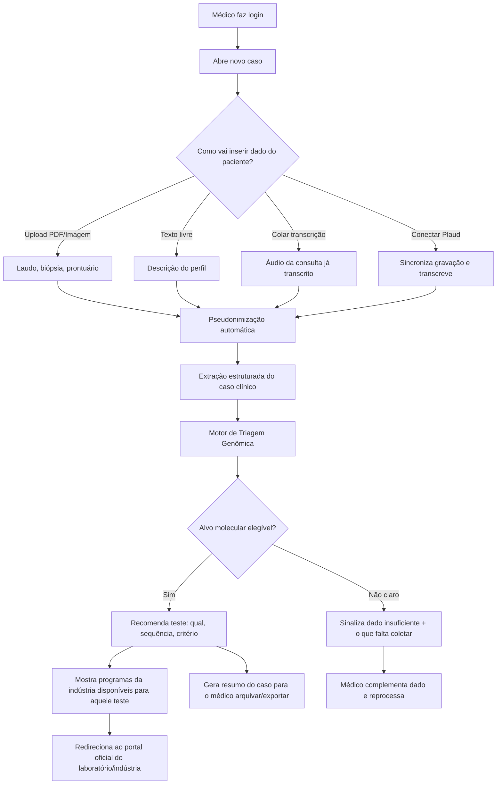

# OncoGeneHUB — Arquitetura Conceitual

> Baseado no pitch deck "OncoGeneHUB I Projeto Conceitual 2026" (Dr. Haonne Abboud) e na conversa de desenho de produto. Este documento une os dois: o conceito de **Hub de Acesso** (portal + OncoBot já desenhados no deck) com o módulo que você descreveu — **triagem multimodal no ponto de cuidado**, onde o médico sobe dados brutos do paciente (PDF, imagem, texto, áudio) e recebe direcionamento sobre qual teste molecular pedir e onde pedir de graça.

---

## 1. O que essa ferramenta É e NÃO É

**É:**
- Uma ferramenta de **triagem e direcionamento** — "existe alvo molecular relevante nesse caso? Qual teste pedir? Onde pedir de graça?"
- Um tradutor entre **dado clínico bruto e desfecho acionável**: perfil do paciente → biomarcador elegível → programa de acesso da indústria.
- Um **facilitador de logística e literacia clínica** no momento da decisão (o gargalo real, conforme os dados SGO/Labcorp-Illumina que você trouxe).

**NÃO é:**
- Uma ferramenta de **decisão terapêutica** (não sugere droga, dose ou linha de tratamento).
- Um **repositório de dados de pacientes** (não hospeda, não cruza dados entre médicos, não é banco retrospectivo).
- Um substituto de **aconselhamento genético** (sempre encaminha para especialista quando indicado, ex.: critérios de síndrome hereditária).

Essa distinção é a base regulatória e de MLR: o produto orienta *processo de solicitação de exame*, não *conduta terapêutica*. Isso muda a régua de risco (mais perto de "suporte administrativo/educacional" do que "software as medical device" de decisão terapêutica) — mas ainda exige disclaimers e trilha de auditoria, porque toca decisão clínica indiretamente.

---

## 2. Jornada do médico (fluxo ponta a ponta)



---

## 3. Arquitetura em camadas

### Camada 1 — Ingestão multimodal
Responsável por receber o dado bruto, seja qual for o formato.

| Fonte | Mecanismo | Observação |
|---|---|---|
| PDF (laudo anatomopatológico, prontuário) | Upload + parsing (texto nativo ou OCR se digitalizado) | Extrai texto, tenta localizar campos-chave (diagnóstico, estadiamento, IHQ) |
| Imagem (foto de laudo, lâmina, prescrição) | Upload + OCR | Mesma pipeline do PDF escaneado |
| Texto livre | Campo de descrição | Médico descreve o caso em linguagem natural |
| Transcrição de áudio colada | Campo de texto | Médico cola transcrição já pronta (de qualquer gravador) |
| Plaud (cartão gravador) | Integração via API/webhook do Plaud, se disponível, ou export manual do arquivo de transcrição | **Ver seção 7 — depende de disponibilidade de API pública do Plaud** |

Todo dado bruto (PDF, imagem, áudio) é **processado e descartado** — não fica retido além do necessário para gerar o resumo estruturado do caso (ver seção 5, retenção de dados).

### Camada 2 — Pseudonimização (LGPD by design)
Executa **antes** de qualquer outro processamento, inclusive antes de qualquer chamada a modelo de IA externo.

- Nome completo → iniciais + identificador sequencial gerado pela plataforma (ex.: "Renan Lourenço Vidal" → `R.L.V. — Caso #0142`).
- Nenhum CPF, data de nascimento completa, endereço, telefone ou nome de familiar é mantido em texto pleno — campos sensíveis são mascarados ou removidos na extração.
- A tabela de correspondência **nome real ↔ código do caso** fica isolada, criptografada, e só é visível para o médico dono do caso (nunca trafega para o motor de triagem nem para qualquer chamada de IA/terceiro).
- Esse desenho segue o princípio de **minimização de dados** da LGPD (Art. 6º, III) — a IA e qualquer processamento downstream só enxergam o caso pseudonimizado.

### Camada 3 — Extração e estruturação do caso clínico
Converte o dado bruto (já pseudonimizado) em um **objeto clínico estruturado**:

```
CasoClinico {
  codigo_caso: "R.L.V.-0142"
  sexo, idade_faixa
  subtipo_oncologico: enum [Ginecológico, Geniturinário, Mama, Pulmão, ...]
  histologia, grau, estadiamento
  biomarcadores_ja_conhecidos: []
  historico_familiar: { presente: bool, detalhes_relevantes }
  tratamentos_previos: []
  fonte_dados: [PDF, texto, áudio-Plaud, ...]
  dados_insuficientes: []   // o que falta para triagem completa
}
```

Aqui entra o parsing de PDF/OCR + um modelo de linguagem para extrair essas entidades do texto livre/transcrição. Idade e sexo viram faixas/categorias sempre que possível, para reduzir ainda mais a identificabilidade.

### Camada 4 — Motor de Triagem Genômica
O coração do produto. Uma árvore de decisão **por subtipo oncológico**, baseada em diretrizes NCCN/ESMO, que responde três perguntas:

1. Existe alvo molecular relevante para esse subtipo/perfil?
2. Qual(is) teste(s) pedir (germinativo, somático, HRD, painel amplo) e em que ordem?
3. Que critério de elegibilidade o caso já cumpre ou ainda precisa documentar?

Ver seção 6 para o desenho por subtipo.

### Camada 5 — Base de Programas da Indústria (o "Hub" do pitch deck original)
Catálogo pesquisável por **patologia × biomarcador × empresa**, exatamente como já desenhado no deck (`Catálogo de Programas`, Fase 1). Para cada teste elegível identificado na Camada 4, a plataforma:
- Lista quais indústrias oferecem aquele teste gratuitamente/patrocinado naquele subtipo.
- Mostra critérios de elegibilidade do programa (podem ser mais restritos que o critério clínico puro).
- Redireciona para o **portal oficial** de cada laboratório/indústria parceira — a plataforma nunca processa a solicitação em si (mantém o desenho "facilitador, não gestor" do deck original).

Essa base precisa de **manutenção contínua** (programas mudam, critérios mudam) — é dado curado, não gerado por IA.

### Camada 6 — Output / Resumo do caso
Gera um resumo que o médico pode salvar/exportar:
- Caso pseudonimizado (`R.L.V.-0142`)
- Alvo(s) molecular(es) elegível(is) e por quê (critério aplicado)
- Teste(s) recomendado(s) e sequência
- Programas de acesso disponíveis + link oficial
- Disclaimer: "Esta é uma ferramenta de triagem e direcionamento, não substitui julgamento clínico nem aconselhamento genético."

### Camada 7 — Compliance, auditoria e disclaimers
- Log de auditoria: quem gerou qual triagem, quando, com base em qual versão da diretriz (importante para defensibilidade médico-legal e para eventual submissão a Medical/Regulatory).
- Disclaimer fixo em toda tela de recomendação.
- Trilha de decisão explicável: a recomendação sempre aponta a regra/diretriz que a gerou (não é "caixa-preta" de IA generativa pura — a IA ajuda a extrair dado, mas a lógica de triagem é regras auditáveis mapeadas a NCCN/ESMO).

---

## 4. Estrutura de telas (informação, não visual ainda)

1. **Login/Cadastro do médico** (CRM, especialidade, instituição) — conforme "Acesso Seguro ao HUB" do deck.
2. **Dashboard** — casos recentes, catálogo de programas (herdado do deck original).
3. **Novo Caso** — tela de ingestão multimodal (upload, texto, áudio, Plaud).
4. **Revisão do Caso Estruturado** — médico confirma/corrige o que foi extraído antes de rodar a triagem (humano no loop, reduz risco de erro de extração).
5. **Resultado da Triagem** — alvo(s), teste(s), critério, programas disponíveis, botão para portal oficial.
6. **Histórico de Casos** — lista de `R.L.V.-0142`, `R.L.V.-0143`... só o médico logado enxerga a tabela de correspondência real.
7. **Área de Educação** (Fase 3 do deck original).
8. **Analytics/Dashboard agregado** (Fase 3, para parceiros da indústria — sempre agregado e anonimizado).

---

## 5. Retenção e segurança de dados (LGPD)

- **Dado bruto** (PDF/imagem/áudio original): processado em memória/storage temporário, descartado após extração (ou retido criptografado por prazo curto definido em política, só se o médico optar por manter o anexo original).
- **Caso estruturado pseudonimizado**: retido enquanto o médico mantiver a conta, para consulta de histórico.
- **Tabela de reidentificação** (código ↔ nome real): armazenada separadamente, criptografada em repouso, acesso restrito ao médico dono do caso — nem a equipe de produto acessa em operação normal.
- Base legal LGPD: execução de serviço solicitado pelo próprio médico (controlador dos dados do paciente) + apoio a cuidado de saúde — o produto atua como **operador** dos dados do médico, que segue sendo controlador em relação ao paciente dele.
- Necessário: Termo de Uso + Aviso de Privacidade explícitos, e — dado que se trata de dado de saúde (dado sensível, Art. 11 LGPD) — atenção redobrada a criptografia em trânsito/repouso e a não usar esses dados para treinar modelos de terceiros sem anonimização irreversível.

---

## 6. Matriz de biomarcadores por subtipo oncológico (estrutura, não valor final)

Isso deve virar uma tabela **viva e curada**, não hardcoded — mas a estrutura conceitual é:

| Subtipo | Cenário clínico gatilho | Teste(s) indicado(s) | Indústria(s) com programa (exemplo) |
|---|---|---|---|
| **Ginecológico** (ovário seroso alto grau) | Diagnóstico de Ca ovário epitelial não-mucinoso | HRD (somático) + BRCA1/2 germinativo | AstraZeneca, GSK (a validar critério vigente de cada programa) |
| **Ginecológico** | Suspeita de síndrome hereditária (idade jovem + histórico familiar) | Painel germinativo ampliado + encaminhamento aconselhamento genético | Varia por painel/laboratório |
| **Geniturinário** (próstata metastático) | CRPC ou histórico familiar relevante | Painel germinativo + somático (HRR genes) | A mapear |
| **Mama** | Triplo-negativo, idade <45, ou histórico familiar (exemplo do próprio deck) | BRCA1/2 germinativo | A mapear |
| **Pulmão** (NSCLC) | Adenocarcinoma avançado | Painel amplo (EGFR, ALK, ROS1, KRAS, PD-L1, etc.) | A mapear |

**Importante:** você, pela sua posição na BU de Oncologia GYN/Lynparza, já tem know-how direto sobre os programas de HRD/BRCA da AstraZeneca e concorrência (GSK). Isso deveria ser o primeiro bloco a popular com precisão — é onde o produto tem mais credibilidade de saída. Os outros subtipos (mama, pulmão, GU) podem entrar em fases seguintes, com curadoria própria.

---

## 7. Integração com Plaud

Pontos a resolver antes de desenhar o encaixe técnico:
- O Plaud (cartão gravador) tem **API pública/webhook** para exportar transcrições automaticamente, ou o fluxo real hoje é "gravar → app do Plaud transcreve → médico exporta/copia o texto"?
- Se não houver API aberta, a "integração" no MVP é simplesmente: **campo de colar transcrição** (o que você já descreveu como opção separada) — sem sincronização automática. Isso já resolve 90% do valor sem depender de integração externa incerta.
- Uma integração automática (OAuth do Plaud → puxa transcrição direto) fica como item de Fase 2/3, condicionado à Plaud ter API disponível para isso.

---

## 8. Stack sugerida para prototipagem (MVP rápido, alinhado ao "Fase 1: MVP — R$14.000 / 15 dias" do deck)

- **Frontend**: Web app simples (Next.js/React), mobile-responsive — médico usa no celular/tablet entre consultas.
- **Backend**: API leve (Node ou Python/FastAPI) para orquestrar ingestão, pseudonimização, extração e motor de regras.
- **OCR/parsing**: biblioteca de PDF/OCR (Tesseract ou serviço gerenciado) para laudos digitalizados.
- **Extração estruturada**: chamada a LLM (ex.: Claude) **apenas sobre o dado já pseudonimizado**, com prompt restrito a extrair entidades clínicas — nunca envia dado identificável a provedor externo.
- **Motor de triagem**: regras explícitas versionadas (não IA generativa pura) — cada regra referencia a diretriz-fonte, para auditabilidade.
- **Banco de dados**: separar fisicamente/logicamente a tabela de reidentificação (nome real) do banco de casos estruturados.
- **Base de programas da indústria**: tabela curada (CMS simples, como já previsto no deck — "Painel Administrativo (CMS) para gestão dos programas sem necessidade de código").

---

## 9. Como isso conversa com o pitch deck existente

| Elemento do deck | Onde entra no desenho novo |
|---|---|
| OncoBot / Suporte à Decisão Clínica | Camada 4 (Motor de Triagem) + Camada 6 (Output), com a ingestão multimodal como entrada nova (o deck já mostrava um chat simples; aqui expandimos a entrada de dado) |
| Catálogo de Programas | Camada 5 |
| Portal do Médico / login / CRM | Estrutura de telas, item 1 |
| Painel Administrativo (CMS) | Camada 5, manutenção da base |
| Pré-Validação de elegibilidade | Camada 4, parte "critério de elegibilidade" |
| Disclosure (privacidade do paciente) | Camada 2 (pseudonimização) — o desenho novo é mais forte que o do deck original, porque agora manipulamos dado real do paciente (PDF, áudio), não só descrição textual genérica |
| Fases 1/2/3 e orçamento | Mantém a mesma lógica de fases; a ingestão multimodal (PDF/imagem/áudio/Plaud) entra dentro da Fase 1 (MVP) e Fase 2 (IA/fluxo) |

---

## 10. Perguntas em aberto

1. **Escopo do protótipo agora**: você quer um protótipo funcional real (web app) já nesta sessão, ou um desenho/mockup navegável primeiro para validar o fluxo antes de código de produção?
2. **Primeiro subtipo oncológico**: começamos só com Ginecológico (HRD/BRCA), sua área de maior domínio, para ter um caso vertical completo e correto, e expandir depois?
3. **Origem da IA de extração**: tudo bem usar uma API de LLM (ex. Claude) rodando sobre o dado já pseudonimizado, ou você prefere que a extração inicial seja 100% regras/manual (sem chamada a modelo externo) até validar o modelo de compliance com Medical/Regulatory?
4. **Plaud**: você tem hoje acesso a exportar transcrição do Plaud (arquivo/texto), ou só a experiência de uso do device? Isso define se a integração é "colar texto" (simples, imediato) ou "puxar via API" (depende do que a Plaud expõe).
